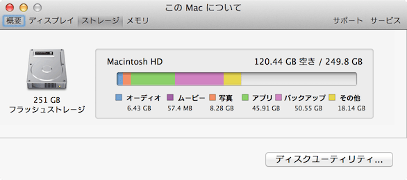
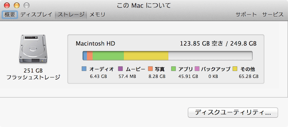
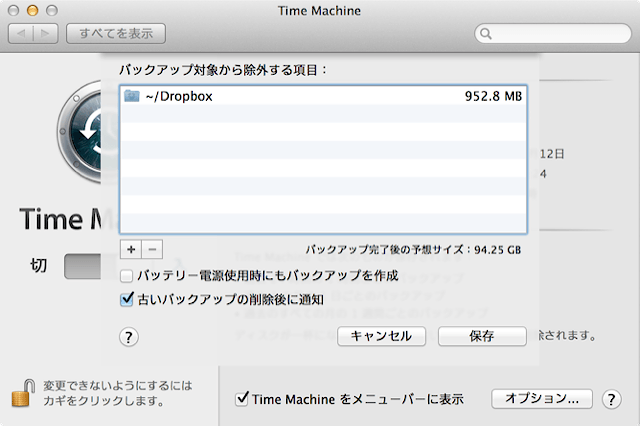

Time Machine は、macOS が誇る史上最大の機能です。外付けのディスクを Mac に接続して、Time Machine をオンにするだけで、自動的に毎日欠かさず、あなたに代わってバックアップを取得してくれます。

photo credit: [adamwilson](https://www.flickr.com/photos/adamwilson/3241009989/) via [photopin](http://photopin.com) [cc](http://creativecommons.org/licenses/by-nc-nd/2.0/)

外付けのディスクは、Mac に直接接続されている必要はありません。たとえば、AirMac Time Capsule の場合、無線 LAN ルーターに 2TB または 3TB のディスクを内蔵されており、ネットワーク経由で Mac のバックアップ取得します。

以降、Time Machine に接続されているディスクのことを、バックアップディスクと呼びます。

さて、Time Machine には以下のものが保存されています。

- ローカルスナップショット（後述）
- 過去 24 時間の 1 時間ごとのバックアップ
- 過去 1 か月の 1 日ごとのバックアップ
- 過去のすべての月の 1 週間ごとのバックアップ

バックアップディスクが一杯になった場合は、一番古いバックアップから自動的に削除されます。これらのバックアップは Time Machine によりどのように保存され、いつでも復旧できる環境を作っているのでしょうか？

## ローカルスナップショットとは？

Time Machine はローカルディスク上にもバックアップを作成します。メニューの「この Mac について」→「詳しい情報」とたどると、ディスプレイやメモリなどと同列で、ストレージの情報を表示できます。ここにある「バックアップ」が「ローカルスナップショット」の正体です。

Time Machine でバックアップを行うためには、バックアップディスクが必要です。MacBook Pro や MacBook Air など、持ち運びを前提として作られている機種の場合、常に Time Machine のバックアップディスクが手元にある状況とは限りません。

このような状況へ対応するために、macOS Lion から**「Mobile Time Machine」**という機能が追加されました。同機能は、Mac が Time Machine のバックアップディスクに接続できない場合、次回のバックアップ候補をいったんローカルディスクの専用の領域に退避します。そして、Mac が Time Machine へ接続できる段階になったら、退避していたバックアップ領域をバックアップディスクにコピーします。こうして、Mac はいつも欠かさずバックアップを取得しようとしているのです。

### Mobile Time Machine の起動／停止方法

MacBook Pro や MacBook Air の使用可能なディスクの領域は、それほど大きくはありません。また、常に Time Machine のバックアップディスクに接続可能な状況で使用するのであれば、本機能自体が意味を持ちません。ディスクを節約したい、などの理由があれば停止してしまっても構わないでしょう。

**Mobile Time Machine の停止**

    $ sudo tmutil disablelocal

**Mobile Time Machine の起動**

    $ sudo tmutil enablelocal

Mobile Time Machine 停止直後のストレージの情報は下図のようになっています。「バックアップ」に注目してください。「0KB」となっているのがお分かりいただけるかと思います。

## Time Machine によるバックアップの仕組み

前述のとおり、Time Machine は、ローカルスナップショットを除けば、1時間ごと、1日ごと、1週間ごととさまざまなバックアップを取得しています。毎回ディスクの中身をすべてバックアップディスクに取得していては、バックアップディスクの容量がいくらあっても足りそうにありません。

そこで、Time Machine では以下のような方式をとっています。なお、参考のためのイメージ図であり実態とは異なることをご承知置きください。

1 世代目、すなわち最初のバックアップはローカルディスクの内容をフルで取得します。そのため 1 回目の Time Machine によるバックアップには時間を要します。

2 世代目のバックアップはどうでしょうか。ローカルディスクの内容をすべて取得するのではなく、1 世代目のバックアップから変更のあった箇所のみをバックアップします。しかし、このままでは 2 世代目のバックアップから復旧することができませんから、変更のなかった箇所については 1 世代目のバックアップを参照するようにします。3 世代目以降も同様です。

Mobile Time Machine も同様です。このような仕組み（スナップショットと言います）を採用することで、確実かつスムーズなバックアップを実現可能にしているのです。

## Time Machine により除外される項目

Time Machine ではすべての項目をバックアップ対象としているわけではありません。たとえば、アプリケーションのキャッシュなど、バックアップする必要のない項目についてはあらかじめ除外されています。除外対象とするディレクトリやファイルについては、Time Machine の設定ファイルに記載されています。

    /System/Library/CoreServices/backupd.bundle/Contents/Resources/StdExclusions.plist

### PathsExcluded（完全に除外される項目）

- /.MobileBackups
- /.Spotlight-V100
- ...

「.MobileBackups」は前述の Mobile Time Machine の保存場所です。Mobile Time Machine（ローカルのバックアップ）で作成されたバックアップファイル自体を Time Machine によるバックアップの対象に含めないように考慮されています。

また、「.Spotlight-V100」は Spotlight のインデックスファイルが保存されている場所です。この領域も保存されません。Time Machine から復元すると、再度 Spotlight のインデックスが構成されます。

### ContentsExcluded（バックアップ対象ではないが復元対象とするもの）

- /Volumes
- /Library/Caches
- /Library/Logs
- /System/Library/Caches
- /System/Library/Extensions/Caches
- …

「/Volumes」は外部ディスクです。Mac に接続されている外付けディスクや SD カードの内容は、Time Machine のバックアップ対象とはなりません。

「/Library/Caches」「/Library/Logs」はアプリケーションが使用するキャッシュおよびログの保存場所です。こうした一時的な情報も Time Machine のバックアップ対象とならないように考慮されています。

### UserPathsExcluded（ユーザーごとのフォルダーで除外される項目）

- Library/Caches
- Library/Logs
- …

基本的な考え方は「ContentsExcluded」と同様です。一時的な情報については Time Machine の対象とはなりません。

## 除外する項目を追加するためには

「システム環境設定」→「Time Machine」の「オプション」から行います。

ここにバックアップの対象から除外する項目を追加します。バックアップ時に復元する必要のない項目については、あらかじめ設定しておきましょう。

- ~/Dropbox
- ~/Downloads
- …

などなど、オンラインストレージに常に保存されているフォルダー、ダウンロードフォルダーなどダウンロード時に一時的に使用するフォルダーを選択すると良いでしょう。

## まとめ

Time Machine、Mobile Time Machine の仕組みについて簡単にご紹介しました。Mac は精密機械ですから、いつどこで何があるかわかりません。Time Machine を活用して、いつでもバックアップから復旧できる環境を整えておきましょう。
