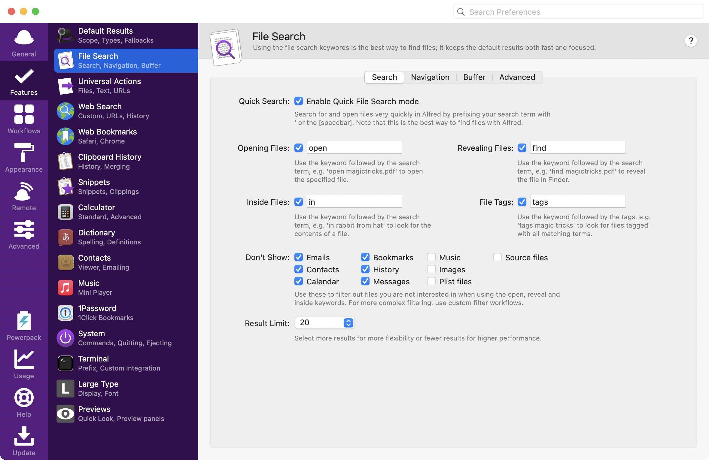
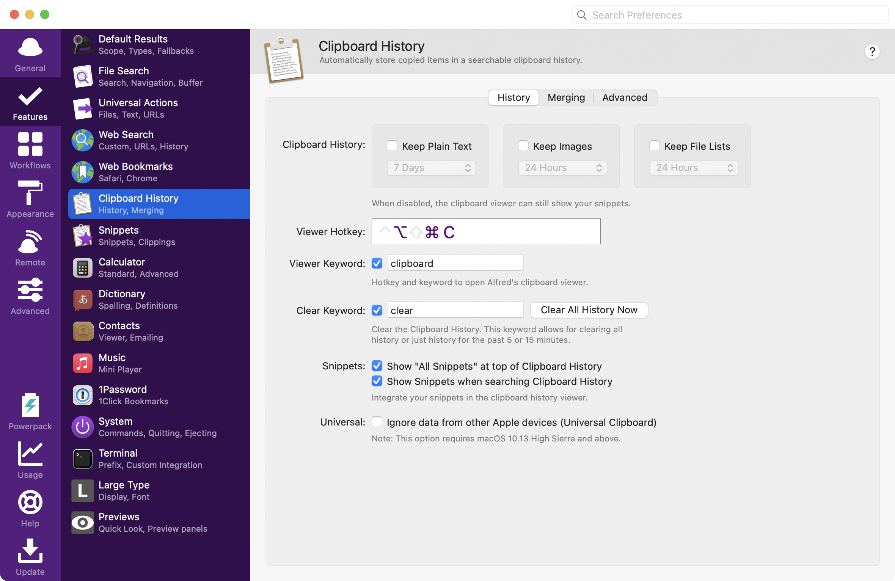
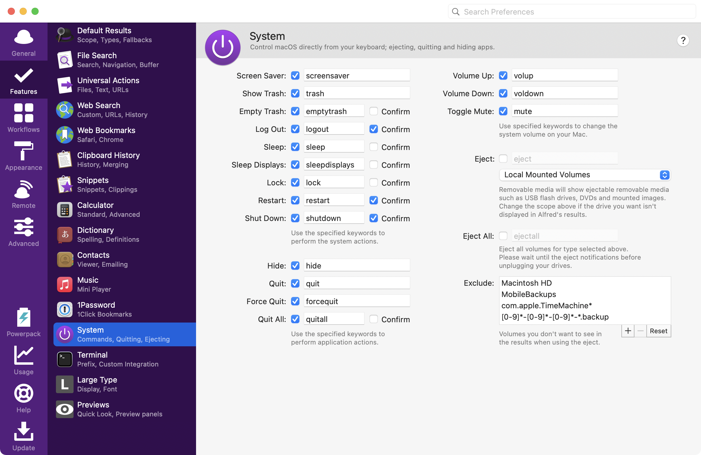

---
author:
- '@ottanxyz'
categories:
- Mac
date: 2014-09-09 00:00:00+00:00
draft: false
tags:
- alfred
- pack
- 検索エンジン
- ホットキー
- power
title: Macユーザーが恋する必須の神アプリAlfredを120%使いこなすための手引
type: post
---

{}
2022/02/01 21:29:13時点の情報にもとづき、記事を更新しました。
{}

[@おったん](https://twitter.com/ottanxyz)です。弊サイトイチオシのMacを購入したらもう手放すことのできない、恋に恋するランチャー「Alfred」でできるさまざまなことを徹底解説します。これだけは覚えてください、という内容です。「Alfred」をただのアプリのランチャーとして使っていませんか？実はできること、こんなにあるんです。

## Alfredのダウンロード

### Mac App Storeからダウンロードする

Alfredは、Mac App Storeから配信されています。しかし、後述する公式サイトからダウンロードできるものと比較すると、一部の機能（Powerpackライセンスを必要とする機能）が利用できませんので注意してください。



### 公式サイトからダウンロードする

Alfredは、Mac App Storeのみならず、公式サイトからもダウンロードできます。Mac App Store版との違いは、Powerpackライセンスを必要とする機能が利用できるかどうかにあります。Mac App Store版は、Powerpackライセンス（有料）を利用する機能は使用できません。

<http://www.alfredapp.com/>

## Alfredの使い方

まず、Alfredを起動するには、あらかじめ設定されているホットキーを押します。デフォルトでは ⌥+␣ です。ホットキーは変更することも可能ですが、私はこのホットキーで慣れてしまったので、最初から変更していません。

まずは、**このホットキーの使い方に馴染むことが重要**です。ホットキーの組み合わせに違和感がある場合は、変更しましょう。オススメは ⌘+␣ です。

また、Alfredの環境設定はダイアログが出ている状態で、`⌘+,` を押す、または、ダイアログの右上の歯車のアイコンをクリックします。ここから各種設定を変更できます。「General」タブの「Launch Alfred at login」にチェックが入っていなければ、今すぐチェックしてください。

Alfredの終了も環境設定から行います。「General」タブの下方にある「Quit Alfred」をクリックすればAlfredを終了させることができます。滅多にクリックすることもないと思いますので、覚える必要もありません。

では、ここからはAlfredのさまざまな使い方を、ご紹介します。なお、Powerpackとあるものは、別途「Powerpack」ライセンスが必要な機能です。Mac App Store版ではなく公式サイトからダウンロードし、かつライセンスを購入する必要があります。また、ワークフローと呼ばれる魅力的な機能がありますが、そちらについては今回は対象外です。

### Default Results

「Default Results」、すなわちAlfredの認識する「キーワード」を何も指定しなかった場合に検索結果として表示されるものです。「Homebrew Cask」でアプリケーションをインストールしている場合は、以下を「Search Scope」（検索範囲）に追加しておきましょう。

    /opt/homebrew/Cellar

そして、**一番重要なのが画面最下部の「Fallbacks」**。デフォルトの検索エンジンをここで設定できますが、最初から登録されているGoogle、Amazon、Wikipediaは、残念ながらすべて英語です。Googleは、日本語の検索エンジンにリダイレクトしてくれるため考慮の必要はありませんが、他の検索エンジンは変更しましょう。

検索エンジンを変更するためには、「+」ボタンをクリックします。変更できるのは、すでに登録済みのAlfredデフォルトの検索エンジンか、後述する**カスタムサーチにて設定した検索エンジン**の、どちらかになります。デフォルトで登録されている検索エンジンはすべて英語のため、カスタムサーチを利用しましょう。ちなみに、Google、Amazon、Wikipedia以外にも追加できます。

### File Search

Alfredは、ランチャーのみならず、ファイラーとしても機能します。キーワードは「/」です。ここでは、**「find」だけ絶対に覚えてください**。「find」と入れて検索ワードを入力すると、その検索ワードに該当するファイルをAlfredが見つけてくれます。

おそらく、macOSのSpotlightのインデックスを使用しているのだと思いますが、検索が超高速です。候補が複数ある場合は、一覧で表示されるので手動で検索するよりも絶対早いです。（Spotlightを使えばいいじゃない、という言葉は心にとめておいてください）

余談ですが、ターミナルでSpotlightのインデックスを使用してファイルを検索するためには「`mdfind`」コマンドを使います。なお、ファイラーとして使いたい場合は、Powerpackライセンスが必要です。単に「find」したいだけならライセンスがなくても大丈夫です。

### Web Search

後述の1Passwordに続き**利用頻度の高い機能がWeb Search**です。ありとあらゆる検索エンジンを登録できます。デフォルトのカスタムエンジンは残念ながら英語圏のものばかりなので、「Enabled」のチェックを外して使用不可能の状態にしておきます。これでカスタマイズした検索エンジンのみを利用できるようになります。

私が登録しているカスタムサーチをいくつかご紹介します。

なお、検索エンジン登録時の以下の設定はデフォルトでオンにしています。Amazonの場合、販売元をAmazon.co.jpに限定するための文字列である「&emi=AN1VRQENFRJN5」を末尾に付与しています。

-   Encode query using UTF8（クエリ文字列をUTF-8にエンコードする）
-   Encode spaces as +（スペース文字列を+に変換する）

とくに後者については検索エンジンの性質にもよりますので、「Test」ボタンで試してみてください。

| キーワード     | Search URL                                                                                             | 説明                       |                             |
| --------- | ------------------------------------------------------------------------------------------------------ | ------------------------ | --------------------------- |
| amazon    | https:\/\/www.amazon.co.jp/s?field-keywords={query}&emi=AN1VRQENFRJN5 | Amazonから商品を検索する         |                             |
| macapp | macappstore://ax.search.itunes.apple.com/WebObjects/MZSearch.woa/wa/search?q={query}                   | Mac App Storeからアプリを検索する |                             |

なお、ここで設定した検索エンジンを「Default Search」でご紹介した「Fallbacks」に登録できます。

### Calculator

なんてかゆいところに手が届くんだ、と思わせてくれるのがこの電卓機能。四則演算はもちろんのこと、キーワード「=」を入力すれば関数電卓にだってなります。消費税の計算、Webサイトのブロック要素の横幅の計算、なんだってAlfredにおまかせです。これなら、消費税が中途半端に13%に上がっても対応できます。

### Dictionary

「define」に続けて検索ワードを入力すると、その検索ワードの用語の意味を調べることができます。もちろん、日本語もOKです。あれ、この単語の意味なんだっけという時に使います。内蔵辞書はこんなに便利です。

また、「spell」に続けて検索ワードを入力すると、検索ワードを含む英単語とその意味が表示されます。先ほどとの違いは、辞書アプリで開くか、クリップボードにコピーするかです。「spell」を使ってあやふやな単語のスペルを確認して使用すると便利です。

### Clipboard Powerpack

**Powerpackを導入しているなら使わないと損です。**「clipboard」と入力することで、過去24時間から最大3か月の間まで、クリップボードの履歴を遡ることができます。これだけでもPowerpackの導入の余地があります。

たとえば、ターミナルでコマンドをクリップボードにコピーしておけば、Alfredで簡単に履歴を検索してコマンドを探すことができるようになります。クリップボードは、`⌥+⌘+C`（デフォルト）だけで起動できるので覚えてしまいましょう。また、「Advanced」タブでクリップボード履歴から除外するアプリを選択できます。「1Password」など機密情報を扱うアプリからのコピーは無効化しておきましょう。

もう1つ便利な使い方が、スニペット。「snip」キーワードに続けて使用します。**たとえばよく使う単語やメールアドレスを登録しておく**と、Alfredからすぐに呼び出すことができます。また、現在は「Automatically expand snippets by keyword」をチェックしておくことで、任意のアプリでキーワードを入力するだけで登録済みのスニペットに自動的に変換されます。これは非常に強力な機能です！

### 1Password Powerpack

**Powerpackライセンスを購入したら真っ先に導入しましょう**。デフォルトでは「1p」というキーワードが必要ですが、「Show in default results without keyword」にチェックすれば、キーワードが不要になります。

Alfredの検索結果から1Passwordに登録したパスワードが呼び出せるようになる素晴らしい連携機能です。1Passwordでログイン情報を登録しておけば、あとはAlfredからそのログイン情報を検索してクリックすれば勝手にログインしてくれます。**1PasswordのためにAlfredを、Alfredのために1Passwordを**導入してもよいくらい切って離せない存在です。



#### 注意事項

Alfredと1Passwordを連携させるためには、1Passowrdの環境設定の「詳細設定」から、「Spotlightを有効にして、サードパーティーアプリを統合」をチェックする必要があります。

### System

AlfredからMacの操作までできてしまいます。「lock」「restart」をまず覚えましょう。メニューバーからアクセスすることなく、確認画面を出すことなく強制的にロックしたりリスタートしてくれます。

便利なのが「quitall」。**すべてのアプリケーションを終了させてくれる便利なコマンドです**。ぜひこれも覚えておきましょう。「quitall」してから「lock」で安心です。なお、常駐アプリケーションは「quit」されないので、Alfredもそのままです。

## まとめ

私の独断と偏見でお届けしました。あなたのオススメや便利な使い方があれば、ぜひコメント欄または[@ottanxyz](https://twitter.com/ottanxyz)でおしえてくださいね。
