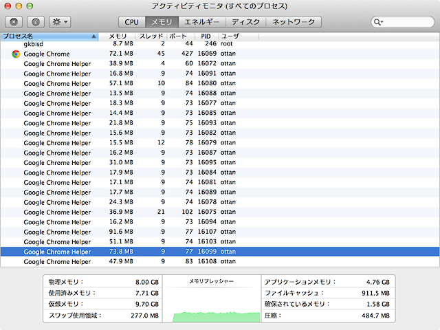
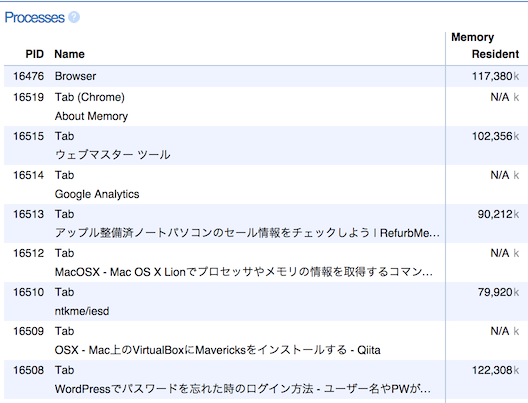
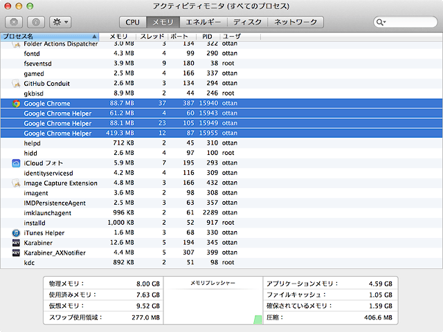
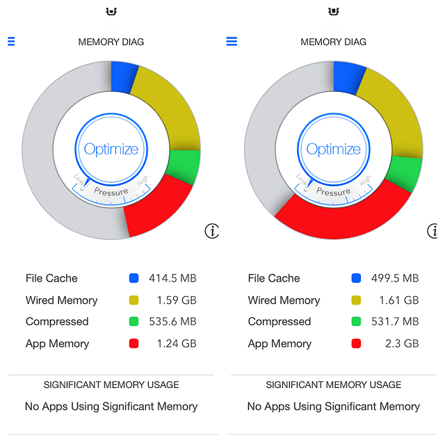
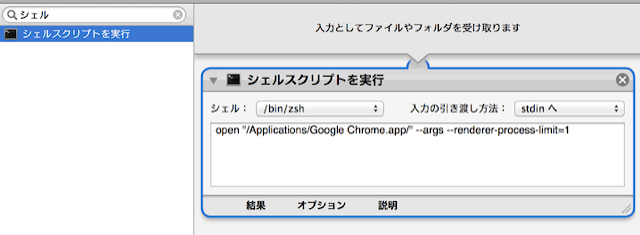

[@おったん](https://twitter.com/ottanxyz)です。今回は、Google Chromeを通常通り使用しながら、メモリ使用量を圧倒的に削減するための魔法のコマンドをご紹介します。なお、今回は魔法のコマンドを使用する前と後で、どれくらいメモリ使用量が増減するか実験を行っています。今回の実験のポイントは以下の通りです。

  * 任意のWebページを10個開いてメモリ使用量を比較する
  * 実験に使用するWebページは無作為抽出とする

無作為抽出とはいえ、人の手によるものですから、完全なランダムではありません。実験の方法によっては多少の誤差があることをお見知り置きください。

## 魔法のコマンド使用前のアクティビティモニター

Google Chromeは、タブ数や拡張機能が増加すればするほど「Google Chrome Helper」という、Google Chrome本体から生成された子プロセスでいっぱいになります。同プロセスの1つ1つのメモリ使用量は少ないですが、塵も積もれば山となるという言葉があるように、すべてを足し合わせるとそれなりの量になります。もはや目も当てられない状況ですね。

Google Chromeのコンフィグ（アドレスバーに「chrome://memory」と入力することで確認可能）からGoogle Chrome全体のメモリ使用量を確認すると、約1GBとなっています。エントリーモデルのMacのメモリ搭載量が4GBであることを考慮すると、これは到底無視できる値ではありません。

タブごとにプロセスが生成されていく過程は、同ページで確認できます。ページの内容によってメモリ使用量は若干前後しますが、**平均的に1タブあたり100MB**を使用しているようです。

また、「Memory Diag」で「App Memory」（アプリケーションのメモリ使用量）の差異を比較すると、**約1.7GBにのぼることがわかります**。



## 魔法のコマンド使用後のアクティビティモニター

では、魔法のコマンド使用後の状況を見てみましょう。魔法のコマンド使用前と比較して、「Google Chrome Helper」のプロセスの数が大幅に少なくなっていることがわかります。1つ1つのプロセスのメモリ使用量は若干増加していますが、すべてのプロセスの合計値は、魔法のコマンド使用前よりも明らかに少なくなっています。

Google Chromeのコンフィグから確認したときの状況も、魔法のコマンド使用前と比較すると明らかに下がっています。表示するページの内容により若干前後するとは思いますが、それでもこの減少量は脅威です。

魔法のコマンド使用前は、「1タブ = 1子プロセス」という状態でしたが、使用後は、1つ1つのプロセスが請け負うタブが増加する代わりに全体のプロセス数が減少しています。そのため個々のプロセス自体のメモリ使用量は増大していることがわかります。

Memory Diagの比較結果です。「App Memory」が1GB増えています。魔法のコマンド使用前は約1.7GBでしたから、これからもメモリ使用量が削減されていることがわかりますね。Google Chromeのためにメモリ使用量を増やさなければいけない時代なんでしょうか。

## では、魔法のコマンドは？

Google Chromeがメモリを食い潰してしまう原因は、レンダリングプロセス数の増加です。**同時に生成されるレンダリングエンジンの数を制限してしまえば良い**わけです。Mac、Windowsの場合で、レンダリングエンジンの数を減らす魔法の言葉は以下の通りです。

#### Mac

    open "/Applications/Google Chrome.app/" --args --renderer-process-limit=1

#### Windows

    "C:¥Users¥%USERNAME%¥AppData¥Local¥Google¥Chrome¥Application¥chrome.exe" --renderer-process-limit=1

Macの場合はターミナルから起動、Windowsの場合はショートカットの設定を変更してください。

### MacユーザーはAutomatorですぐ起動できるようにすると便利

Windowsユーザーはショートカットの設定を変更するだけですが、Macユーザーは毎回ターミナルから起動しなければならず、これでは若干不便です。そこで、Automatorを使用して引数を指定しながらGoogle Chromeを起動できるラッパーを作成しましょう。

Automatorを起動したら「アプリケーション」を選択します。

ライブラリから「シェルスクリプトを実行」をドラッグ＆ドロップします。そこに、前述の魔法の言葉を入力します。

    open "/Applications/Google Chrome.app/" --args --renderer-process-limit=1

最後に、作成したアプリケーションを保存します。名前は任意で構いませんがわかりやすいものにしておきましょう。

作成後はアプリケーションをクリックするだけで、Google Chromeが起動します。Automatorのアイコンは好みに応じて変更しましょう。

## まとめ

今回利用した方法は、Google Chromeの、いわば裏技です。**将来的な安定版のリリースにおいて、今回の施策が使用できなくなる可能性もあります**。また、一部のプラグインが正しく動作しなくなる可能性があります。あくまで実行は自己責任でお願いします。
