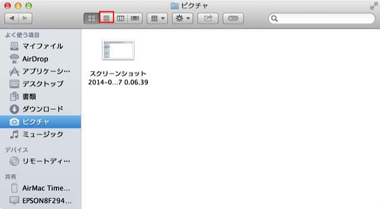
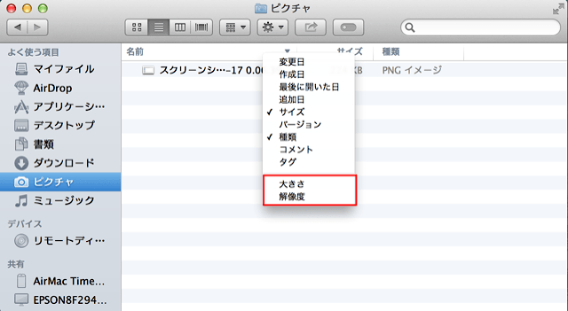
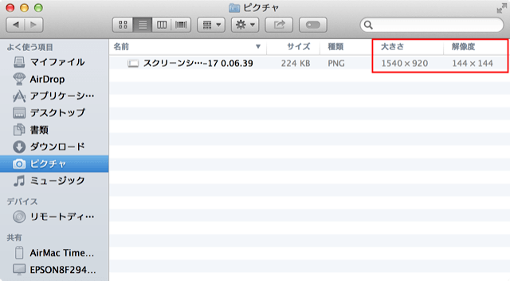
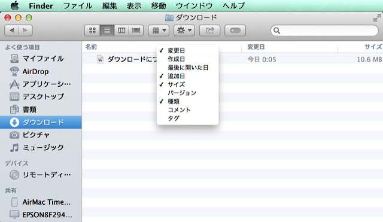
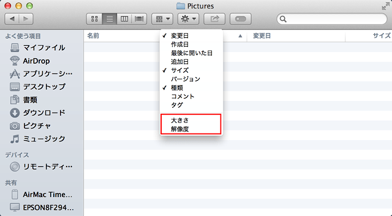
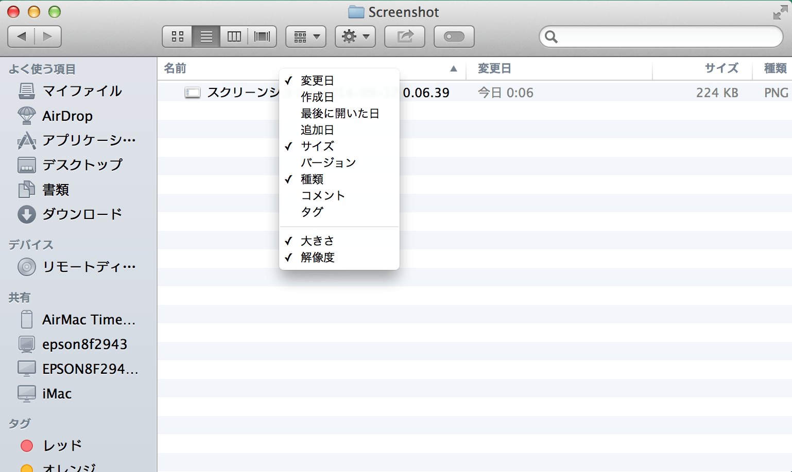

---
author:
- '@ottanxyz'
categories:
- Mac
date: 2014-09-17 00:00:00+00:00
draft: false
tags:
- 解像度
- カラム
- ピクチャフォルダー
- フォルダー
- finder
title: これは便利！Finderで画像ファイルの解像度と大きさを確認する方法
type: post
---

## Finderで画像ファイルの解像度と大きさを調べる

画像ファイルの大きさと解像度を調べたい場合は、Finderが便利です。Quick Lookやプレビューのアプリを開かなくてもFinderだけで画像ファイルの大きさ、解像度を調べることができるので重宝します。

### ホームディレクトリのピクチャフォルダーの場合

まず、ピクチャフォルダーに移動します。Finderの表示形式には「アイコン」「リスト」「カラム」「Cover Flow」がありますが、今回の方法が使用できるのは「リスト」表示の場合のみです。それ以外の表示形式になっている場合は、「リスト」表示に変更してください。

次に、「名前」や「変更日」といったカラムのヘッダー部分を右クリックします。表示するカラムをカスタマイズできますが、ピクチャフォルダーの場合のみ、**「大きさ」「解像度」**を選択できます。

下図のように、「大きさ」「解像度」がカラムに追加されました。「解像度」は1インチあたりのピクセル数を表しています。

### ホームディレクトリのピクチャフォルダー以外の場合

では、ピクチャフォルダー以外で解像度と大きさを表示することはできないのでしょうか。たとえば、スクリーンショットの保存先を変更している場合は、そのフォルダーでも解像度と大きさを表示したい。

たとえば、「ダウンロード」フォルダーに移動して、カラムを右クリックしても「解像度」と「大きさ」は表れません。

#### 「解像度」と「大きさ」を任意のフォルダーで表示するためには？

任意のフォルダーに「解像度」と「大きさ」を表示するためには、**まず「Pictures」という名称でフォルダーを作成**します。**必ず「P」は大文字にしてください**。すると、ホームディレクトリのピクチャフォルダー同様、「解像度」と「大きさ」をカラムに追加できるようになります。

一度、「解像度」「大きさ」を表示すれば、後は任意の名称に変更しても大丈夫です。今回は「Screenshot」という名称に変更してみました。

## まとめ

簡単に画像の大きさや解像度を知りたい場合は、ぜひFinderを使用してみてください。ちなみに、ミュージックフォルダーも通常とは異なるカラムを表示することができるので、ぜひ試してみてくださいね。