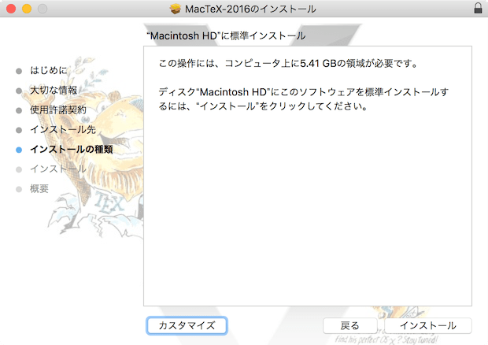
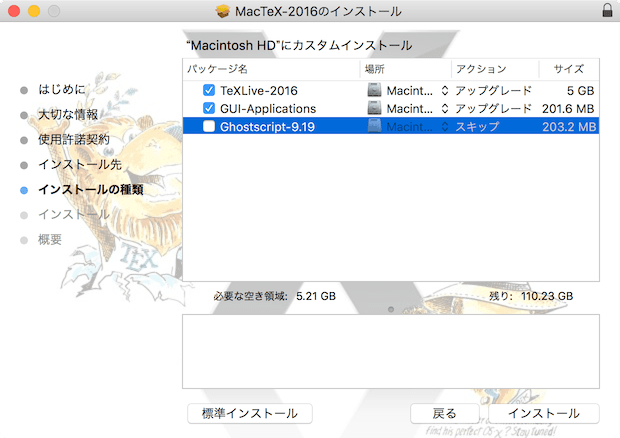
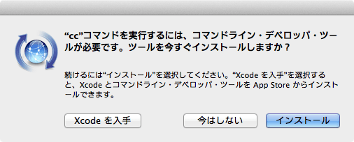
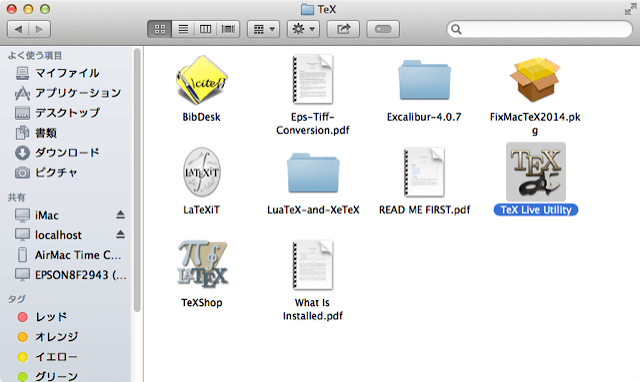
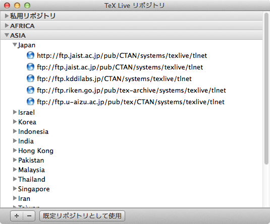
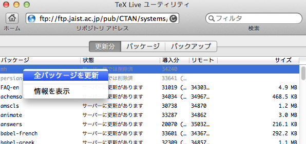
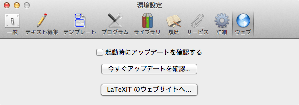
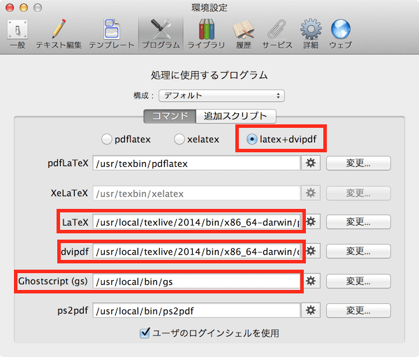

今回はプレゼン資料に数式を貼り付けるのに重宝する「LaTeXiT」というアプリケーションと、MacにLaTeX環境を構築するまでの過程についてご紹介したいと思います。自由に数式が扱える様になると、資料作成の幅が広がります！

## Homebrewのインストール

MacのTex環境を構築する前に、「LaTeXiT」で使用する最新のライブラリをダウンロードする必要があります。これは、後述のパッケージに含まれませんので手動でダウンロードする必要があります。ダウンロードは、**Homebrew**経由で行います。すでにインストール済みの場合は、このステップを飛ばしてください。Homebrewをインストールするためには、ターミナルから以下のコマンドを実行します。

```bash
/usr/bin/ruby -e "$(curl -fsSL https://raw.githubusercontent.com/Homebrew/install/master/install)"
```

ターミナルを再起動し、以下のコマンドを実行して、インストールが正常に完了したことを確認してください。

```bash
brew doctor
```

「Your system is ready to brew.」と表示されればインストールは完了しています。もし、エラーが表示された場合は、表示されたエラーの内容にしたがって処置してください。Homebrewインストール時、インストール後の代表的なエラーは以下の通りです。

-   環境変数PATHの設定で「/usr/local/bin」よりも「/usr/bin」が優先されている

→ホームディレクトリの「.bashrc」[^1]、「.zshrc」[^2]に、**PATH=/usr/local/bin:$PATH**を追加してください。

[^1]: ログインシェルが/bin/bashの場合

[^2]: ログインシェルが/bin/zshの場合

-   Homebrewが最新にアップデートされていない。

→「brew update」コマンドで最新にアップデートしてください。

### imagemagick、ghostscript、pdf2svgのインストール

Homebrewの準備ができたら「LaTeXiT」に必要なパッケージのインストールを行います。ターミナルで以下のコマンドを実行してください。

```bash
brew install imagemagick ghostscript pdf2svg
```

<https://brew.sh/>

以上で、Homebrewの準備は完了です。

## MacTexのインストール

続いて、MacTexと呼ばれるMacのTex環境を構築するにあたって必須のパッケージをインストールします。インストーラーのダウンロードは公式サイトから行いますが、繋がりづらい場合はミラーサイトが複数用意されていますので、そちらからダウンロードしてください。なお、ダウンロードについて、公式サイトにも明記されている通り、なぜかGoogle Chromeより**Safari経由のほうが速い**です。（なお、ファイルサイズは2.4GB程度あります）

<https://tug.org/mactex/>

## MacTexのインストール



基本的にはインストールウィザードの内容にしたがってインストールします。しかし、「ghostscript」パッケージは前述のHomebrewでインストールしたパッケージを使用するため、インストーラーで上書きされないようにカスタマイズします。上記の画面で「カスタマイズ」をクリックしてください。



「Ghostscript-9.19」のチェックを外してインストールします。

### Command Line Toolsのインストール



なお、XcodeのCommand Line Toolsがインストールされていない場合は、MacTexインストール後に、このようなダイアログが表示されます。こちらもウィザードの内容に従い「インストール」ボタンをクリックして進めてください。

### MacTexが正常にインストールされているかを確認する

MacTexが正常にインストールされていることを確認するために、ターミナルを開いて以下のコマンドを実行してください。

```bash
which mktexlsr
```

「/usr/texbin/mktexlsr」と表示されれば正常にインストールされています。

-   「command not found: mktexlsr」と表示される

→ホームディレクトリの「.bashrc」[^1]、「.zshrc」[^2]に、**PATH=$PATH:/usr/texbin**を追加してください。

```bash
echo $PATH
/usr/bin:/bin:/usr/sbin:/sbin:/usr/local/bin:/usr/texbin
```

## Tex Live Utilityによるパッケージの更新

MacTexにより導入されるアプリケーションは、すべてアプリケーションフォルダーの「Tex」フォルダーに保存されます。気軽に数式を貼り付けることが可能な「LaTeXiT」もここに保存されています。アプリケーションの中から「TeX Live Utility」を開いてください。「信頼されない開発元」と表示される場合は、右クリックした上で「開く」をクリックしてください。



「TeX Live Utility」は「Tex」環境のパッケージ管理ソフトです。「MacTex」をインストールした段階では古いパッケージが導入されていますので、このアプリケーションを使用して更新します（時間がかかりますので注意してください）


もし、パッケージ一覧の取得に失敗するなどエラーが発生した場合は、「設定」→「リポジトリの管理」を開いて、ミラーサイトを選択してください。現時点で日本だけでも5つのミラーサイトがあります。



パッケージを更新するためには、画面を右クリックして「全パッケージを更新」をクリックします。200以上のパッケージを更新する必要がありますので、時間を要します。時間のあるときに実行してください。



## LaTeXiTの環境設定

いよいよ、今回の本題である「LaTeXiT」の出番です。アプリケーションフォルダーの「Tex」フォルダーから「LaTeXiT」を開いてください。まずは、一番右の「ウェブ」タブからアップデートを確認します。「今すぐアップデートを確認」をクリックしましょう。「起動時にアップデートを確認する」をチェックしておくと便利です。



アップデートが完了したら、再度アプリケーションを開き、今度は「プログラム」タブの設定を行います。以下の表、および図のように設定してください。これで日本語環境にも対応し、LaTeXの文書に日本語が混ざっている場合でも正常に変換できるようになります。

| 項目             | コマンド                                           |
| ---------------- | -------------------------------------------------- |
| LaTeX            | /usr/local/texlive/2014/bin/x86_64-darwin/platex   |
| dvipdf           | /usr/local/texlive/2014/bin/x86_64-darwin/dvipdfmx |
| Ghostscript (gs) | /usr/local/bin/gs                                  |



以上で準備は完了です。お疲れ様でした！

## LaTeXiTを使用してみよう！

では実際にLaTeXiTを使用してみましょう。以下の文言を入れて「LaTeXiT」ボタンを押してみてください。正常に変換されましたか？変換されない場合は、日本語環境が認識できていない可能性があります。前述の設定を見直してみてください。

    行列 $A=\begin{pmatrix} 2 & 1 \\ 2 & 3 \end{pmatrix}$ によって表される線形変換


LaTeXiTの便利なところは、作った数式をそのままドラッグ＆ドッロップで引き渡すことができるという点です。また、PDF、TIFF、EPS、PNG、JPEG、SVGとさまざまな形式で渡すことができるため、形式に困ることはありません。


ブログにも簡単に数式をのせることができます（PNG形式、もしくはJPEG形式が良いでしょう。SVGを試しましたが正常に貼り付けることができませんでした）


大学生の頃は数学の教師を目指していましたので、簡単に数式を作れるこのようなツールには目を奪われてしまいます。すべて無料でできるというのも素晴らしいことです。最後までお付き合いいただきありがとうございました！なお、LaTeXの数式は以下からお借りしました。

<http://www1.kiy.jp/~yoka/LaTeX/latex.html>

<http://www.latex-cmd.com/>
