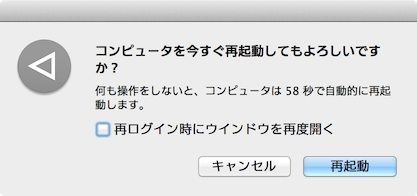
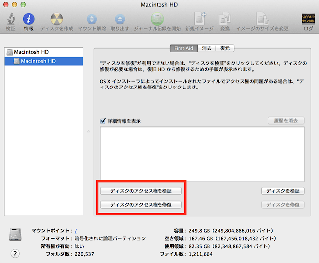
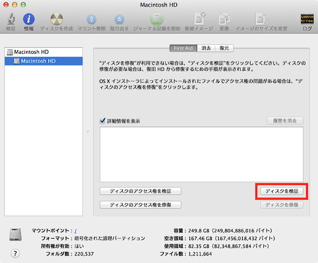

[@おったん](https://twitter.com/ottanxyz)です。Macのシャットダウンが遅くなりイライラしてしまったことはありませんか？また、Macの購入当初に比べて起動や停止に時間がかかるなあと思ったことはありませんか？そんなときに、見直してみたい項目についてまとめてみました。

## 「再ログイン時にウインドウを再度開く」を無効にする



システム終了時に表示されるダイアログの「再ログイン時にウインドウを再度開く」をチェックすると、現在起動しているアプリケーションの状態を保存する必要があるため、シャットダウンに時間がかかります。必要でなければオフにしておきましょう。

## マウントしているボリュームをアンマウントする


ディスクのマウント、アンマウントは時間のかかる作業です。システムのシャットダウン時に外部ディスクをマウントしていた場合、シャットダウン時にアンマウント処理を行う必要があり、必要以上に時間がかかります。不要なボリュームは事前にアンマウントしておきましょう。

## ディスクのアクセス権を修復する



誤ったアクセス権（所有者、パーミッション）が設定されている場合、システムの処理速度低下を招きます。これはシャットダウンのみならず、通常時の動作にも関わりますので、定期的に実行すると良いでしょう。

## ディスクの検証を行う



ディスクに損傷および不整合が発生していないか確認しましょう。ディスクの検証は、前述の「ディスクのアクセス権を修復」同様に、ディスクユーティリティで行います。

## 起動ディスクの設定を行う


BootCampなどに代表される複数のブートパーティションが存在する場合は、「起動ディスク」から「コンピューターの起動に使用したいシステム」を選択しておきましょう。複数のパーティションが存在する場合、Macは終了時、起動時にそれらを探しに行きますが、起動ディスクが設定されていればそれがなくなるため時間のロスが少なくなります。

## PRAMのリセットを行う

PRAM（Parameter Random-Access Memory）に保存されているシステムの情報をリセットしましょう。PRAMには起動ディスクに関連する設定が含まれています。これらをいったんリセットすることにより起動、停止が速くなるかもしれません。

<http://support.apple.com/kb/PH11243?viewlocale=ja_JP>

## カーネルキャッシュの再構築を行う

カーネル（macOSの根幹となるプログラム）の使用するシステムキャッシュを更新することで、システムの起動、および停止が速くなるかもしれません。システムキャッシュを更新するためには、ターミナルから以下のコマンドを実行します。

```bash
sudo kextcache -system-prelinked-kernel
sudo kextcache -system-caches
```

## デーモンのタイムアウト値を設定する

Bonjour環境を構築する「mDNSResponder」など、macOSを構成するプロセスについて、システム終了時に「待ち」が発生しシャットダウンを遅くする事例が報告されているそうです。

<https://forums.macrumors.com/threads/1589712>

これらのデーモンの処理終了時に強制終了されるまでのタイムアウト（待ち）時間はデフォルトで20秒となっていますが、これを短縮することでシステム停止にかかる時間が大幅に短縮される可能性があります。

タイムアウト値を変更するためには、ターミナルから以下のコマンドを実行します。有効になるのは次回起動時です。

```bash
sudo defaults write /System/Library/LaunchDaemons/com.apple.coreservices.appleevents ExitTimeOut -int 5
sudo defaults write /System/Library/LaunchDaemons/com.apple.securityd ExitTimeOut -int 5
sudo defaults write /System/Library/LaunchDaemons/com.apple.mDNSResponder ExitTimeOut -int 5
sudo defaults write /System/Library/LaunchDaemons/com.apple.diskarbitrationd ExitTimeOut -int 5
sudo defaults write /System/Library/LaunchAgents/com.apple.coreservices.appleid.authentication ExitTimeOut -int 5
```
