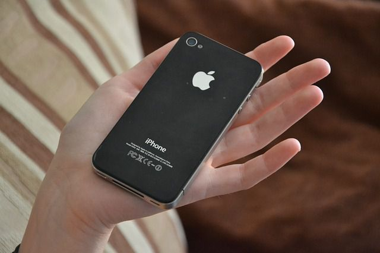
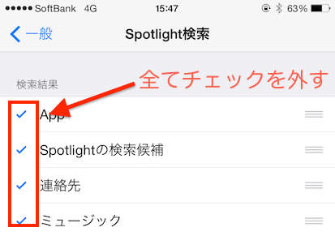
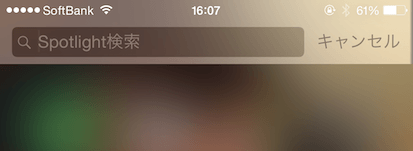
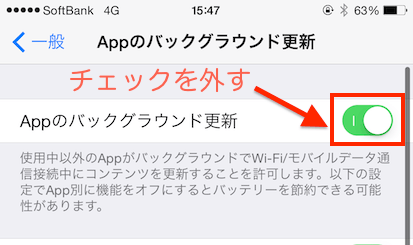
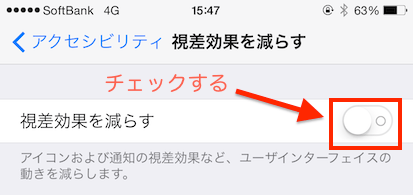
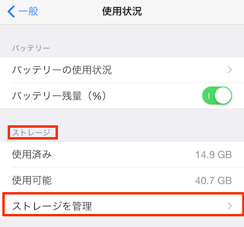

---
author:
- '@ottanxyz'
categories:
- iPhone
date: 2014-10-15 00:00:00+00:00
draft: false
tags:
- 視差
- バックグラウンド
- 効果
- 4s
- spotlight
title: iPhone4Sで快適にiOS8を使用するために見直したい項目
type: post
---

iPhone 6が発売された今、iPhone 4Sは随分前の過去のモデルとなってしまいました。それでもなお、iPhone 4Sを使用している人は多いのではないでしょうか。しかし、CPUのスペックも当時から大幅に向上しており、iPhone 4Sが対応している最新のOSであるiOS8を動作させるためには、やや心もとない状況です。そこで、今回はiOS8上でもiPhone 4Sを快適に動作させるための設定について考えてみました。要は使用していない機能を削ぎ落としてやればいいわけです。

今回ご紹介する方法はiPhone 4Sのみが対象というわけではありません。iPhone 6、iPhone 5についても同様の効果を得ることができますので、iPhoneの動きが鈍いなあと思ったら実践してみてください。

## Spotlight検索をオフにする

Spotlightは、iPhoneでの検索能力を向上させるためにバックグラウンドで独自のインデックスを構築します。Spotlight検索はiPhoneのホーム画面で下側に軽くタップすると表示されます。もし、この機能を使用していないのであれば、Spotlight検索をオフにしましょう。オフにすることでCPUやメモリの使用率を抑えることができます。

オフにするためには、「設定」→「一般」→「Spotlight検索」と進み、**Spotlightのチェックをすべて外します**。

## バックグラウンドの更新をオフにする

iOS7からアプリのバックグラウンド更新に関する緩和措置がとられ、ホーム画面に戻った後でもアプリはバックグラウンドで更新することができるようになりました。

バックグラウンドで動作するアプリが多いということは、それだけCPUやメモリを食い潰す可能性があります。バックグラウンドの更新をオフにした場合においても、iOS6までと同様にアプリを使用できます。

バックグラウンドで更新してくれた方が便利な場合もあります（ナビゲーションアプリなど）が、ここは思い切ってオフにしましょう。

バックグラウンドの更新をオフにするためには、「設定」→「一般」→「Appのバックグラウンド更新」で、「Appのバックグラウンド更新」のチェックを外します。

## 視差効果を減らす

iOS7からさまざまな視覚エフェクトが追加されています。半透明の通知センターやコンロとロールセンターであったり、アイコンをタップしたときのアニメーションであったりと。これらはすべて「視差効果」と呼ばれています。「視差効果」を快適に実現するためには、それなりのスペックのCPU、メモリが必要です。もし、まだまだ重いなあと感じる場合は、「視差効果」を減らしてみてください。

視差効果を減らすためには、「設定」→「アクセシビリティ」→「視差効果を減らす」で「視差効果を減らす」をチェックします。

## ストレージの容量を増やす

もし、ストレージの容量をぎりぎりまで使い込んでしまっている場合は、空き容量を増やしましょう。iOSの構造がどのようになっているかは定かではありませんが、限られたメモリ（RAM）を使用して複数のアプリを動かすためには、メモリ本体のみならずディスクも活用しているはずだからです。ディスクにメモリに保存しきれないアプリの状態を保存しようとしても、空き容量がなければそれも実現できません。ここで処理待ちが発生し動作が遅鈍になっている可能性があります。

どのアプリケーションがストレージの容量を食い潰しているかを確認するためには、「一般」→「使用状況」→「ストレージを管理」（ストレージ）と進みます。使用状況の数値が高く、使用していないアプリケーションがあれば削除してしまいましょう。

