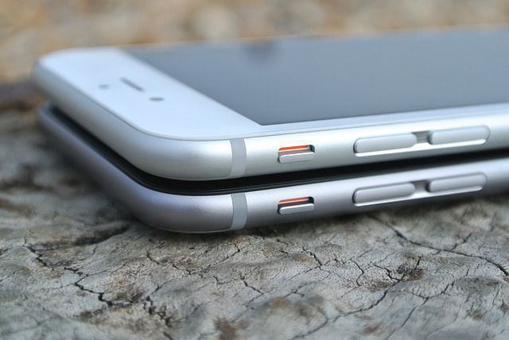
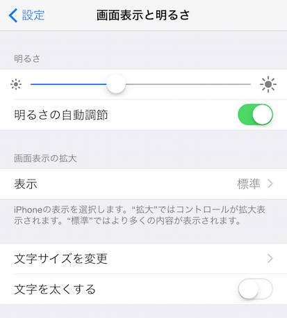

今回は iPhone のバッテリーを節約するための施策をご紹介します。ご紹介する施策以外に「使用していない場合は Wi-Fi をオフにする」「Bluetooth をオフにする」「機内モードにする」など、一般的によく言われる項目がありますが、あまり実用的ではないと考えられることから Tips としては割愛しています。もちろんオフにしたほうが多少バッテリーの節約になると思いますので、コントロールセンターからオン、オフを行ってください。

## iPhone のバッテリーを節約するための 4 つの Tips

### 画面の輝度を適切にする

**画面の輝度を適切に保つことはバッテリーを節約する上で非常に重要なファクターとなります**。画面の輝度は「設定」アプリの「画面表示と明るさ」から変更できます。

最大限輝度を小さくする（スライダーを左端にする）ことでバッテリーへの影響を最小限に抑えることができますが、周囲が明るい環境下（外出時の太陽光の下など）では画面が見づらくなってしまい実用的ではありません。

そこで、うまく使いたいのが**「明るさの自動調節」**です。オススメの方法は灯りの消えた暗い部屋に入った状態で「明るさ」を示すバーを左方向にスライドし、視認性が損なわれない程度の明るさに調節してみることです。また、その状態で周囲が明るい環境下でも問題ないかを確認します。少し暗すぎるなと思えばスライダーを右に動かしましょう。

最初のステップが完了すれば、後は iPhone が輝度を自動的に調節してくれます。輝度を最小限に抑えることだけがバッテリー節約に繋がるとは限りません。ぜひ「明るさの自動調節」を有効活用してください。

### 使い終わったら電源ボタンを押してスリープさせる

iOS8 からバッテリーの使用状況をより詳しく見ることができるようになりました。「設定」アプリの「一般」→「使用状況」→「バッテリーの使用状況」と進みます。ここでどのアプリケーションがもっともバッテリーを使用しているかを確認できます。

通常の使用方法をしている限り、常に上位を占めるのは**「ホーム/ロック画面」**です。ホーム画面、ロック画面を開いている状態が一番バッテリーを使用している状況ということになります。

そこで実践したいのが、**使用後は電源ボタンを押してスリープさせる**ということです。使い終わったら片付ける、普段の習慣とまったく同じです。スリープしている状態のほうがバッテリー消費を抑えることができます。

### アプリごとの通知方法を見直す

前述の「ホーム/ロック画面」のバッテリーにも関わってきます。「設定」アプリの「通知」を開くと、アプリごとの通知方法について確認できます。

たとえば、上図は Facebook の設定画面です。この中に「ロック画面に表示」という項目があります。Facebook から通知があった場合は、スリープ中の iPhone を起こしてロック画面に表示するということです。

本当にこの通知は必要でしょうか？わざわざスリープ状態から復帰させてまで通知が必要なものでしょうか？**ロック画面に表示させるということは、「ロック画面」がバッテリーを使用するということ**です。ポケットの中で知らず知らずのうちにロック画面に表示されているかもしれません。ロック画面を表示するだけで iPhone のバッテリーは消費されてしまいます。

そこで、メールやメッセージなど重要な項目を除き、**「ロック画面に表示」する項目を最小限に抑える**ことで iPhone のバッテリーを節約できます。ムダな通知がないかどうか改めて見直してみてはいかがでしょうか。

### アプリ毎のバックグラウンド更新可否を見直す

[iPhone、iPad、または iPod touch のマルチタスク機能とバックグラウンド処理について理解する - Apple サポート](http://support.apple.com/ja-jp/HT4211)にある通り、バックグラウンド更新は「バッテリーを節約するために、App のバックグラウンド更新は、Wi-Fi や電源に接続されているとき、App の使用中など、特定の時間帯に行われます」。

そのためバックグラウンド更新がオンの場合においても極端にバッテリーへの影響を与える可能性は低そうですが、バックグラウンド更新の恩恵を受けることのできるアプリケーションは限られています。本当に必要なアプリケーションのみに絞ることをオススメします。すべてのアプリケーションがバックグラウンドを必須としているわけではありません。

## まとめ

私が実践している 4 つの Tips をご紹介しました。その他、冒頭のサイトによると「Siri」をオフにすることでも、一定の効果が得られるそうです。「バッテリー節約」ばかりが気になると、iPhone の機能を十分に満喫することができません。節約するときは節約する、くらいの軽い気持ちで上記の TIps を実践してみてください。
