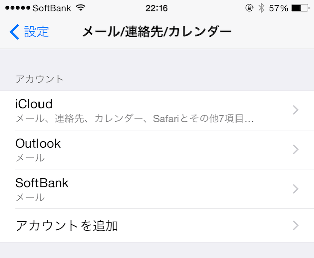
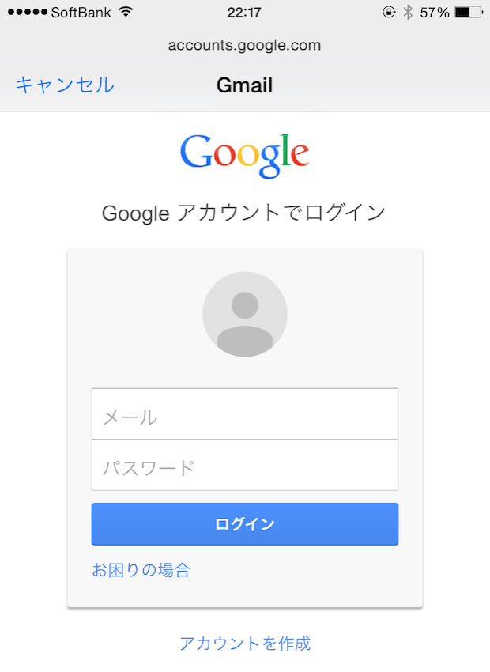
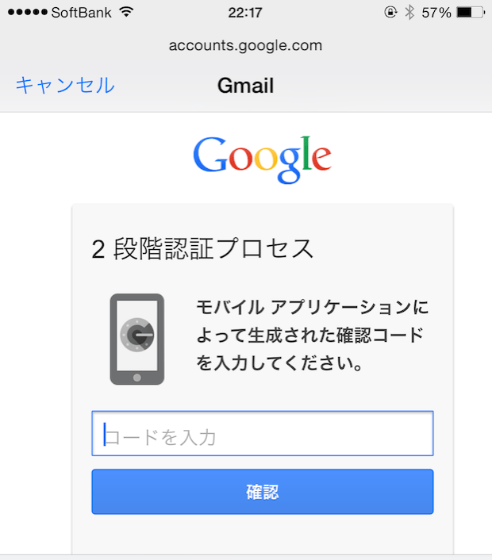
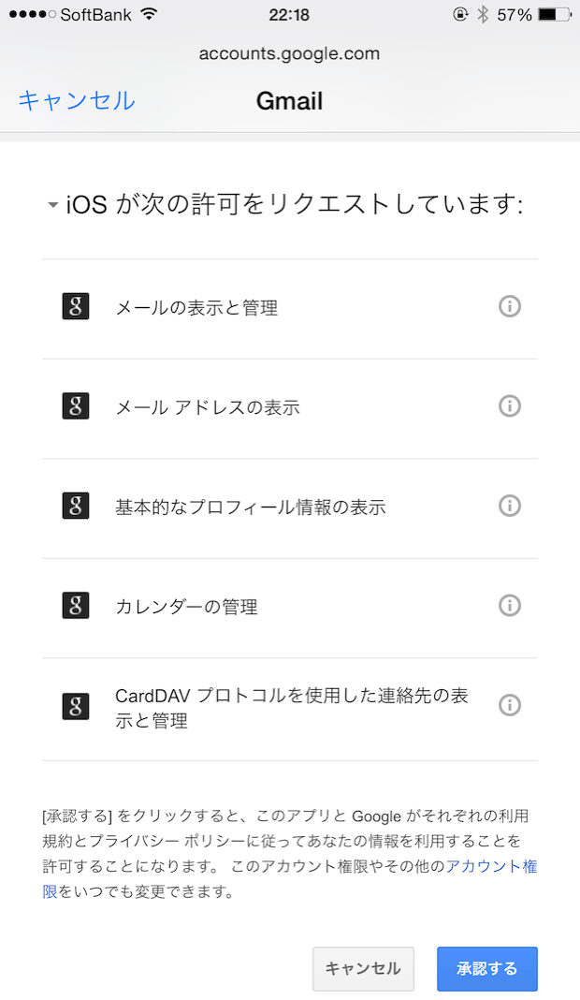
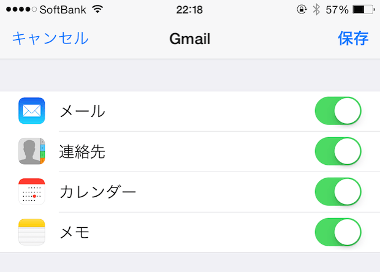
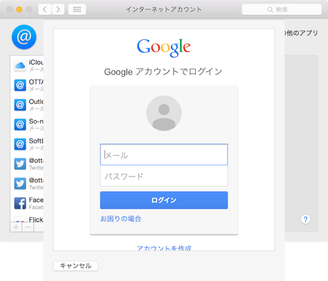
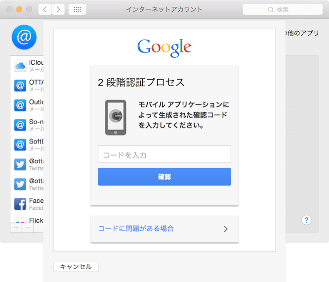

[Google アカウントの 2 段階認証を有効にする方法](/posts/2015/04/google-two-step-authentication-890/)でご紹介したように、Mac や iPhone のメールアプリケーションは、Google の 2 段階認証プロセスに対応していなかったため、アプリケーション固有のパスワードを生成し、管理する必要がありました。しかし、**macOS 10.10.3、iOS 8.3**へのバージョンアップにより、メールアプリケーションが 2 段階認証プロセスに対応しました。

## Google アカウントを設定する

### iPhone で Google アカウントを設定する

「設定」→「メール/連絡先/カレンダー」で、「アカウントを追加」をタップします。

「Google」をタップします。

従来とは異なり、Google アカウントの認証画面が表示されます。Google アカウントのメールアドレス、パスワードを入力します。

2 段階認証を有効にしている場合には、ワンタイムパスワードを入力します。

「承認する」ボタンをクリックします。

最後に同期する項目を選択したら、設定は完了です。お疲れ様でした。

### Mac で Google アカウントを設定する

「システム環境設定」から「インターネットアカウント」をクリックします。

「Google」をクリックします。

iOS 同様に Google アカウントのログイン画面が表示されるため、Google アカウントのメールアドレスとパスワードを入力します。

2 段階認証を有効にしている場合には、ワンタイムパスワードを入力します。

「承認する」ボタンをクリックします。

最後に同期する項目を選択したら、設定は完了です。お疲れ様でした。

## まとめ

従来は、Google アカウントの 2 段階認証プロセスを有効化している場合、わざわざ Google アカウントのアプリケーション固有のパスワードを設定する必要がありました。アプリケーション固有のパスワードについては、[Google アカウントの 2 段階認証を有効にする方法](/posts/2015/04/google-two-step-authentication-890/)を参照してください。

macOS 10.10.3、iOS 8.3 へのアップデートにより、アプリケーション固有のパスワードを入力する手間をようやく省くことができるようになりました。これで、Google アカウントの管理も一段と楽になるはずです。
