---
author:
- '@ottanxyz'
categories:
- Web
date: 2015-04-07 00:00:00+00:00
draft: false
tags:
- 2段階認証
- パスワード
- googleアカウント
- ワンタイムパスワード
- 固有
title: Googleアカウントの2段階認証を有効にする方法
type: post
---

Googleアカウントの2段階認証プロセスを有効化する方法をご紹介します。2段階認証プロセスとは、通常のログイン時のパスワードに加えて、ワンタイムパスワードと呼ばれる1回限りのパスワードを入力することで、アカウントのセキュリティを高めるために有効な方法です。

## Googleアカウントのセキュリティ強化

### 2段階認証を有効にする方法

Googleアカウントの2段階認証を有効にするためには、以下のリンクからGoogleアカウントにアクセスします。

<https://accounts.google.com/login?hl=ja>

「2段階認証プロセス」が「オフ」となっている場合は、クリックします。「オン」となっている場合には、すでに2段階認証が有効化されているため、設定の必要はありません。

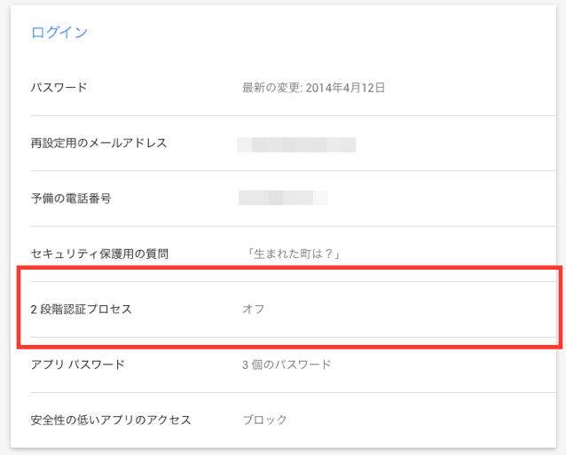

「設定を開始」ボタンをクリックします。

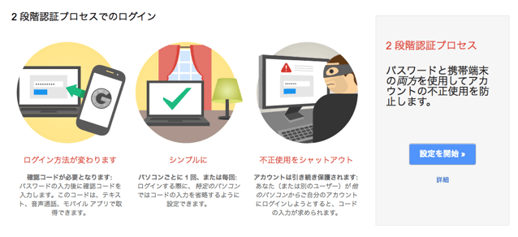

2段階認証のワンタイムパスワードを受け取るための、メールアドレスの設定を行います。値を入力したら、「コードを送信」ボタンをクリックします。

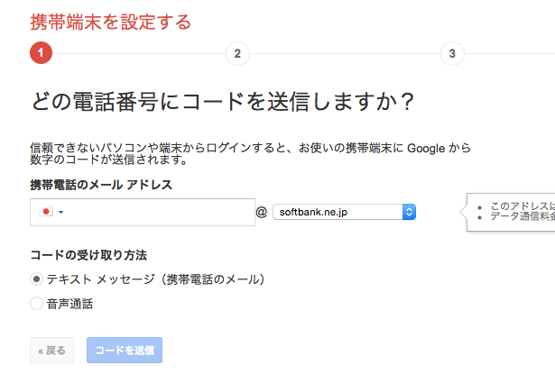

メールを受信したら、メールに記載されている確認コード6桁を入力します。確認メールが届かない場合は、キャリアの迷惑メール設定を確認してください。迷惑メールとしてブロックされている可能性がありますので、「**@google.com**」（後方一致）を受信できるように設定してください。

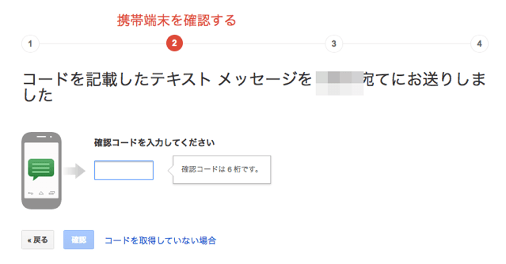

デフォルトのまま、「次へ」ボタンをクリックします。2段階認証プロセスを有効化すると、通常のパスワードの他に、ワンタイムパスワードが必要になりますが、信頼できるパソコン（ブラウザ）として登録しておくことで、次回以降のログイン時にワンタイムパスワードの入力の手間を省くことができます。

「確認」ボタンをクリックします。以上で、2段階認証プロセスの有効化の作業は完了です。

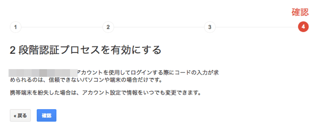

### アプリケーション固有のパスワードを設定する

Googleアカウントの2段階認証プロセスを有効にすると、ログイン時にワンタイムパスワードが必要になりますが、iPhoneやMacのメールなどアプリケーションによっては、ワンタイムパスワードそのものを入力する仕組みが用意されていないものがあります。

その場合は、通常のGoogleアカウントのパスワードとは別に、Googleが発行するアプリケーション固有のパスワードを使用します。このアプリケーション固有のパスワードを使い回すことはできませんので、使用するアプリケーションごとに発行する必要があります。

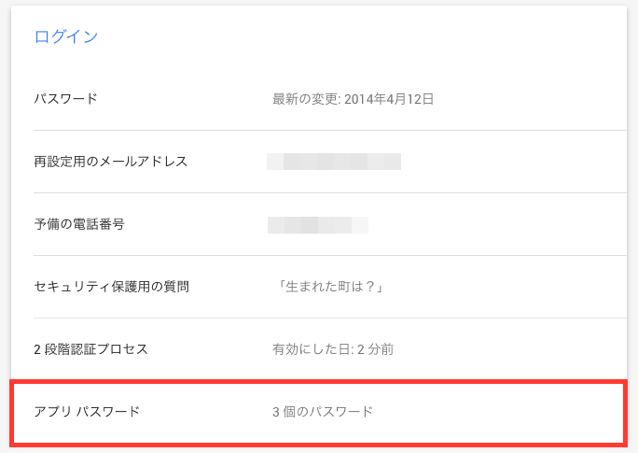

たとえば、「iPhone」の「メール」のパスワードを取得する場合には、以下のようにダイアログを設定し、「生成」ボタンをクリックします。

アプリケーション固有のパスワードが発行されます。この固有のパスワードを表示できるのは、生成時の1回のみです。パスワードを忘れてしまった場合には、再度、アプリケーションパスワードを設定してください。

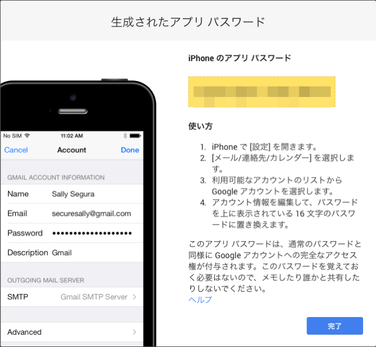

#### iPhoneのメールアプリにアプリケーションパスワードを設定する

「設定」→「メール/連絡先/カレンダー」と進み、「Gmail」のアカウントを設定します。

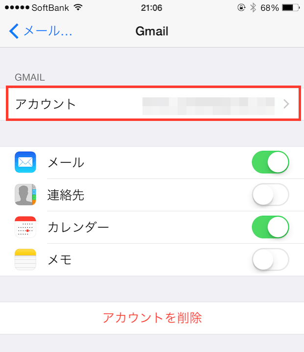

パスワードに先ほど生成したアプリケーション固有のパスワードを入力することで、iPhoneでもメールが受信できるようになります。

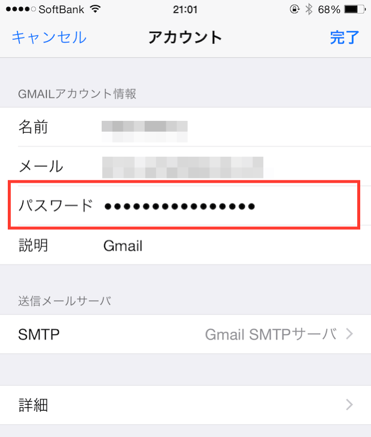

#### Macのメールアプリにアプリケーションパスワードを設定する

「システム環境設定」を開き、「インターネットアカウント」をクリックします。

Googleアカウントを選択したら、「詳細」ボタンをクリックします。

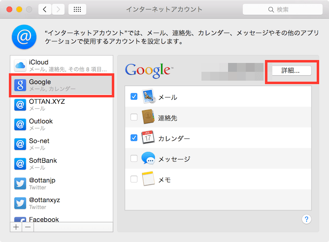

「パスワード」に、生成したアプリケーション固有のパスワードを入力してください。

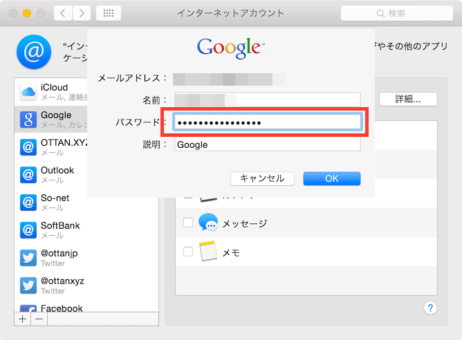

### ワンタイムパスワードの発行にモバイルアプリケーションを使用する

ワンタイムパスワードは、テキストメールではなくモバイルアプリケーションを使用して生成することもできます。その場合は、App Storeから専用のアプリケーションをダウンロードする必要があります。ここでは、Googleの「Google Authenticator」を使用する方法をご紹介します。



Googleアカウントにアクセスし、2段階認証プロセスをクリックします。「アプリに切り替え」ボタンをクリックします。

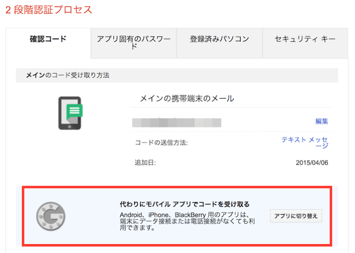

スマートフォンの種類を選択して、「次へ」をクリックします。

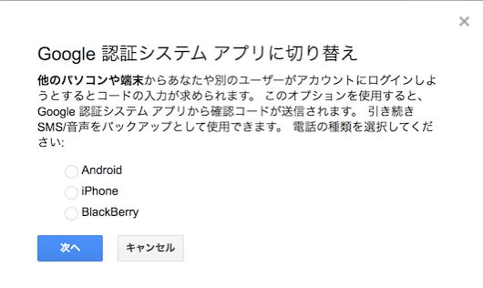

QRコードが表示されるため、「Google Authenticator」でQRコードを読み込みます。

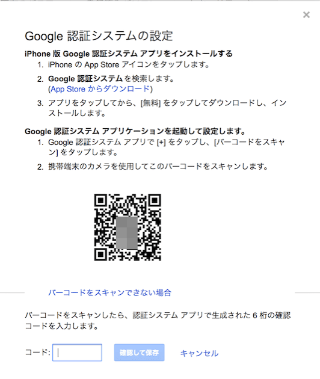

QRコードを正常に読み込めたら、Googleアカウントにログインするためのパスワードが表示されるようになります。これで、次回以降、2段階認証によるログインが必要な場合は、アプリケーションを使用してワンタイムパスワードを確認するようにしてください。

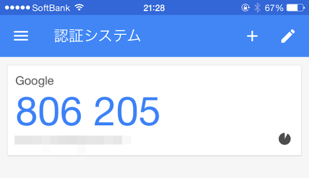

以上で、Googleアカウントの2段階認証プロセスは終了です。
