---
author:
- '@ottanxyz'
categories:
- iPhone
date: 2015-04-26 00:00:00+00:00
draft: false
tags:
- バッテリー
- オフ
- 位置情報
- iphone
- ネットワーク
title: iPhoneのバッテリーを劇的に改善する27の方法
type: post
---

利便性をとるか、バッテリーをとるか、あなたのライフサイクルに合わせて重要視するものが決まってくると思いますが、ここではiPhoneの利便性については一切無視して、バッテリーを最大限節約する方法をご紹介したいと思います。

## iPhoneのバッテリーを劇的に改善する26の方法

### ロック画面に表示する通知を減らす

「設定」→「通知」で、アプリケーションごとの通知の挙動を設定できますが、その中でも「ロック画面に表示」がオンになっている項目が多くないかどうか確認しましょう。この項目がオンになっていることで、iPhoneを使用していない場合においても、液晶画面がオンになりiPhoneのバッテリー消耗につながる可能性があります。

### フィットネス・トラッキングをオフにする

フィットネス・トラッキングは、歩数計や日々の活動量など、iPhoneに記録することができる便利な機能ですが、バッテリーを消耗する大きな原因になりかねません。使用していないようであれば、オフにしてしまいましょう。「設定」→「プライバシー」→「モーションとフィットネス」で設定できます。

### iPhoneでの通話を無効にする

iCloudアカウントに登録されているデバイスが近くにあり、Wi-Fiに接続されている場合に、たとえば、MacからiPhoneの携帯電話接続を利用して通話の発信、着信を行うことができる便利な機能が搭載されていますが、こちらもバッテリー消耗に繋がる可能性があります。「設定」→「FaceTime」→「iPhoneでの通話」をオフにしておきましょう。

### AirDropは必要な時だけ使用する

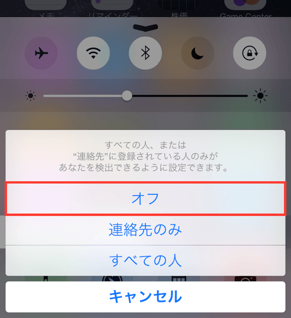

AirDropは、iOS、macOS同士で画像ファイルやURLをやり取りできる非常に便利な機能ですが、常時オンにしている場合、バッテリー消耗に繋がる可能性があります。AirDropを使用する機会がない（たとえば、オフィス）場合は、AirDropをオフにしましょう。AirDropは、コントロールセンターから簡単にオン、オフができます。

### Appのバックグラウンド更新を必要最低限に絞り込む

アプリケーションを使用していない間も、バックグラウンド更新を行うことで、情報を常に最新に保つことができるなど、「Appのバックグラウンド更新」は非常に便利な機能ですが、こちらもバッテリー消耗に繋がる可能性があります。「設定」→「一般」→「Appのバックグラウンド更新」をオフにするか、バックグラウンド更新を許可するアプリケーションを最小限に絞り込みましょう。

### iTunes & App Storeの自動ダウンロードを無効にする

iTunes Store、またはApp Storeで新規購入した項目を、他のデバイスに自動的にダウンロードできます。しかし、電波の悪い状態で自動的にダウンロードを行なった場合、非効率的で、かつバッテリー消耗の原因にもなります。電波の良い状態で、できればWi-Fiネットワークに接続されている状態でダウンロードできるようにしましょう。「設定」→「iTunes & App Store」から「自動ダウンロード」の項目をオフにしておきましょう。

### しつこい勧誘の電話は着信拒否する

毎日のようにかかってくる、たとえば勧誘の電話は拒否してしまいましょう。電話の着信中もiPhoneのバッテリーは消耗し続けています。「設定」→「電話」→「着信拒否設定」で、一度その電話番号を登録してしまえば、電話、メッセージ、FaceTimeの着信は一切無くなります。

### 利用頻度の高い位置情報を無効にする

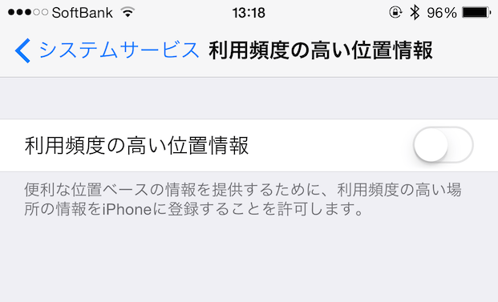

iPhone には、重要な場所を学習するために、最近行った場所のほかに、その場所に行く頻度や行った日時が記録されています。予測交通経路指定のようなユーザに合わせたサービスを提供する際に使われますが、位置情報の記録はバッテリー消耗に繋がる可能性があります。「設定」→「プライバシー」→「位置情報サービス」→「システムサービス」→「利用頻度の高い位置情報」をオフにしておきましょう。

### 位置情報共有をオフにする

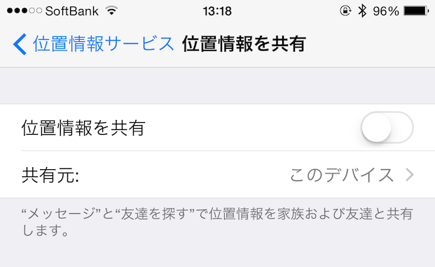

親しい友人と、位置情報を共有することで、コンサート会場や待ち合わせ場所を間違えることなく、その人が今どこにいるかを確認できますが、この機能はGPS情報、Wi-Fiネットワークを利用します。そのため、バッテリー消耗に繋がる可能性があります。「設定」→「プライバシー」→「位置情報サービス」→「位置情報を共有」をオフにしておきましょう。

### Handoffを無効にする

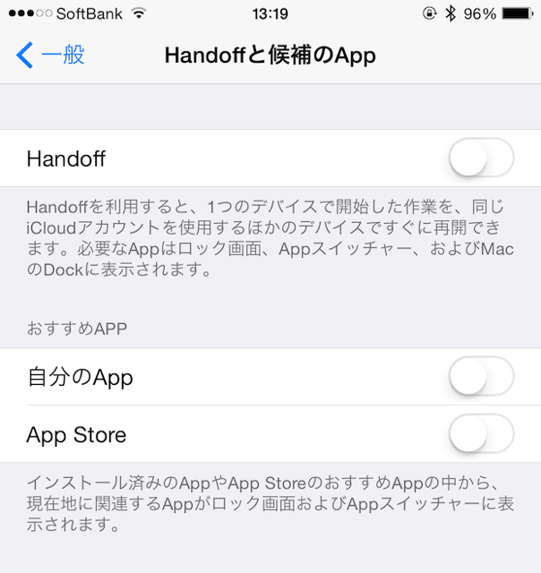

Handoffを利用すると、たとえばiPhoneで作成途中のメールをMacに引き継いで作業することができる、とても便利な機能ですが、バッテリー消耗に繋がる可能性があります。「設定」→「一般」→「Handoffと候補のApp」から「Handoff」「自分のApp」「App Store」をオフにしておきましょう。

### iTunes & App Storeの「モバイルデータ通信」を無効にする

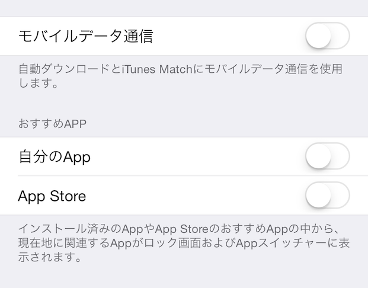

iTunes Store、またはApp Storeで購入した項目は、電波の悪いモバイルデータ通信ではなく、Wi-Fiに接続されている状態でダウンロードできるようにしておきましょう。また、「自分のApp」「App Store」の項目をオフにすることで、よりバッテリー節約につながる可能性があります。「設定」→「iTunes & App Store」から「モバイルデータ通信」、「自分のApp」「App Store」をオフにしておきましょう。

### iCloudで同期する項目を最小限にする

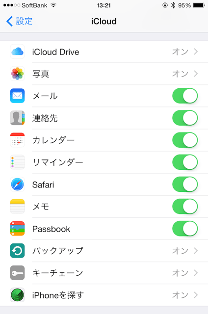

iCloudを利用すれば、iPhone、iPad、iPod touch、macOSで項目を同期できますが、すべての項目を同期する必要はありません。同期する項目を最小限に絞れば、バッテリー節約につながる可能性があります。「設定」→「iCloud」から必要な項目に絞り込みましょう。

### 視差効果を減らす

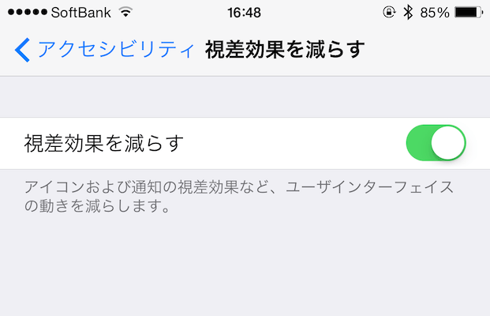

iOSでは、視差（パララックス）効果を利用して、ホーム画面とアイコンの間に奥行き感を演出しています。しかし、これはバッテリー消耗に繋がる可能性があるため、オプションをオフにしておきましょう。「設定」→「一般」→「アクセシビリティ」→「視差効果を減らす」でオンにします。

### Spotlight検索の対象を最小限にする

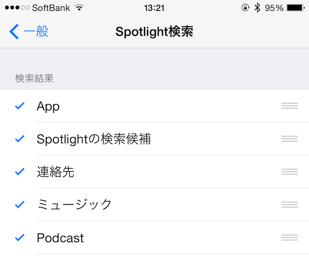

Spotlightは、iPhoneにおける検索を高速化するために、常にインデックスの作成を行っています。Spotlight検索の対象を絞り込むことにより、このインデックス作成のタスクが頻繁に行われなくなり、バッテリー節約に繋がる可能性があります。「設定」→「一般」→「Spotlight検索
」で、必要最小限の項目のみチェックしましょう。

### 明るさの自動調節をオンにする

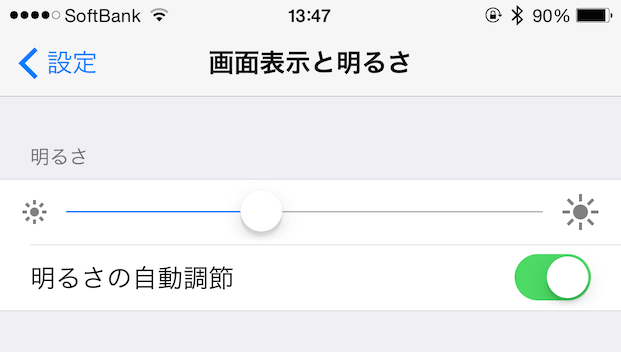

液晶画面の明るさの調節はiPhoneに任せてしまいましょう。ポイントは、真っ暗な部屋でiPhoneの状態が確認できる程度にスライダーの位置を調節し、あとは屋内、屋外でスライダーを動かし、液晶画面の明るさを微調整しましょう。「設定」→「画面表示と明るさ」→「明るさの自動調節」をオンにします。

### 壁紙の種類を静止画にする

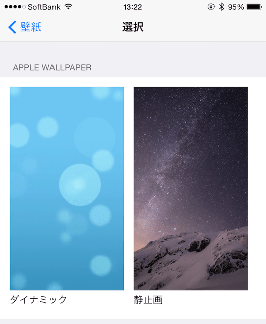

壁紙の種類には「ダイナミック」「静止画」の2種類があります。「ダイナミック」な壁紙はiPhoneの動作に応じて動的に姿を変えていきますが、「静止画」と比較するとバッテリー消耗が激しくなります。壁紙は「静止画」を利用しましょう。「設定」→「壁紙」→「静止画」を選択します。

### 位置情報に基づく情報をオフにする

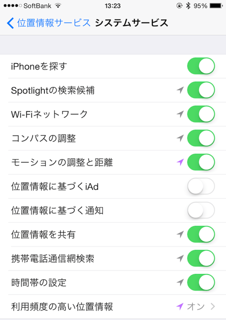

「位置情報に基づくiAd」は、位置情報に応じて最適なiAd（広告）を表示する機能、「位置情報に基づく通知」は、たとえばリマインダーアプリで位置情報に基づいて通知を行う機能です。バックグラウンドでGPSを使用し続けるため、バッテリー消耗に繋がる可能性があります。「設定」→「プライバシー」→「位置情報サービス」→「システムサービス」から「位置情報に基づくiAd」「位置情報に基づく通知」をオフにしておきましょう。

### Appleに診断データを自動送信しない

診断データと使用状況データを毎日Appleに自動的に送信することで、iPhoneの改善に繋がる可能性のある情報を提供することもできますが、情報の送信にはネットワークが使用されます。バッテリーの消耗を抑えるためには、こちらもオフにしておきましょう。「設定」→「プライバシー」→「診断/使用状況」で「送信しない」を選択します。

### メールの配信には「フェッチ」を使用する

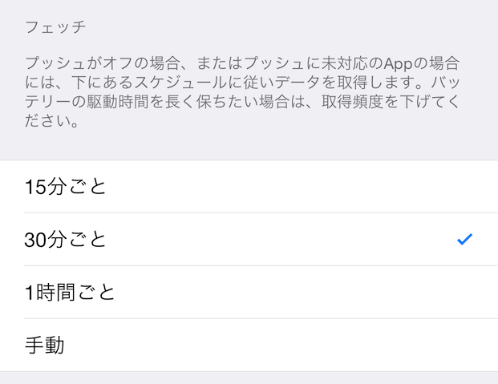

プッシュ型の電子メールは即座に情報を手に入れることができるため非常に便利ですが、メールサーバとのやり取りが頻繁に行われるため、バッテリー消耗に繋がる可能性があります。電子メールの配信方式には「フェッチ」を使用しましょう。間隔が長ければ長いほど良いでしょう。「設定」→「メール/連絡先/カレンダー」→「データの取得方法」から行います。

### 安定したWi-Fiネットワークに接続する

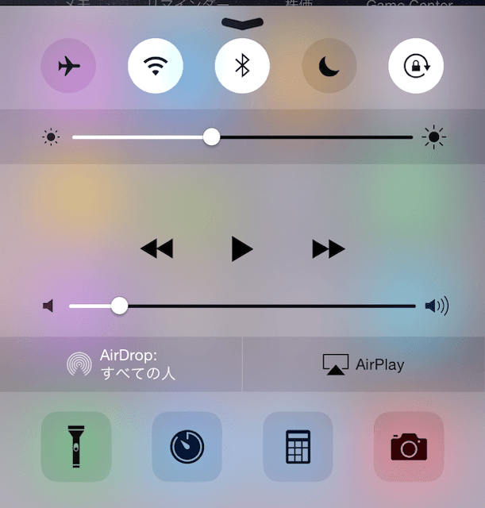

オフィスや家庭で安定したWi-Fiネットワークに接続できるのであれば、3GまたはLTE通信を使用せずに、Wi-Fiネットワークを積極的に利用するにしましょう。3GやLTEより、Wi-Fiネットワークに接続されている時間が長ければ長いほど、iPhoneのバッテリーは長持ちする傾向にあります。

### 必要に応じてWi-Fi、Bluetoothをオフにする

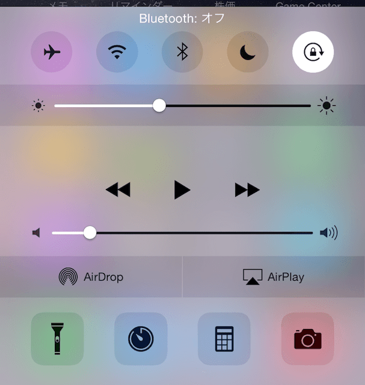

逆に、安定したWi-Fiネットワークが存在しない場合は、Wi-Fiをオフにしましょう。また、周囲にBluetoothで通信する機器がないのであれば
、合わせてBluetoothもオフにしておきましょう。

### 電波が悪い状態では機内モードを利用する

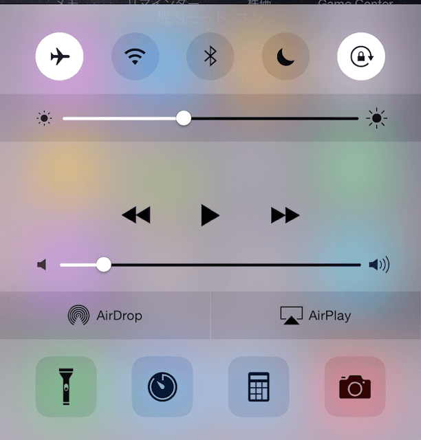

電波の状態が著しく悪く、ネットワークに接続できる環境にないのであれば、機内モードを使用するようにしましょう。余計な通信を抑えることができるため、バッテリー節約になります。

### 自動ロックをオンにする

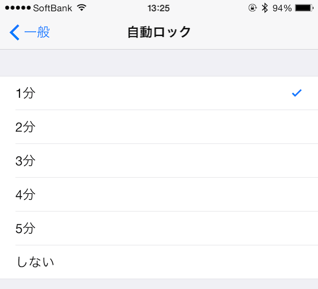

液晶画面が表示されている時間が短ければ短いほど、iPhoneのバッテリー節約に繋がります。自動ロックの機能を使用して、なるべく短い間隔で液晶画面をオフにするように心がけましょう。「設定」→「一般」→「自動ロック」から設定できます。

### バイブレーションをオフにする

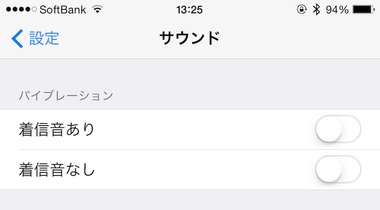

不必要なバイブレーションはバッテリー消耗に繋がります。バイブレーションが不要な場合は、オフにしてしまいましょう。「設定」→「サウンド」から、バイブレーションの項目の「着信音あり」「着信音なし」をオフにします。

### 常に最新のOSを使用する

最新のOSでは、新機能の追加のみならず、数多くのバグフィックスが行われています。できる限り最新のOSを使用するように心がけましょう。

### バッテリーの使用状況を確認する

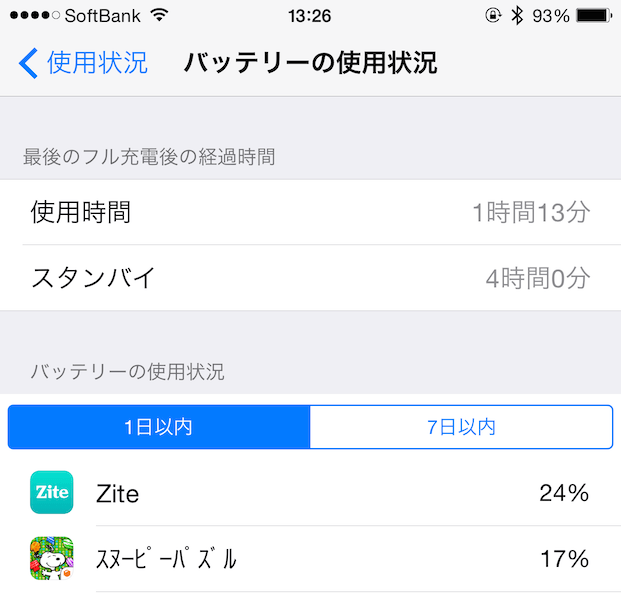

「設定」→「一般」→「使用状況」→「バッテリーの使用状況」から、どのアプリがバッテリーを消耗しているかの目安を知ることができます。アプリの使用方法を見直すことでバッテリー消耗が改善される可能性がありますので、定期的に使用状況を確認してみましょう。

### ネットワーク設定をリセットする

「設定」→「一般」→「リセット」→「ネットワーク設定をリセット」をタップします。Wi-Fiの接続情報などがすべてリセットされてしまうため、事前にネットワークの情報（SSIDやパスワードなど）は控えておきましょう。

## まとめ

利便性をとるか、バッテリーをとるか、それはあなたの決断次第です。今回ご紹介したTipsをすべて実行する必要はありません。この中から取捨選択し、自分に合ったiPhoneライフを見つけてくださいね。

## 参考リンク

http://www.zdnet.com/pictures/how-to-improve-your-iphone-ipad-battery-life-ios-8/