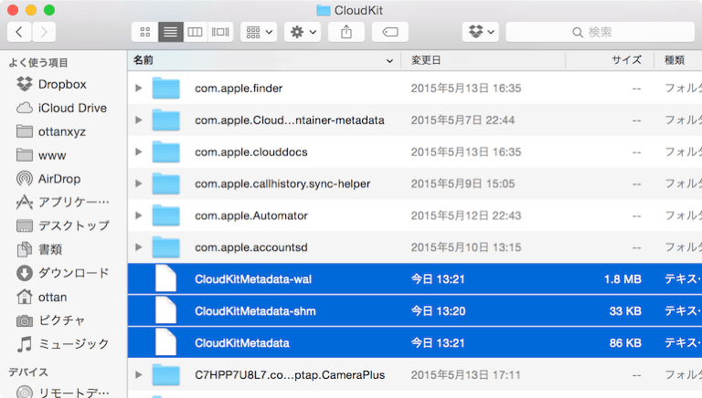

macOS Yosemiteを10.10.3にバージョンアップしてから、Finderの操作が異常に遅くなる問題が報告されています。もし、そのような状況に陥ってしまった場合には、以下の方法を試してみてください。

## clouddデーモンを再起動する

### GUIから操作を行う方法

Finderを開いて、⇧+⌘+Gを押して、`~/Library/Caches/CloudKit/`に移動します。名前でソートして、以下のファイルを削除してください。システムファイルの削除になるため、操作には十分注意してください。

  * CloudKitMetadata
  * CloudKitMetadata-shm
  * CloudKitMetadata-wal

次に、「アプリケーション」→「ユーティリティ」フォルダーのアクティビティモニター」を起動します。プロセス名でソートして、`cloudd`のプロセスを強制終了します。左上のアイコンをクリックして強制終了してください。以上で操作は完了です。

### ターミナルから実行する方法

ターミナル（CUI）の操作に慣れている場合は、以下の方法が簡単です。ターミナルを開いて、以下のコマンドを実行してください。

    $ rm ~/Library/Caches/CloudKit/CloudKitMetadata*;killall cloudd

## 参考リンク

http://osxdaily.com/2015/04/17/fix-slow-folder-populating-cloudkit-macosx/
