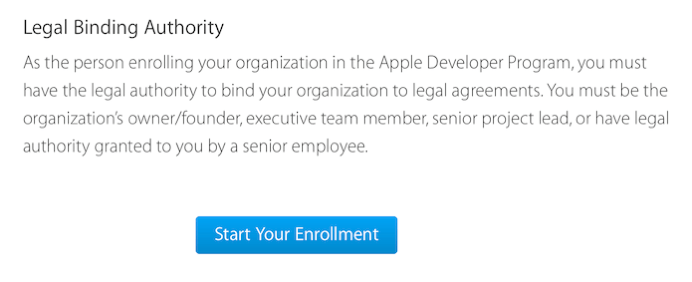
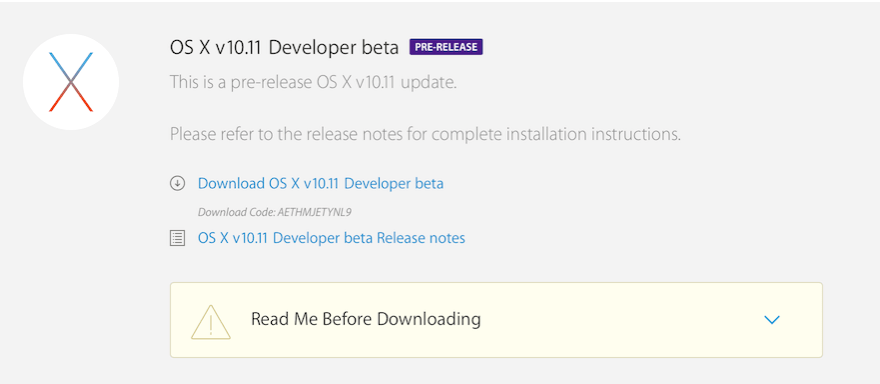

---
author:
- '@ottanxyz'
categories:
- Mac
date: 2015-06-12 00:00:00+00:00
draft: false
tags:
- capitan
- el
- usbメモリ
- ディスク
- macos
title: macOS 10.11 El Capitan（β版）の起動ディスク（USBメモリ）を作成する方法
type: post
---

WWDCにて、新しいmacOS、El Capitanが公開されました。とくに、日本語入力については、まったくもって新しい革新的なエンジンが搭載されているなど、Macユーザにとっては眉唾ものです。いつでもインストールできるように、起動ディスクを作成する準備をしておきましょう。

## macOS 10.11 El Capitanの起動ディスクを作成する方法

今回は、USBメモリを使用してEl Capitanの起動ディスクを作成する方法をご紹介します。なお、USBメモリには、8GB以上の空き容量が必要です。

### Developer Centerに登録する

macOS 10.11 El Capitanは、まだβテストの段階であるため、通常のユーザーはダウンロードすることができません。開発者登録を行う必要があります。年間、$99必要です。

<https://developer.apple.com/programs/enroll/>

ウィザードの内容にしたがって、開発者登録を行ってください。

### macOS 10.11 El Capitanをダウンロードする

以下のリンクから、macOS 10.11 El Capitanをダウンロードしてください。

<https://developer.apple.com/osx/download/>

### USBドライブを初期化する

次に、「アプリケーション」→「ユーティリティ」フォルダーの「ディスクユーティリティ」を起動します。8GB以上のUSBメモリを指定したら、フォーマットは「Mac OS 拡張（ジャーナリング）」、名前は任意（後で使用します）で入力したら、「消去」ボタンをクリックしてください。これで準備完了です。

### 起動ディスクを作成する

次に、「アプリケーション」→「ユーティリティ」フォルダーの「ターミナルを起動して、以下のコマンドを実行してください。XXXXXには、ディスクユーティリティで指定したUSBメモリの名前を指定します。

    sudo /Applications/Install\ OS\ X\ 10.11\ Developer\ Beta.app/Contents/Resources/createinstallmedia --volume /Volumes/XXXXX --applicationpath /Applications/Install\ OS\ X\ 10.11\ Developer\ Beta.app --nointeraction

成功すると以下のように表示されます。

    Erasing Disk: 0%... 10%... 20%... 30%...100%...
    Copying installer files to disk...
    Copy complete.
    Making disk bootable...
    Copying boot files...
    Copy complete.
    Done.

以上で起動ディスクの作成は完了です。クリーンインストールしたい場合は、この起動ディスクを使用するようにしましょう。
