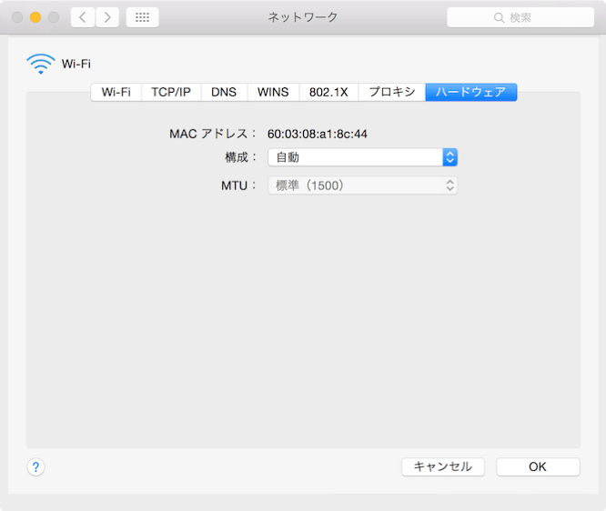

Macで頻繁にWi-Fiネットワークから切断されてしまう、もしくは速度が出ない問題については、ネットワーク構成に問題のあることが大半です。ここではチャンネルの干渉の見分け方から、ネットワーク構成の見直しまで、よくある問題に対して取り組みます。

なお、管理人の環境（NURO 光 G2 Vコース）で測定した内容は以下の通りです。無線接続にしては十分な値を確保しているといえるのではないでしょうか。

| 測定値 |            |
| ------ | ---------- |
| 下り   | 276.13Mbps |
| 上り   | 121.27Mbps |

<http://www.speedtest.net/>

## Wi-Fiスキャン機能を使って最適なチャンネルを見つける

意外に知られていませんが、macOS Yosemiteにも無償でネットワーク診断アプリが付属してます。Finder上で、⇧  + ⌘ + G を押して「/System/Library/CoreServices/Applications」と入力してください。

アプリケーションが起動したら、「ウインドウ」メニューから「スキャン」を起動します。これでようやく目的のアプリケーションまで辿りつけました。

チェックポイントは以下の通りです。

-   現在接続しているWi-Fiネットワークは、他のネットワークと同一のチャンネルを使用していないか（干渉しあっていないか）
-   現在接続しているWi-Fiネットワークの強度（RSSI）とノイズの差は十分か

### Wi-Fiネットワーク同士のチャンネルの干渉について

Wi-Fiネットワークが利用できる周波数帯は、2.4GHz、5GHz帯問わず有限です。とくに、2.4GHzで使用できる周波数帯は少ないため、よくチャンネルの取り合いになっていることが多いです。**Wi-Fi診断アプリケーションの右下に最適なチャンネルが表示されている**ため、もし干渉が起こっている場合は今すぐこちらのチャンネルに乗り換えるよう無線LANの設定を見なおしてみましょう。

### Wi-Fiネットワークの強度

Wi-Fiネットワークの強度は「RSSI」[^1]と呼ばれ、**一般的に安定した電場の供給を受けるには-59dBm以上必要**、と言われています。目安は以下の通りです。

[^1]: Received signal strength indication：受信信号強度。

| RSSI        | 電波の強さ   |
| ----------- | ------------ |
| -39dBm以上  | かなり強い   |
| -49〜-40dBm | 強い         |
| -59〜-50dBm | 普通         |
| -79〜-60dBm | 弱い         |
| -80dBm以下  | 接続しにくい |

もし、受信信号強度がカテゴリ「弱い」にあてはまるようでは安定した接続ができません。Wi-Fiネットワークは他の家電や壁など家の構造の影響を受けやすいため、無線LANの親機の位置の見直し、もしくは中継器の購入を視野に入れましょう。外部サイトになりますが、[無線LANをパワーアップ | BUFFALO バッファロー](http://buffalo.jp/products/catalog/network/wirelesspowerup/powerup_03.html)のページがわかりやすいです。

#### ノイズについて

「RSSI」（受信信号強度）が十分でも、「ノイズ」の値が大きいと十分な恩恵を受けられない可能性があります。一般的に**「RSSI」と「ノイズ」の差が-25dBm以上であれば良い**とされていますので、こちらも参考にまで。

## ネットワーク構成を初期化する

Wi-Fiネットワークから頻繁に切断される場合は、Mac自身に問題がある可能性も考えられます。

### 対策①：ネットワーク構成を再構成する

一番手っ取り早いのは、ネットワーク構成を再構成する方法です。ネットワーク構成を再構成する方法は、[MacでWi-Fiの速度が出ない、繋がらないなど、調子がおかしい時に試したい5つの対処法](/posts/2015/05/mac-wi-fi-1143/)を参照してください。

### 対策②：MTUの値を見直す

MTUとは送受信できる最大の通信量（パケットサイズ）です。あなたのMacは、Wi-Fiネットワークを司るルーターに対して、ルーターの限界を超えて通信しようとしているかもしれません。Macからルーターに対して以下のコマンドを実行してみてください。IPアドレスは仮であるため、適宜変更してください。正常に応答が返ってくるでしょうか。

    $ ping -D -s 1472 192.168.1.1

もし、「ping: sendto: Message too long」と表示されるなら、送信したサイズ（1472byte）は、ルーターにとっては大きすぎる値だったのかもしれません。値を下げて、何回も繰り返しチャレンジしてください。**安定する数値 + 28が最適なMTU値**です。

Macでは自動的にMTUが1500に設定されています。もし、1500を下回る場合は、値を変更することをオススメします。

### 対策③：それでもダメならOSのシステムファイルを初期化する

もし、上記で改善できない場合は、Finderから以下のファイルを削除しましょう。削除する場合には管理者権限のパスワードを求められます。誤って他のシステムファイルを削除しないように注意してください。システムファイルの削除については、[MacでWi-Fiの速度が出ない、繋がらないなど、調子がおかしい時に試したい5つの対処法](/posts/2015/05/mac-wi-fi-1143/)を参照してください。具体的には下記の3つのファイルになります。

-   com.apple.airport.preferences.plist
-   com.apple.captive.probe.plist
-   com.apple.network.eapolclient.configuration.plist
-   com.apple.wifi.message-tracer.plist
-   NetworkInterfaces.plist
-   preferences.plist

削除後に、OSを再起動し再びネットワーク設定を行います。

## まとめ

その他にも、そもそもルーター機器やMacが古くパフォーマンスを発揮できない、といった問題も考えられます。もう何年も使っていて寿命だなあと思って一度買い替えてみると、思わぬ体験をすることがあります。ご質問、ご意見等ありましたらコメント欄、または[@おったん](https://twitter.com/ottanxyz)までお待ちしています。
