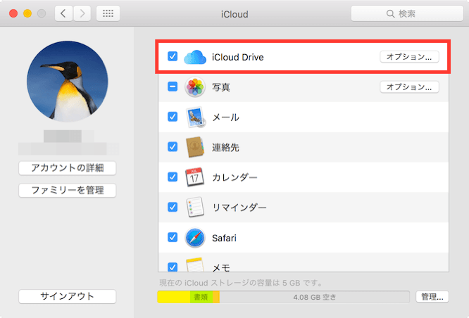
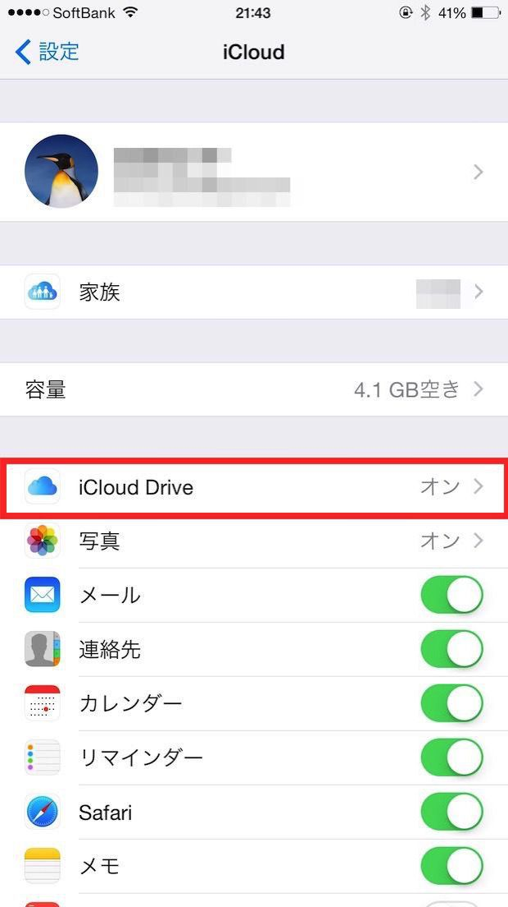

---
author:
- '@ottanxyz'
categories:
- iPhone
- Mac
date: 2015-06-20 00:00:00+00:00
draft: false
tags:
- 辞書
- icloud
- ユーザ
- drive
- dictionaries
title: macOSとiOSでユーザ辞書が同期されない場合の対処法
type: post
---

iOSとmacOSでユーザ辞書が同期されない場合の対処法をご紹介します。非常に簡単な手順で同期できるようになりますので、お試しください。

## macOSとiOSでユーザ辞書を同期する方法

macOSとiOSでユーザ辞書が同期できない問題は、iCloud Drive、およびiCloud Drive上に保存されているユーザ辞書に問題があります。macOSとiOSでiCloudの状態を確認しましょう。

### iCloud Driveがオンであることを確認する

MacとiPhoneでiCloud Driveがオンであることを、各々確認します。

#### Mac

「システム環境設定」→「iCloud」から「iCloud Drive」がオンであることを確認してください。

#### iPhone

「設定」アプリを開き、「一般」→「iCloud」から「iCloud Drive」がオンであることを確認します。

### macOSとiOSでユーザ辞書を同期する

Macで、「アプリケーション」→「ユーティリティ」→「ターミナル」を起動し、以下のコマンドを実行します。Finderには表示されないため、すべてターミナルで操作します。まず、既存のユーザ辞書をバックアップします。

    $ cd ~/Library/Mobile\ Documents/com\~apple\~TextInput/
    $ mv Dictionaries Dictionaries_bak

ここで一度、MacとiPhoneを再起動します。

再起動が完了したら、再び先ほどのユーザ辞書のバックアップを元に戻します。Macで、「アプリケーション」→「ユーティリティ」→「ターミナル」を開き、以下のコマンドを実行します。

    $ cd ~/Library/Mobile\ Documents/com\~apple\~TextInput/
    $ mv Dictionaries_bak Dictionaries

再び、MacとiPhoneを再起動します。

これで、macOSとiOSの辞書が同期されるようになります。iOSとmacOSが同期されない場合は、是非試してみてください。

## まとめ

ユーザ辞書が同期されない問題は、iCloud Drive、およびiCloud Drive上に保存されているユーザ辞書に問題があります。いったん、ユーザ辞書を初期化してMacとiPhoneを再起動することで、再び同期されるようになります。なお、環境によって差異があることがありますので、ご注意ください。