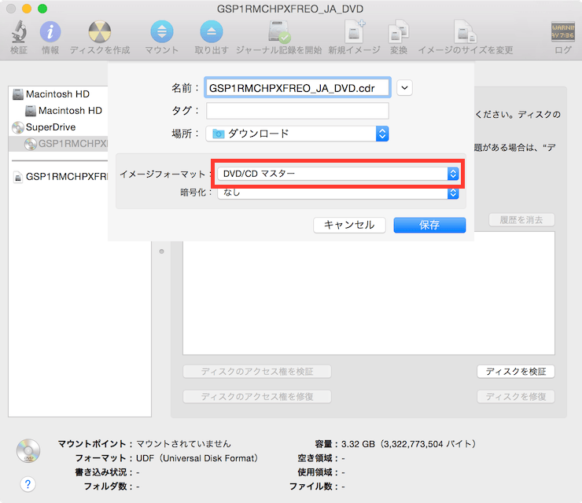

---
author:
- '@ottanxyz'
categories:
- Mac
- Windows
date: 2015-07-31 00:00:00+00:00
draft: false
tags:
- iso
- メディア
- イメージファイル
- ディスクユーティリティ
- インストール
title: MacでWindowsのインストールメディア（DVD）からイメージファイル（ISO）を作成する方法
type: post
---

Boot Camp環境にWindows 10 Previewをインストールしたまま放置していたら、ビルド番号が古すぎて最新版にアップデートすることもできませんでした。そこで、Boot Camp環境を初期化し、Windows 7を再インストールしようとしたところ、Windows 7のISOファイルが手元にないことに気付き、インストールメディアからISOファイルを作成することにしました。今回はその方法をご紹介したいと思います。

## ディスクユーティリティでイメージファイルを作成する

方法はとても簡単です。macOSに標準で具備されている「ディスクユーティリティ」を使用するだけです。インストールメディアを挿入した状態で、「アプリケーション」→「ユーティリティ」フォルダーの「ディスクユーティリティ」を起動します。

「ディスクユーティリティ」を起動したら、インストールメディアを選択した状態で「新規イメージ」をクリックします。名前は任意で構いません。イメージフォーマットを「DVD/CD マスター」に変更して「保存」ボタンをクリックしてください。

ISOファイルを作成するには10分程度の時間がかかりますので、気長にお茶を飲みながら待ちましょう。

最後にでき上がったイメージファイルの拡張子を「.cdr」から「.iso」に変更するだけです。以上でイメージファイル（ISOファイル）の作成は完了です。とても簡単に作成することができました。いざという時に覚えておくと、とても便利ですよ！

