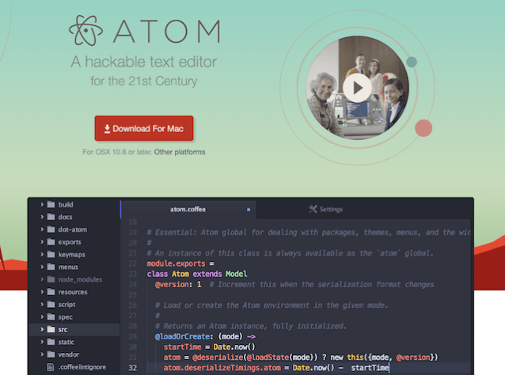

---
author:
- '@ottanxyz'
categories:
- Mac
- Windows
- Blog
date: 2015-08-25 00:00:00+00:00
draft: false
tags:
- apm
- atom
- install
- linter
- php
title: WordPress開発のためにAtomに導入しておきたい最低限のプラグイン8選
type: post
---

GitHub 謹製のエディター「Atom」、バージョンアップによる機能追加、バグ修正を重ね、「Sublime Text」と並ぶくらいに多機能で使いやすいエディターです。どちらを使用するかは好みが分かれますが、「Atom」は「Sublime Text」と比較し GUI が充実しているなど、優れている点も多いです。この際に、ぜひ使用してみてください。

さて、今回はこの「Atom」で WordPress の「テーマ」や「プラグイン」を開発するために欠かせない、「Atom」の「パッケージ」（プラグイン）をご紹介します。ここでご紹介するのは最低限必要であろうと思われるパッケージです。これがすべてではありませんのでご承知おきください。

## 最低限導入したい Atom のプラグイン 8 選

それでは、ここから順を追ってご紹介していきたいと思います。

### A Color Picker for Atom

右クリック 1 つで、好きな色を選択してさまざまな形式で貼り付けることのできるパッケージです。公式パッケージのリンクの動画をご覧になっていただければ、すぐに使い方が理解できると思います。

https://atom.io/packages/color-picker

インストールは、以下のコマンドを実施します。

    $ apm install color-picker

### Emmet plugin Atom editor

Emmet は、コーディングにはもはや欠かせないツールとなりつつあります。

https://atom.io/packages/emmet

インストールは、以下のコマンドを実施します。

    $ apm install emmet

### Minimap package

ソースコードの全体を俯瞰するためのミニマップを表示してくれるツールです。ソースコードが長い場合、今自分がどのあたりを修正しているのかが一発でわかります。

https://atom.io/packages/minimap

インストールは、以下のコマンドを実施します。

    $ apm install minimap

### atom-beautify

HTML, CSS, JavaScript, PHP, Python, Ruby, Java, C, C++, C#, Objective-C, CoffeeScript, TypeScript, SQL など、さまざまな言語でか書かれたソースコードを整形してくれるツールです。

https://atom.io/packages/atom-beautify

インストールは、以下のコマンドを実行します。

    $ apm install atom-beautify

#### PHP

atom-beautify を使用するためには、あらかじめインストールしておかなければならないツールが存在します。HTML や CSS はインストールの必要はありませんが、WordPress 開発の要、PHP で書かれたソースコードを整形するためには、あらかじめ「PHP CS Fixer」をダウンロードしておく必要があります。

インストールは、以下のコマンドを実行します。

    $ brew install homebrew/php/php-cs-fixer

「PHP CS Fixer」の「CS」は「Coding Standard」の略です。文字通り、コーディングスタンダードに則り、PHP のソースコードを整形してくれるツールです。

### Linter

「Linter」自体はこれからご紹介する、さまざまなパッケージ群を動作させるためのベースでしかありません。「Lint」とはソースコードのチェックを行うプログラムのことです。「Linter」はそのベースとなるパッケージです。

https://atom.io/packages/linter

インストールは、以下のコマンドを実行します。

    $ apm install linter

また、Atom でチェック可能なソースコードは、以下のリンク先から確認可能です。ただし、パッケージを導入しただけでは動作せず、あらかじめローカル環境に、各言語の「Linter」用のプログラムを用意しておく必要があります。

https://atomlinter.github.io/

#### CSS

インストールには、「npm」（Node Package Manager）が必要です。「npm」については、[はじめての gulp.js！Mac で CSS ファイル、JavaScript の圧縮を行おう](/posts/2014/09/gulp-css-sass-268/)で詳しくご紹介していますので、そちらをご覧ください。

インストールは、以下のコマンドを実行します。

    $ apm install linter-csslint
    $ npm install -g csslint

「CSS Lint」は、CSS で書かれたソースコードの誤りを指摘してくれるツールです。

#### HTML

インストールには、「Homebrew」が便利です。「Homebrew」については、[Mac でプレゼン資料に数式を貼り付けるのに便利な「LaTeXiT」](/posts/2014/09/mac-latex-presentation-92/)で詳しくご紹介していますので、そちらを参照してください。

インストールは、以下のコマンドを実行します。

    $ apm install linter-tidy
    $ brew install tidy-html5

「Tidy HTML5」は、W3C の開発した、HTML5 で書かれたソースコードの誤りを指摘してくれるツールです。

#### JSON

JSON 形式のファイルを使用することは滅多にありませんが、外部システムとの連携の際によく使用されるため、念のためインストールしておきましょう。

インストールは以下のコマンドを実行します。

    $ apm install linter-jsonlint
    $ npm install -g jsonlint

#### JavaScript

JavaScript の Linter は 4 種類用意されています。普段愛用しているパッケージのみを選択しても良いですし、すべて導入して良いとこ取りしてみるのも良いかもしれません。ここは使いながらカスタマイズしてみてください。ここではインストール方法のみを列挙しておきます。

JavaScript の構文解析の定番、JSHint をインストールするためには以下のコマンドを実行します。

    $ apm install linter-jshint
    $ npm install -g jshint

JSCS は「JavaScript Code Style cheker」の略称で、こちらも JSHint 同様に JavaScirpt の構文解析を行ってくれます。

    $ apm install linter-jscs
    $ npm install -g jscs

続いて、ESLint は独自の構文解析ルールを追加することができるなど、JSHint や JSLint に比べて柔軟性が高いツールです。[JavaScript - ESLint についてのメモ - Qiita](http://qiita.com/makotot/items/822f592ff8470408be18)のページが参考になります。

    $ apm install linter-eslint
    $ npm install -g eslint

最後に「Closure Linter」のご紹介です。これは、Google 社の[Closure Linter  |  Google Developers](https://developers.google.com/closure/utilities/#what-is-the-closure-linter)にしたがって構文解析を行ってくれる、Google 社謹製ツールです。Google に愛を注ぎ込みたい場合は、ぜひ使用してみてください。

ただし、インストールには、Python のパッケージマネージャーソフトウェアである「pip」が必要になります。あらかじめ、「easy_install」コマンドを使用して、「pip」をインストールしておいてください。

    $ apm install linter-gjslint
    $ sudo easy_install pip
    $ sudo pip install https://github.com/google/closure-linter/zipball/master

インストール途中で、下記のような行が表示され停止した場合は、P キーを押したあと、↵ キーを押してください。

    (R)eject, accept (t)emporarily or accept (p)ermanently? p

続いて「linter-flow package」のご紹介です。といってもこの記事を書くまで知りませんでした。どのような機能を具備しているのかわかりませんが、興味のある方は使用してみてください。

    $ apm install linter-flow
    $ brew install flow

続いて、ご紹介するのは、「linter-js-standard」です。といっても…「standard」「semistarndard」「happiness」の 3 種類のスタイルから選ぶことのできるのが特徴のようです。

    $ apm install linter-js-standard
    $ npm install -g standard
    $ npm install -g semistandard
    $ npm install -g happiness

最後にご紹介するのは「linter-xo」こちらもこの記事を書くまで知りませんでした。どのような機能を具備しているのかわかりませんが、興味のある方は使用してみてください。

    $ apm install linter-xo
    $ npm install -g xo

#### PHP

PHP にも 2 種類のパッケージが用意されています。まず、はじめに「PHP」がインストールされていれば問題なくすぐ利用できるのが「linter-php」です。PHP で書かれたファイルに対して、「php」コマンドに「-l」オプションを付与すると、構文チェックを行ってくれますが、それを Atom 上で実現するのがこのパッケージです。

    $ apm install linter-php

次にご紹介するのは、PEAR で開発された PHP の構文解析ツール「PHP CodeSniffer」です。インストールするためには、「pear
」コマンドがインストールされている必要があります。

    $ apm install linter-phpcs
    $ sudo pear install PHP_CodeSniffer

##### PEAR がインストールされていない場合

「pear」コマンドをインストールするためには、以下のコマンドを実行します。「wget」がすでにインストール済みの場合は、最初のコマンドを実行する必要はありません。

    $ brew install wget
    $ wget http://pear.php.net/go-pear.phar
    $ sudo php -d detect_unicode=0 go-pear.phar

以下のような表示でインストールが止まってしまった場合には、そのまま ↵ キーを押してください。

     1. Installation base ($prefix)                   : /usr
     2. Temporary directory for processing            : /tmp/pear/install
     3. Temporary directory for downloads             : /tmp/pear/install
     4. Binaries directory                            : /usr/bin
     5. PHP code directory ($php_dir)                 : /usr/share/pear
     6. Documentation directory                       : /usr/docs
     7. Data directory                                : /usr/data
     8. User-modifiable configuration files directory : /usr/cfg
     9. Public Web Files directory                    : /usr/www
    1.  Tests directory                               : /usr/tests
    2.  Name of configuration file                    : /private/etc/pear.conf

    1-11, 'all' or Enter to continue:

また、以下のような表示でインストールが止まってしまった場合も同様です。↵ キーを押してください。

    Current include path           : .:
    Configured directory           : /usr/share/pear
    Currently used php.ini (guess) :
    Press Enter to continue:

最後にご紹介するのは、「linter-phpmd」です。「PHPMD」は「PHP Mess Detector」の略称です。PHP で書かれたソースコードにメスを入れ、潜在的なバグになりそうな箇所や実装上の問題を指摘してくれる、少し毛色の異なるツールです。こちらも、インストールには「pear」コマンドが必要です。

    $ apm install linter-phpmd
    $ sudo pear channel-discover pear.phpmd.org
    $ sudo pear channel-discover pear.pdepend.org
    $ sudo pear install --alldeps phpmd/PHP_PMD

#### SASS/SCSS

SASS や SCSS のチェックには、「scss-lint」を使用します。インストールするためには、以下のコマンドを実行してください。

    $ apm install linter-scss-lint
    $ sudo gem install scss_lint

### file-icons

file-icons は、プロジェクトのツリー上に表示されているファイルを、わかりやすくしてくれる、痒い所に手が届くパッケージです。インストールしておいて損はないでしょう。

https://atom.io/packages/file-icons

インストールは以下のコマンドを実行します。

    $ apm install file-icons

### css-comb package

CSSComb の Atom 版です。[【便利ツール】CSScomb for sublime text 2 で、CSS プロパティを整理・整頓【16 日目】 ｜ Developers.IO](https://dev.classmethod.jp/tool/csscomb/)のページで詳しく紹介されています。

https://atom.io/packages/css-comb

インストールは以下のコマンドを実行します。

    $ apm install css-comb

### WordPress Core API Support

WordPress のコードを補完してくれるパッケージです。

https://atom.io/packages/wordpress-api

インストールは、以下のコマンドを実行します。

    $ apm install wordpress-api

## まとめ

今回ご紹介したパッケージは、あくまで「最低限」に絞ったものです。「Atom」には上記以外にもさまざまなパッケージが存在します。こんな便利なパッケージがあった、こんな使い方があったなどあれば、ぜひ[@おったん](https://twitter.com/ottanxyz)まで教えてくださいね。