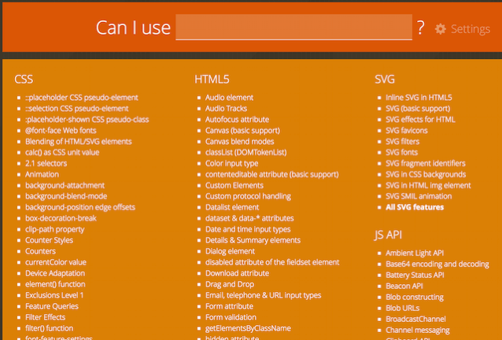
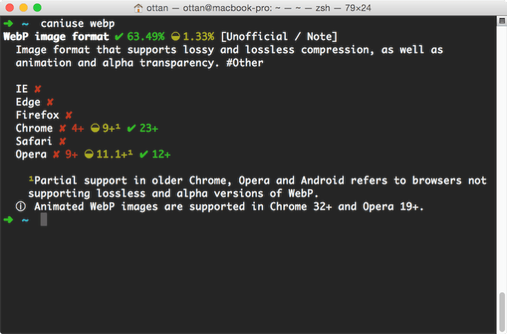
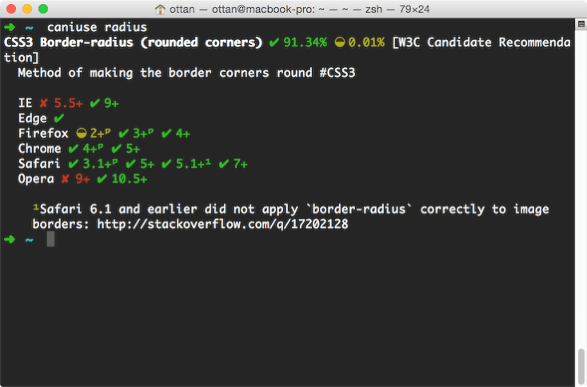
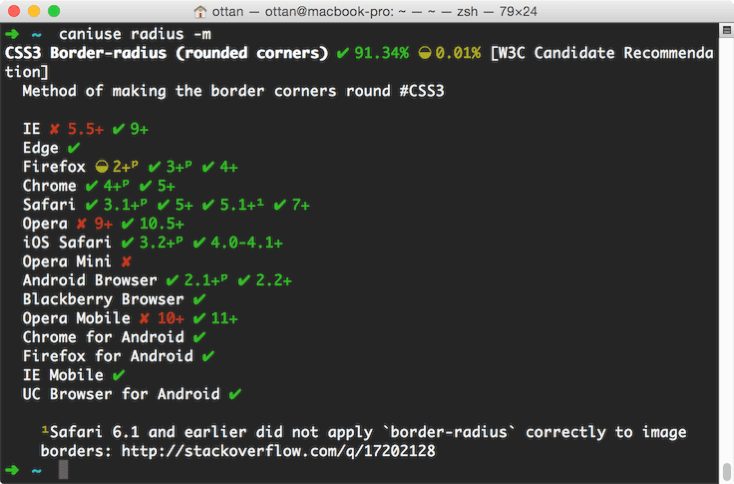

---
author:
- '@ottanxyz'
categories:
- Mac
- Web
- Blog
date: 2015-08-12 00:00:00+00:00
draft: false
tags:
- コマンドライン
- css3
- ブラウザ
- border
- html5
title: Webデザイナー必見！CSS3のブラウザの対応状況をコマンドラインで確認できる「caniuse-cmd」
type: post
---

[Can I use... Support tables for HTML5, CSS3, etc](https://caniuse.com/)といえば、CSS3 や HTML5 のブラウザの対応状況をブラウザで教えてくれる便利なツールですが、コマンドラインで確認できるツールが登場したのでご紹介します。

## HTML5、CSS3 のブラウザの対応状況を CUI で調査

インストールは、「npm」コマンドにより行います。

    npm install -g caniuse-cmd

「npm」によるパッケージ管理については、[はじめての gulp.js！Mac で CSS ファイル、JavaScript の圧縮を行おう](/posts/2014/09/gulp-css-sass-268/)で詳しくご紹介していますので、こちらを参照してください。

### 使用方法

使用方法は以下の通りです。*XXXXX*は、調べたいコードを入力します。

    caniuse XXXXX

たとえば、Google が開発し話題となった静止画フォーマットである、WebP（ウェッピー）を調べたい場合は、「XXXXX」に「webp」と入力します。

Google Chrome は、バージョン 9 以上でベンダープレフィックス付きで対応、バージョン 23 以上でベンダープレフィックス無しで完全対応していることがわかります。逆に、IE や Firefox には対応していません。

調べたいコードは、部分的に入力しても構いません。たとえば、「border-radius」について調べたい場合は、「XXXXX」に「radius」と入力するだけで、「border-radius」について調べることができます。シェア 91.34%のブラウザで対応済み、シェア 0.01%のブラウザでベンダープレフィックス付きで対応していることもわかります。

オプションで「-m」をつけると、モバイルブラウザについて調べることもできます。先ほどの「border-radius」について調べてみると、Opera Mobile はバージョン 11 以上、iOS の Safari はバージョン 4 以上で完全に対応していることがわかります。

オプションで「-web」をつけると、結果をコマンドラインではなく、Can I Use の結果をブラウザで表示してくれます。

## まとめ

「あのプロパティは、ブラウザに対応していたかな」と、ちょっと思った時に、気軽にコマンドラインから調べられるので便利ですね。なお、このコマンドは Can I Use のデータベースをローカルで参照しているため、最新情報を入手するためには、定期的にアップデートするようにしましょう。アップデートが必要な場合は、コマンドラインで実行した際に警告してくれます。（Caniuse data is more than 30 days out of date! Consider updating: npm install -g caniuse-cmd）1 か月に 1 回程度が目安です。アップデート方法はインストール時と同様です。

    npm install -g caniuse-cmd
