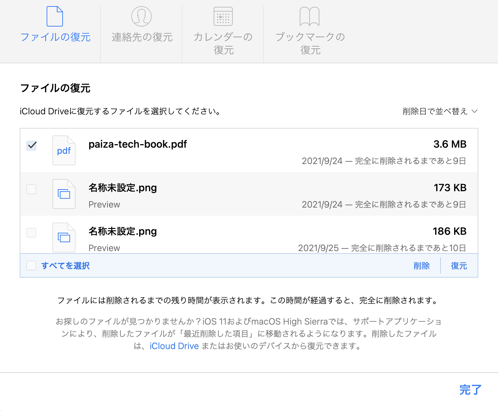

{}
2021年10月16日時点の情報にもとづき、記事を更新しました。
{}

iCloud.comでは、誤って削除した連絡先、カレンダー、ブックマーク、ファイルの復元ができます。

## iCloudで誤って削除したファイルを復元する

以下のリンクをクリックします。

<https://www.icloud.com/>

iCloudのホーム画面が表示されます。今回は、「iCloud Drive」を選択します。

iCloudに保存されているファイルを選択し、ゴミ箱のアイコンをクリックして、ファイルを意図的に削除します。

### 誤って削除したファイルを復元する

では、先ほど削除したファイルを復元してみましょう。iCloud.comのトップ、もしくは左上のメニューから「アカウント設定」をクリックします。

「アカウント設定」画面の最下部に、「詳細設定」があります。「詳細設定」の「ファイルの復元」をクリックします。

「ファイルの復元」タブで、復元したいファイルを選択し、「復元」をクリックすれば、復元できます。

### 連絡先を復元する

連絡先、カレンダー、ブックマークの復元方法は、ファイルの復元方法と多少異なります。連絡先、カレンダー、ブックマークを復元する場合は、前回のバックアップ時刻への復元になります。リアルタイムで復元できるわけではありませんので、誤って削除しないように心がけましょう。

### カレンダー、ブックマークを復元する

カレンダー、ブックマークも連絡先と同様です。前回のバックアップ時刻への復元になります。

## まとめ

iCloud.comで、カレンダー、ブックマーク、連絡先、任意のファイルの復元ができます。Dropboxのようにバージョン管理まではできませんが、誤って削除した場合にはある程度の復元ができますので、ぜひ試してみてくださいね。
