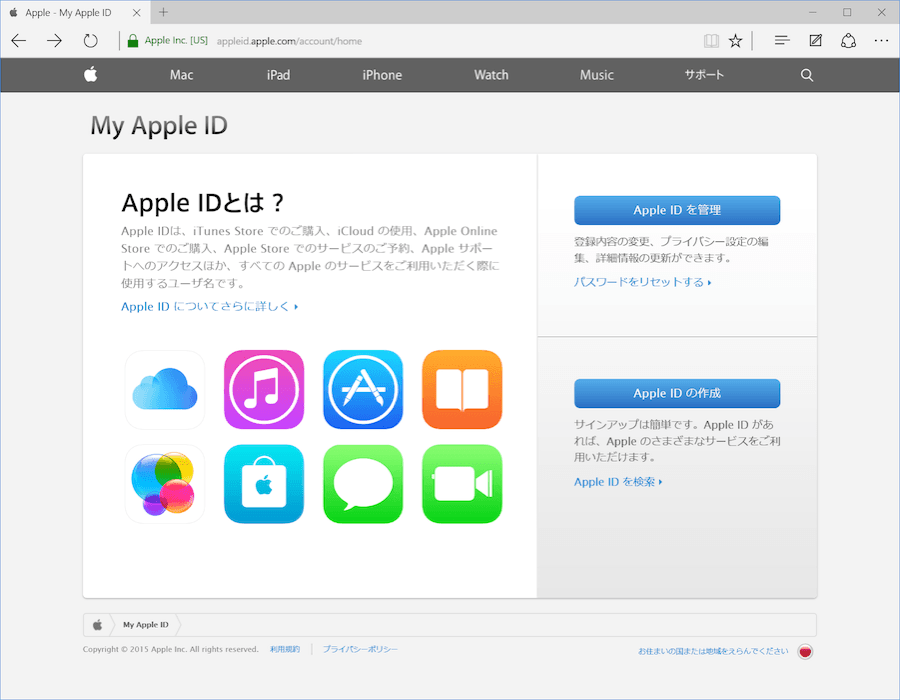
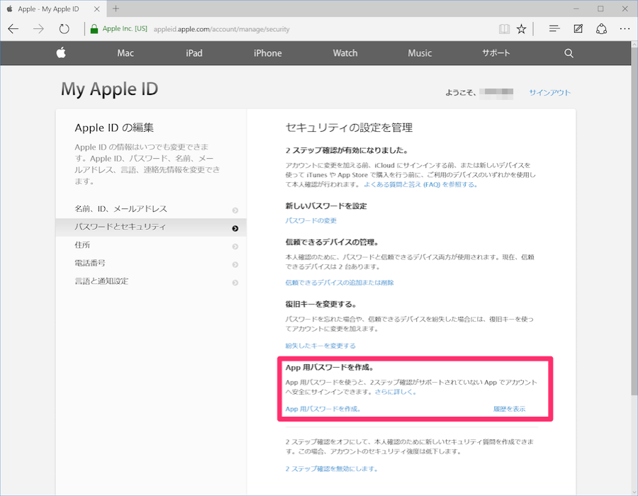
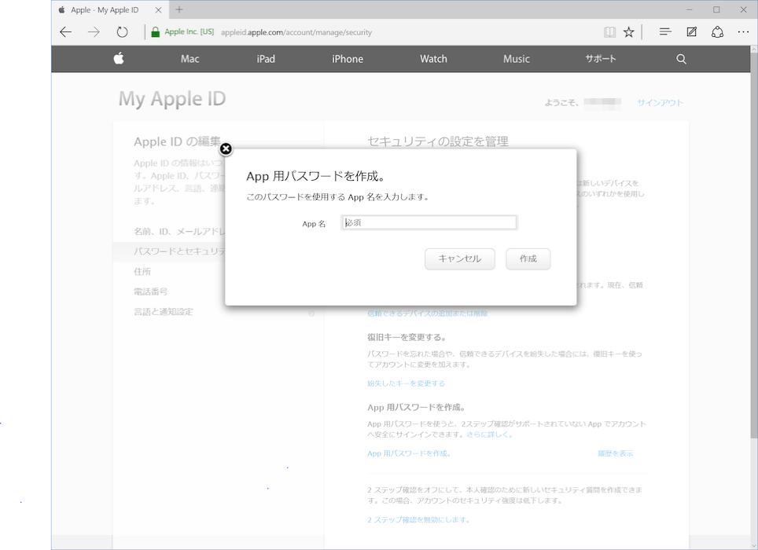
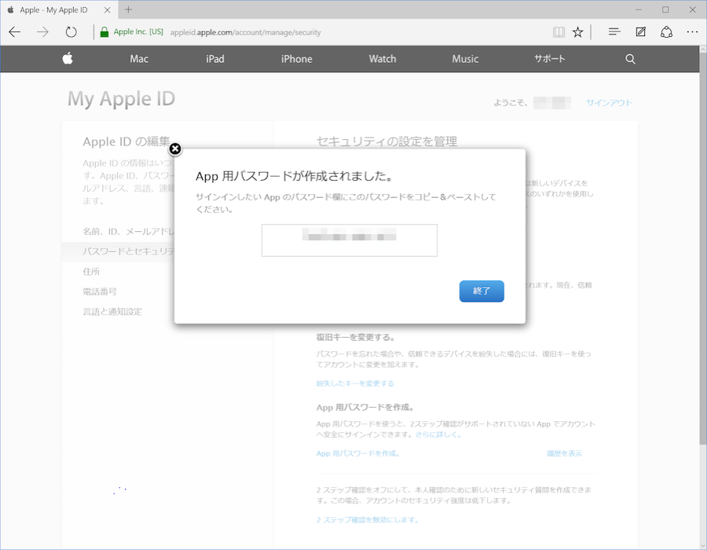
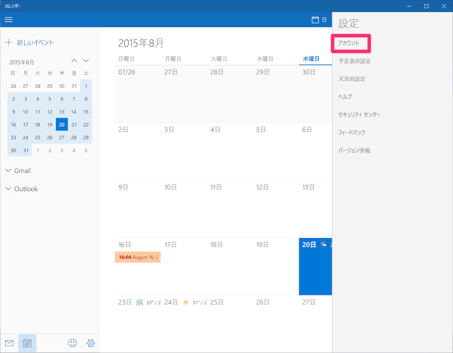
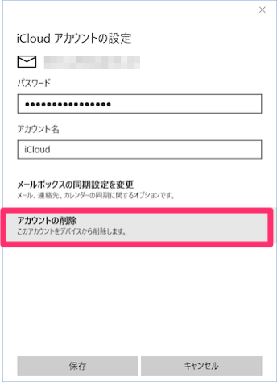
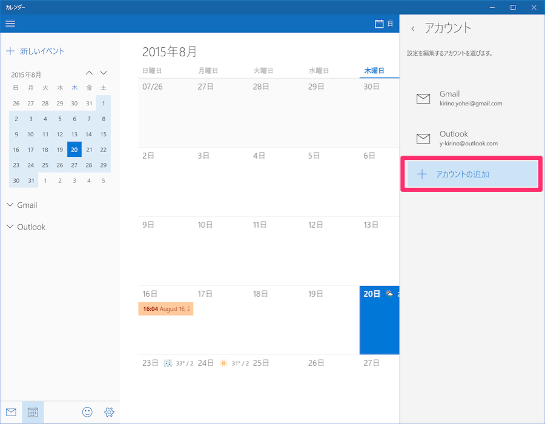
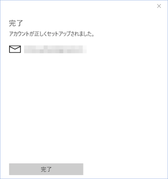
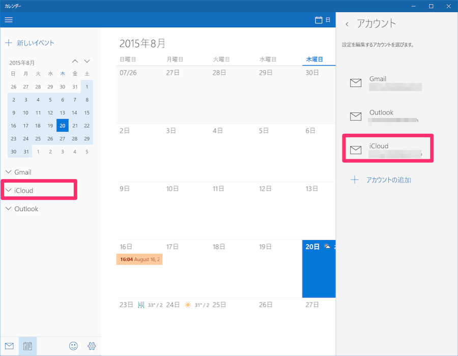

Windows 10から標準でiCloudがサポートされるようになりました。カレンダーやメールなどの標準アプリでiCloudがサポートされるようになったため、iCloudアカウントのみ別管理、という状況からようやく打破できるようになったのですが…。

## カレンダーやメールにiCloudアカウントが同期されない

正しいApple IDとパスワードを入力し、アカウントにiCloudアカウントが正常に追加されているにもかかわらず、カレンダーやメールにiCloudアカウントが表示されない、という問題が発生することがあります。たとえば、下図ではカレンダーアプリにiCloudアカウントを追加していますが、左側のメニューには「iCloud」が表示されていません。

### 問題の根源はApple IDの2段階認証

Apple IDの2段階認証（パスワードとワンタイムパスワードによる認証）を行っている場合、上記の現象が発生します。原因は、Windows 10の標準アプリが、Apple IDの2段階認証に対応していないからです。（Googleアカウントは2段階認証に対応しています）そこで、Windows 10でカレンダーやメールアプリにiCloudアカウントを追加したい場合は、アプリケーション固有のパスワードの発行が必要になります。

#### アプリケーション固有のパスワードを発行する

まず、以下のリンクにアクセスしましょう。

https://appleid.apple.com/jp/

「Apple IDを管理」をクリックします。

サイドメニューから「パスワードとセキュリティ」を選択し、「App用パスワードを生成」の「App用パスワードを作成」をクリックします。

アプリケーションに任意の名称を付与します。たとえば、「iCloud for Windows 10」など分かりやすいものにしておくと良いでしょう。

App用パスワードが表示されます。このApp用パスワードは二度と表示されませんのでコピーしておきましょう。コピーを忘れてしまった場合は、再度App用パスワードを作成してください。

#### 既存のiCloudアカウントを削除する

カレンダーアプリを例に説明します。左下の歯車アイコンをクリックし、サイドメニューの「アカウント」をクリックします。

iCloudアカウントを選択し、「アカウントの削除」をクリックします。

#### iCloudアカウントを追加する

左下の歯車アイコンをクリックし、サイドメニューの「アカウント」をクリックします。「アカウントを追加」をクリックしましょう。

「iCloud」をクリックします。

Apple IDとパスワードをたずねられますので、Apple IDと**2段階認証で生成したApp固有のパスワード**を入力します。正常に完了すると、「アカウントが正しくセットアップされました」と表示されます。

これでiCloudアカウントもカレンダーアプリに追加されるようになりました。

## まとめ

今回の問題がわかりづらい点として、**通常のApple IDとパスワードでセットアップが完了してしまう**、という点があります。2段階認証を使用している場合も、通常のパスワードでセットアップが完了してしまうため、いつまで経っても同期されず困ってしまいました。Windows 10のアップデートで、iCloudの2段階認証に対応してもらえることを祈りましょう。
