---
author:
- '@ottanxyz'
categories:
- iPhone
date: 2015-09-03 00:00:00+00:00
draft: false
tags:
- デジタル
- アナログ
- 通知センター
- ウィジェット
- clock
title: 無料でいいの？！ランチャー系のアプリはもう不要！CPU使用率から明日の天気予報までなんでもありのウィジェット「Vidgets」
type: post
---

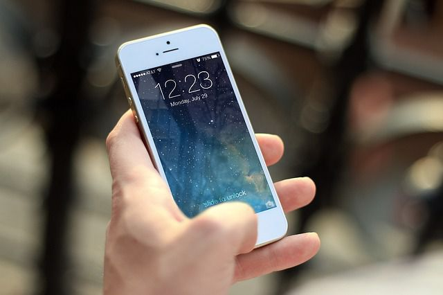

「これが無料でいいの！？」と思わせるくらい多機能なウィジェット専用アプリケーション「Vidgets」を今回はご紹介します。何から何までできる一方で、何を選択したらいいかわからない、という悩みを抱えているあなたのために、「Vidgets」で使用できるウィジェット一覧を作成しましたので、ぜひご覧になってくださいね。



## 使い方

「Vidgets」を開くと、このような画面になります。画面上部に表示されているのが実際に通知センター上に表示される項目、画面下の「＋」ボタンが表示項目追加、「鉛筆」ボタンが項目の編集に使います。

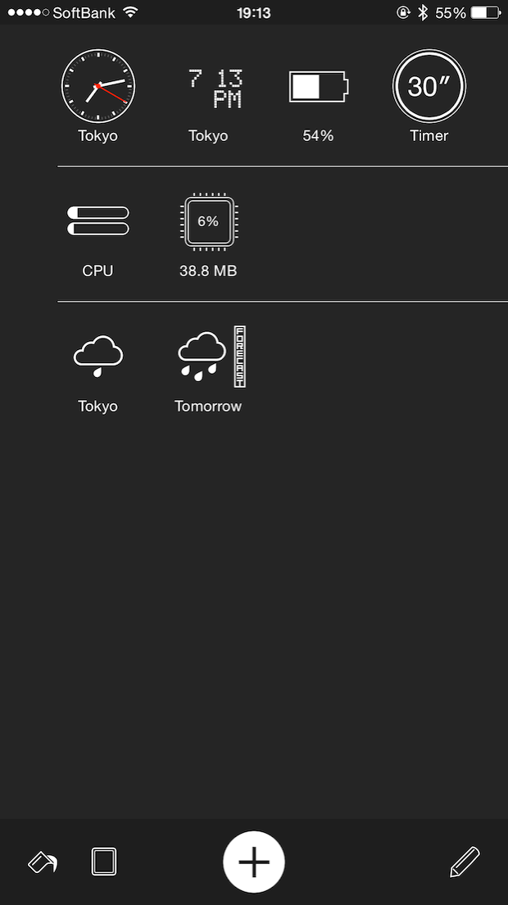

### Quick Contacts

「Quick Contacts」では、あらかじめ、よく連絡を取る人の電話番号やメールアドレスを登録することで、タップ1つで電話、メールするための機能です。

  1. Send Email
  2. Send Message
  3. Phone Call
  4. Facetime
  5. Facetime Audio
  6. Twitter Mention
  7. Skype

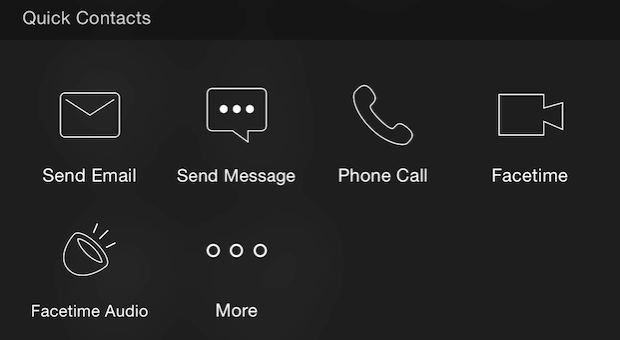

たとえば、「Send Email」を選択した場合、「Email」のアイコンをタップすると、連絡先を入力できます。一度登録しておけば、次回以降、すぐにメール作成画面を開くことができます。

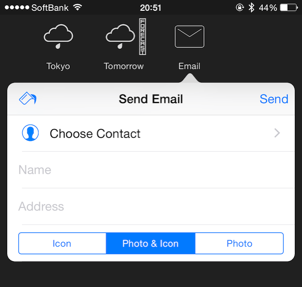

Twitter Mentionの場合は、連絡に使用するアイコン（アイコンは連絡帳に登録されているアイコンが使用されます）とアカウント名（@username）を指定します。次回以降、すぐに登録した相手にメンションを送ることができます。

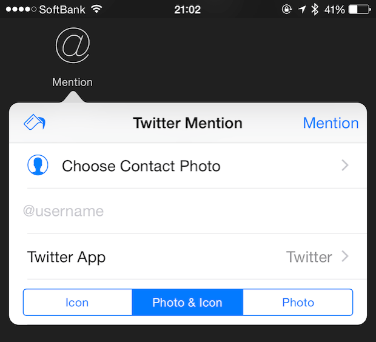

### Clock

続いて、「Clock」では世界時計やデジタル時計にカレンダー、そして、タイマーを設定できます。

  1. World Clock
  2. Analog Clock
  3. Digital Clock
  4. Calendar
  5. Timer

たとえば、「World Clock」を選択した場合、アイコンをタップするとタイムゾーンを選択できるようになります。デフォルトではローカルのタイムゾーンが使用されますが、外国の時間が知りたい場合はタイムゾーンを設定しておきましょう。

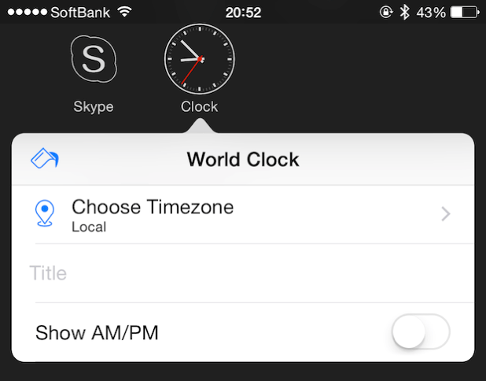

次に、「Timer」を選択した場合、デフォルトの時間を決めることができます。通知センターには登録された時間が表示され、タップするとカウントダウンが始まり、0になると通知される仕組みになっています。地味に便利です。

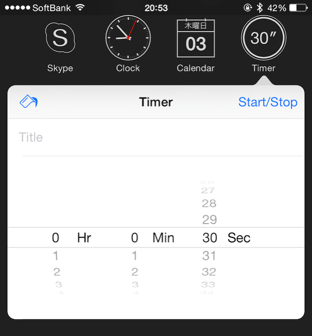

### System

続いて、「System」ではバッテリーの状態、ストレージの空き容量、フリーメモリ、CPU使用状況が表示できます。

  1. Battery
  2. Free Space
  3. Free Memory
  4. CPU Usage

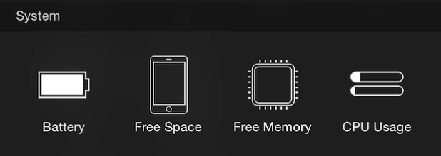

### Installed Apps

続いて、「Installed Apps」では、URLスキームに対応しているアプリケーション限定になりますが、アプリケーションをあらかじめ登録しておき、通知センターから簡単に操作できるようになります。

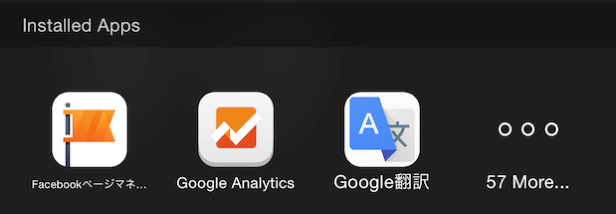

### App Launcher

続いて、「App Launcher」では、あらかじめ「VIdgets」に登録されているアプリケーションのショートカットを作成できます。さまざまなアプリケーションがプリセットされていますので、ここではすべて列挙しませんが、「More」をタップしてみてください。

  1. Facebook
  2. Twitter
  3. Dropbox
  4. Chrome
  5. More

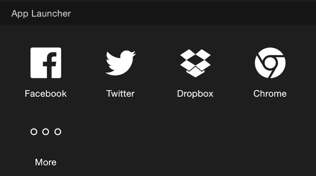

### Barometer

続いて、「Barometer」では気圧計を表示できます。アナログ表示、デジタル表示の2種類から選択できます。

  1. Barometer（アナログ）
  2. Barometer（デジタル）

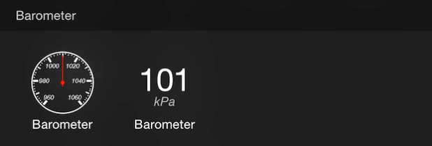

### Network Speed Monitor

続いて、「Network Speed Monitor」では、現在のネットワーク使用量、モバイルデータ通信の使用量、Wi-Fi通信の使用量を知ることができます。

  1. Network
  2. Mobile
  3. WiFi

### GPS

続いて、「GPS」では速度計のアナログ表示、デジタル表示、コンパスのアナログ表示、デジタル表示、標高を選択できます。

  1. Speedmeter（アナログ表示）
  2. Compass（アナログ表示）
  3. Speedmeter（デジタル表示）
  4. Compass（デジタル表示）
  5. Altitude

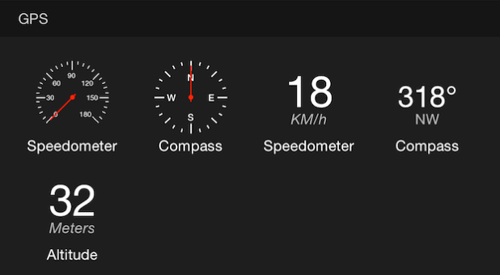

### Quick Actions

続いて、「Quick Actions」では、ブックマークとナビゲーションを登録できます。

  1. Web Bookmark
  2. Quick Navigation

「Web Bookmark」を選択した場合、ブックマークのタイトルと
URL、ブックマークを開くのに使用するブラウザを設定できます。

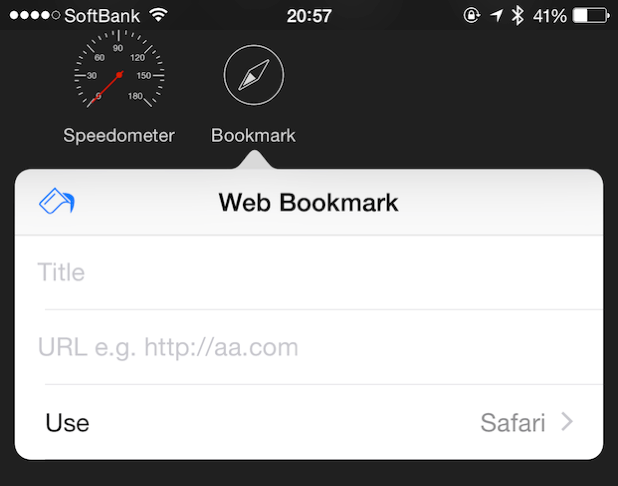

「Quick Navigation」を選択した場合、連絡帳から住所を選択し、目的地を入力しておくことで、すぐにマップアプリで経路を調べることができます。また、マップアプリを標準アプリで開くか、Google Mapで開くか選択することが可能です。

### Weather

続いて、「Weather」では、今日の天気、明日の天気、明日の温度、現在の温度、今日の最低気温、今日の最高気温、日の出時刻、日の入り時刻を選択できます。

  1. Weather
  2. Tomorrow
  3. Tomorrow Temp.
  4. Temperature
  5. Min Temperature
  6. Max Temperature
  7. Sunrise
  8. Sunset

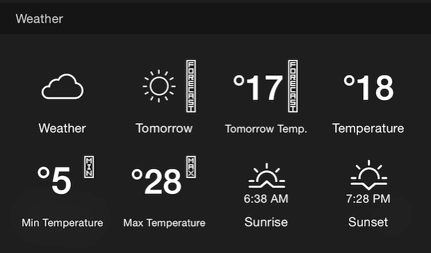

たとえば、「Weather」を選択すると、デフォルトでは現在値が使用されますが、特定の都市の天気が知りたい場合は、設定から変更しておきましょう。

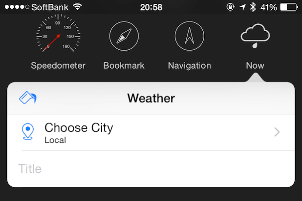

## 通知センターに表示

実際に通知センターにはこのような感じで表示されます。

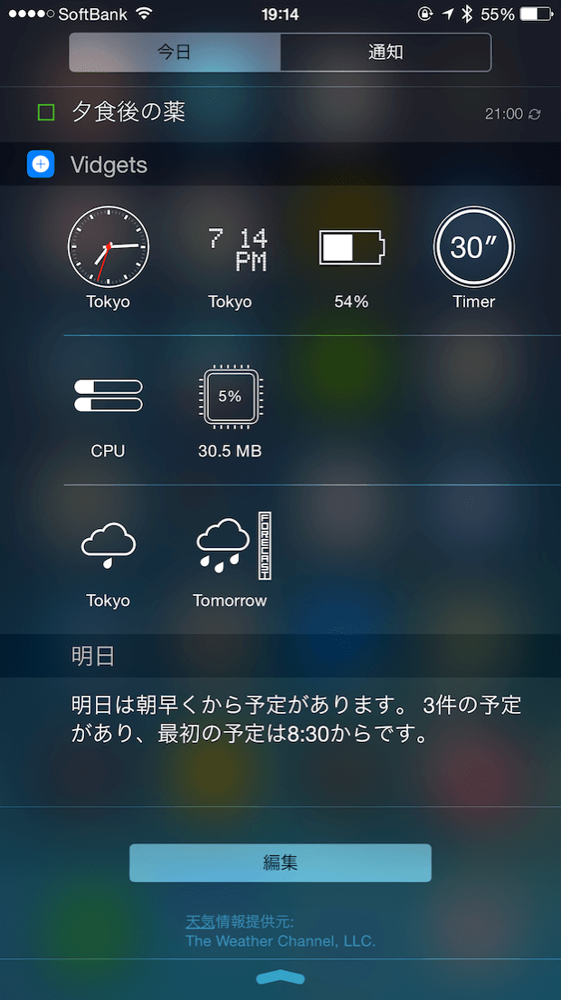

## まとめ

何から何まで揃う贅沢なウィジェットアプリ「Vidgets」。これがあれば、他のランチャー系のアプリなど一切いらないのではと思ってしまいます。ただし、項目が多すぎてウィジェットに実際に何を表示すれば良いか困ることもあるかと思いますので、ぜひこの記事を参考に自分だけのウィジェットを作成してみてくださいね。

