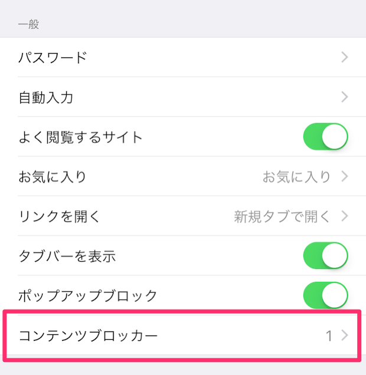
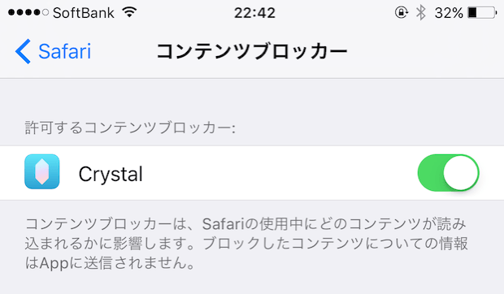

---
author:
- '@ottanxyz'
categories:
- iPhone
date: 2015-09-17 00:00:00+00:00
draft: false
tags:
- 非表示
- safari
- 拡張機能
- ios
- 単体
title: Safariで広告を非表示にするコンテンツブロッカーを使用する方法
type: post
---

iOS9でSafariの拡張機能が有効になり、その代表的な機能として広告非表示できるアプリケーションが早速登場しました。ここでは、Safariで広告を非表示にするための方法をご紹介します。

## Safariで広告を非表示にする方法

Safari単体では広告を非表示にできません。Safariに対応した拡張機能が必要です。

### Safariの拡張機能をダウンロードする

iOS9のSafari単体で広告を非表示にすることはできません。あくまで、iOS9でSafariの拡張機能が使用できるようになっただけで、広告を非表示にする拡張機能をダウンロードする必要があります。ここでは、広告を非表示にすることに特化した「Crystal」をご紹介します。



### Safariの拡張機能を有効にする

「設定」→「Safari」に「コンテンツブロッカー」が追加されているため、それをタップします。

「Crystal」を有効にします。

以上で、コンテンツブロッカーが有効になります。

## まとめ

iOS9のSafariの拡張により、より快適にウェブブラウジングが可能になりました。導入しておいて損はないアプリケーションですので、iOS9にアップデートしたら是非ダウンロードしておきましょう。
