---
author:
- '@ottanxyz'
categories:
- Mac
- Windows
date: 2015-10-10 00:00:00+00:00
draft: false
tags:
- windows
- インストール
- camp
- boot
- ドライバー
title: macOS El CapitanのBoot Campアシスタントを使ってWindows 7をインストールする方法
type: post
---

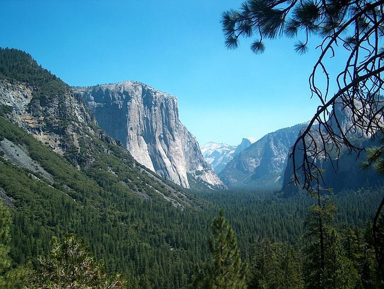

[@おったん](https://twitter.com/ottanxyz)です。macOS El Capitanで、Boot Campアシスタントを使ってWindows 7をインストールするためには、手順がやや煩雑になりました。今回は、macOS El CapitanでWindows 7をインストールする方法をご紹介したいと思います。

#### 使用するUSBメモリについて

コメント欄でご指摘いただいている件について。Windows 7のインストーラーには、USB3.0対応のドライバーが含まれていません。そのため、USB3.0のみ対応のUSBメモリを使用してインストールを進めた場合、Windowsのインストールが先に進みません（no bootable deviceと表示され、インストーラーが認識されません）。その場合、お手数ですがUSB2.0対応のUSBメモリを使用するか、SuperDriveなどUSB2.0対応の光学ディスクを使用してください。

## Boot Campアシスタントを使ってWindows 7をMacにインストールする

大きな流れは「USBメモリの初期化」→「Windowsインストールディスクの作成」→「Windows 7のインストール」になりますが、Boot CampアシスタントがWindows 7用のドライバーを自動的にダウンロードしてくれなくなったため、手動で準備する必要があります。

### Windowsインストールディスクを作成するUSBメモリの初期化

**「アプリケーション」→「ユーティリティ」→「ディスクユーティリティ」**を開きます。インストールディスクを作成するためのUSBメモリを選択した状態で、「消去」ボタンをクリックします。

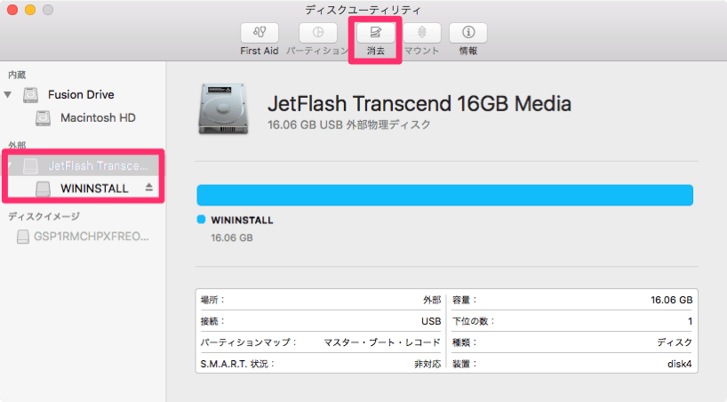

「名前」は任意、「フォーマット」は「MS-DOS（FAT）」「方式」は「GUIDパーティションマップ」を選択して、「消去」ボタンをクリックします。

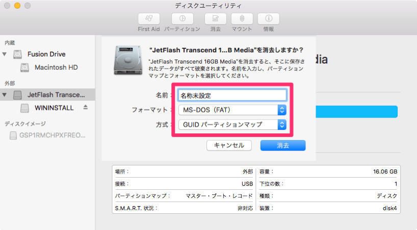

「完了」と表示されればフォーマットは完了です。

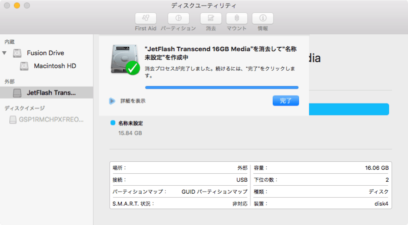

### Windowsインストールディスクを作成する

Boot Campアシスタントを使ってWindows 7をインストールする場合は、Windows 7のイメージファイル（iso）が必要になります。手元に用意がなければ、ディスクユーティリティを使ってイメージファイルを作成します。Windows 7のCD-ROMを挿入し、ディスクユーティリティのメニューから**「ファイル」→「新規イメージ」→「任意のWindows 7のCD-ROM」**をクリックします。

「フォーマット」は「DVD/CDマスター」、「暗号化」は「なし」で、「保存」ボタンをクリックします。

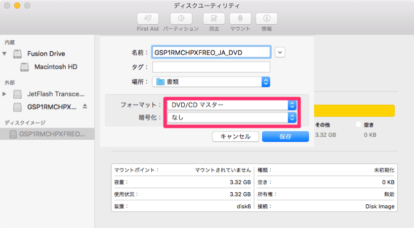

拡張子が「.cdr」のファイルが作成されますので、拡張子を「.iso」に変更します。

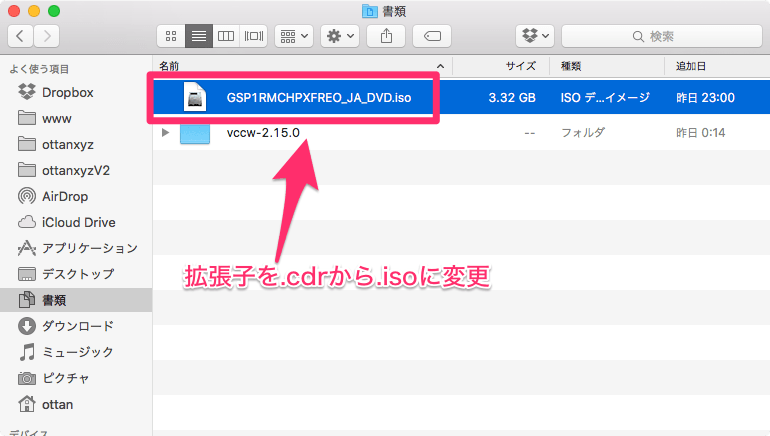

#### Windows 7のイメージファイルをWebサイトからダウンロードする

プロダクトキーがあれば、Windows 7のイメージファイルをWebサイトからダウンロードすることも可能です。

https://www.microsoft.com/ja-jp/software-download/windows7

プロダクトキーを入力して「確認」ボタンをクリックします。画面の手順にしたがって、Windows 7のイメージファイルをダウンロードしてください。

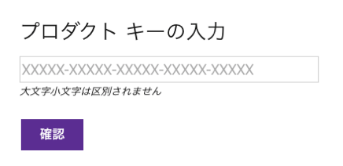

### Boot Campアシスタントを使ってWindows 7のインストールディスクを作成する

次に、Windows 7のインストールディスクを作成します。**「アプリケーション」→「ユーティリティ」→「Boot Campアシスタント」**を開きます。「続ける」ボタンをクリックします。

「Windows 7またはそれ以降のバージョンのインストールディスクを作成」がチェックされていることを確認したら「続ける」ボタンをクリックします。

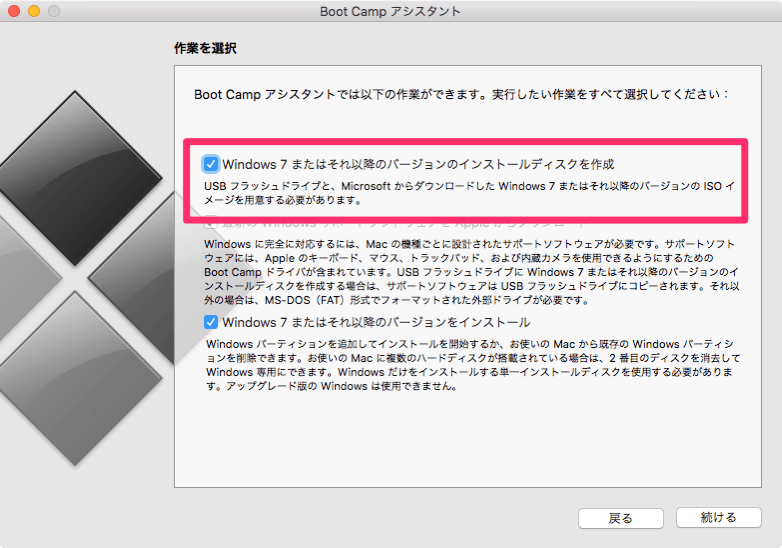

「ISOイメージ」に先ほど作成、またはダウンロードしたイメージファイルを選択した状態で、「続ける」ボタンをクリックします。

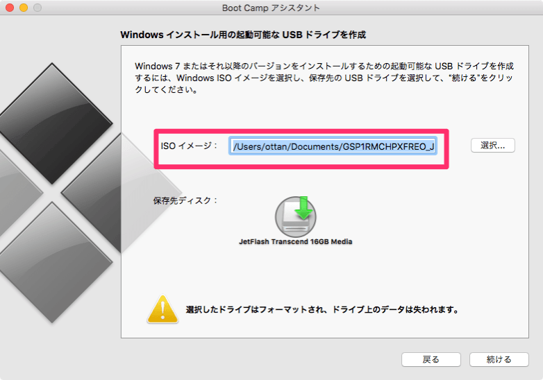

「続ける」ボタンをクリックします。

Windows 7のインストールディスクを作成するためのファイルのコピーが始まります。しばらく時間がかかりますので気長に待ちましょう。

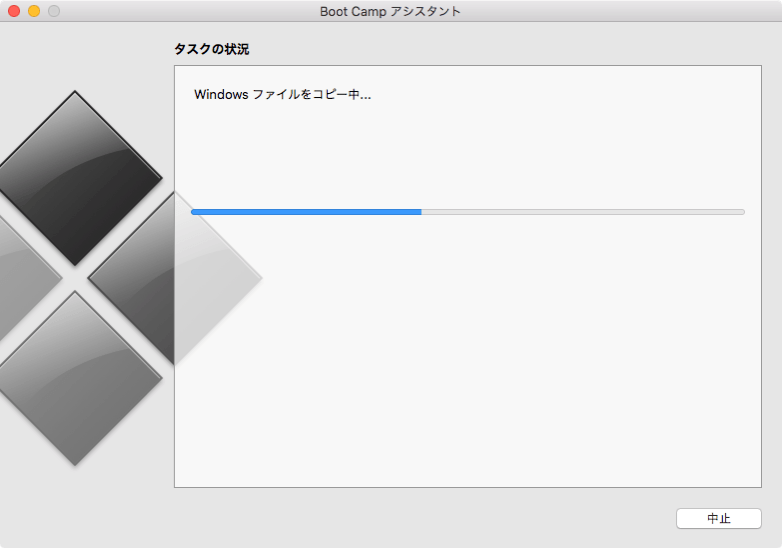

ファイルのコピーが完了すると、以下の画面が表示されます。Windows 8以降であれば、Windowsで必要なドライバーを自動的にダウンロードしてくれますが、Windows 7以前のバージョンのWindowsのドライバーを入手するためには、Appleの公式サイトから手動でダウンロードしてくる必要があります。「Webサイトを開く」ボタンをクリックします。

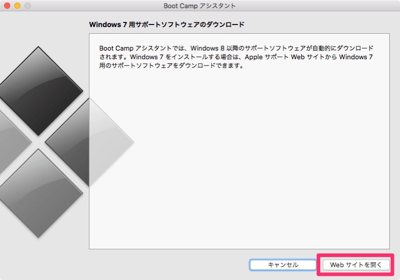

「Install Windows 7」をクリックします。

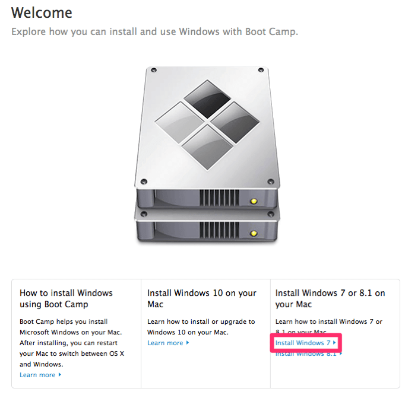

MacのモデルにあったBoot Camp用のドライバーをダウンロードします。私の場合、「iMac（27-inch, Late 2013）」ですので、それに合わせたドライバーをダウンロードします。

Macの発売時期が不明な場合は、メニューバーの「」→「システム情報」をクリックします。すると、いつ発売されたモデルであるかが確認できますので、このモデルに合わせたドライバーをダウンロードしてください。

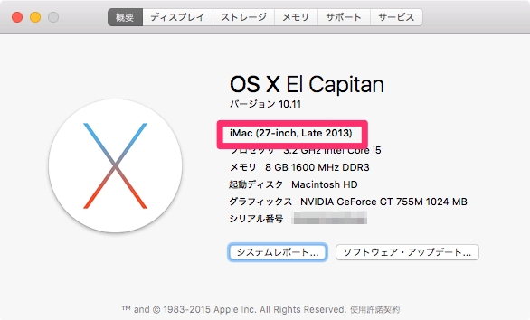

ダウンロードしたファイルを解凍したら、解凍後の3ファイルを先ほど作成したインストールディスク（USBメモリ）にコピーします。コピーには時間を要しますので、気長に待ちましょう。

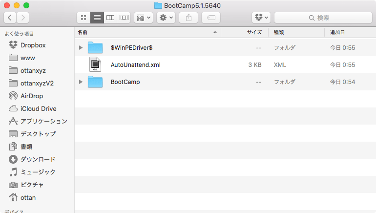

このようにコピーされていれば準備は完了です。

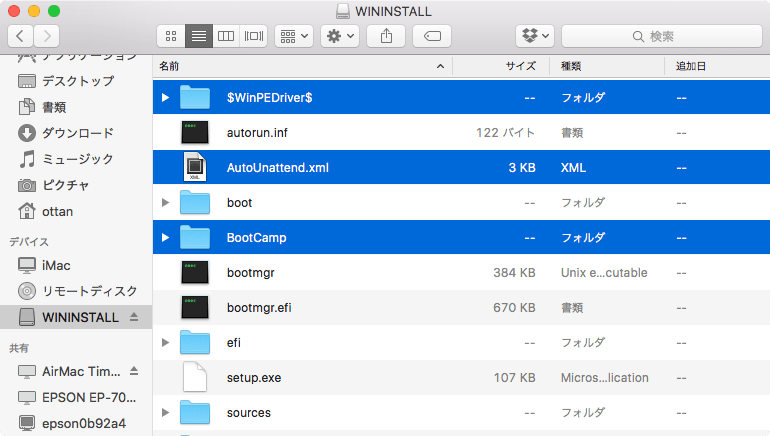

### Boot Campアシスタントを使ってWindows 7をインストールする

再度、Boot Campアシスタントを開き、「Windows 7 またはそれ以降のバージョンをインストール」のみをチェックして、「続ける」ボタンをクリックします。

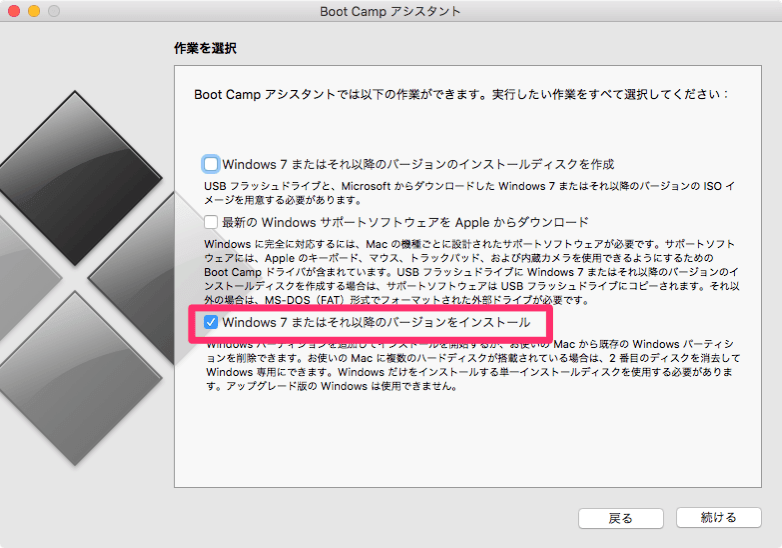

Windows 7に割り当てる領域のサイズを決めたら、「インストール」ボタンをクリックします。

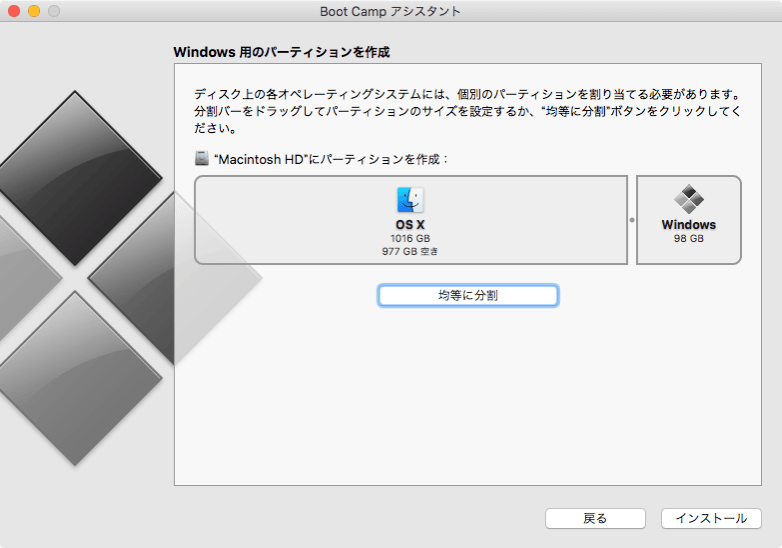

あとは通常通り、Windowsのインストールウィザードに従いながらWindowsをインストールします。

#### 2016/6/27追記：Windows 7インストール後のBootCampドライバーの適用について

Windows 7インストール完了後は、事前に準備したUSBメモリに書き込んだ、「BootCamp」フォルダー内の「Setup.exe」をダブルクリックしてください。Wi-Fi接続等に必要なドライバーがインストールされます。

## まとめ

macOS El CapitanからWindows 7をインストールするためには、手動でAppleが提供するドライバーを入手する必要があります。そこだけクリアできればあとは通常の手順と同様です。macOS El CapitanでWindows 7がインストールできない、とお困りの方の参考になればと思います。