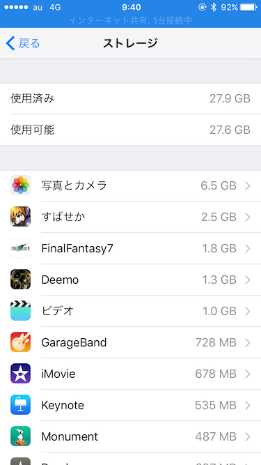
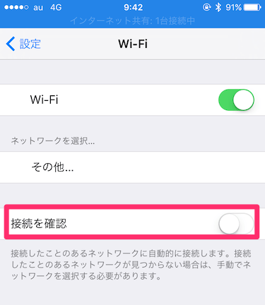
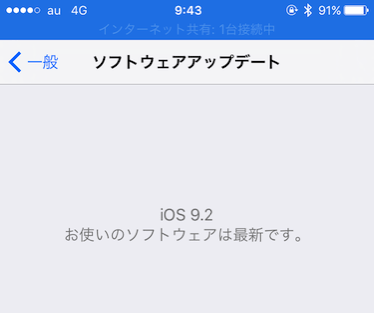

---
author:
- '@ottanxyz'
categories:
- iPhone
date: 2015-12-10 00:00:00+00:00
draft: false
tags:
- iphone
- もたつき
- 原因
- アップデート
- メモリ
title: iPhoneの動作がもたつく場合に試したい簡単にできる11の方法
type: post
---

[@おったん](https://twitter.com/ottanxyz)です。iPhoneを長く使用していると、時に動作がもたつく場合があります。メモリ不足やリソース不足などさまざまな原因が考えられますが、そのような場合に簡単に実践できるトラブルシューティングをご紹介します。

## iPhoneの動作がもたつく場合のトラブルシューティング

今すぐに実践できる簡単な方法をご紹介します。iPhoneの動作がもたつく、遅いと感じている方は是非試してみてください。

### 不要な写真を削除する

iPhoneのストレージに保存されているファイルの数が多くなればなるほど、iPhoneの動作に影響をもたらすことがあります。とくに写真アプリはファイルがたまりやすいため、時にカメラロールの整理をしましょう。

Macの場合は、Lightningケーブル経由でMacにUSB接続し、写真のバックアップを取得し、不要な写真はiPhoneから削除してしまいましょう。また、Googleフォトなど容量無制限に利用できる写真専用のオンラインストレージなどを使用することもオススメです。とくにGoogleフォトの場合、オリジナルサイズでは保存できませんが、画質を保ったまま容量無制限で写真を保存できます。

### 不要なアプリを削除する

**「設定」→「一般」→「ストレージとiCloudの使用状況」→「ストレージを管理」**からiPhoneに保存されているアプリケーションとファイルサイズを確認できます。容量の大きなファイル、最近使用していない不必要なファイルは断捨離しましょう。不要な写真を削除する場合と同様に、ファイル数の増加はiPhoneの動作がもたつく原因の1つになります。

### 過去のメッセージを削除する

**「設定」→「メッセージ」→「メッセージを残す」**から、メッセージアプリに保存されている過去のメッセージを自動削除できます。大きな添付ファイルや大量のメッセージが保存されている場合で、かつ不要な場合は削除してしまうことで、iPhoneに保存されているストレージ容量の節約になるととともに、iPhoneの動作がもたつく原因を解消できる場合があります。

### Safariの履歴とキャッシュを削除する

SafariはWebページ表示の高速化のために、過去の閲覧履歴を保存したり、Webページのキャッシュを保存しています。履歴やキャッシュがたまり続けるとiPhoneのストレージを圧迫し、iPhoneの動作がもたつく原因につながりかねません。

定期的に閲覧履歴とWebページのキャッシュを削除すると良いでしょう。**「設定」→「Safari」→「履歴とWebサイトデータを消去」**でSafariの履歴とキャッシュを削除できます。

### アプリの自動アップデートをやめる

iPhoneの動作がもたついている場合に考えられる原因として、バックググラウンドでアプリケーションのアップデートが行なわれている可能性があります。バックグラウンドで更新中はネットワーク帯域等の使用はもちろんのこと、CPUやメモリリソースを使用するためiPhoneの動作がもたつく原因になります。

自動アップデートはアプリのアップデートの手間が省けて便利ですが、もしiPhoneの動作がもたつく場合には、オフにしておきましょう。**「設定」→「iTunes Store/App Store」**から「アップデート」をオフにします。

### ミュージック、アプリ、ブックの自動ダウンロードをやめる

同一のApple IDを使用しているデバイス同士であれば、他のデバイスでダウンロードしたミュージック、アプリ、ブックを同期する（自動ダウンロードする）機能があります。デバイス間で自動的に同期されるため非常に便利な機能ですが、こちらもバックグラウンドでの動作になるため、気がつけばiPhoneの動作に支障をきたしている可能性があります。

iPhoneの動作のもたつきが気になる場合は、**「設定」→「iTunes Store/App Store」**から、自動ダウンロードの「ミュージック」「App」「ブック」をオフにしておきましょう。

### Wi-Fiの接続確認をオフにする

**「設定」→「Wi-Fi」**から「接続を確認」をオフにしておきましょう。「接続を確認」をオンにしている場合は、iPhoneは常にWi-Fiネットワークを検出するためにバックグラウンドで動作し、Wi-Fiネットワークが見つかった場合はダイアログで表示してくれます。この機能がiPhoneの動作のもたつきの原因になる可能性があります。

もし、既存の接続したことのあるWi-Fiネットワークを利用する必要がない場合には、接続確認をオフにすることでiPhoneのバックグラウンドでの動作を停止できます。Wi-Fiは手動で接続することをオススメします。

### 定期的にiPhoneを再起動する

iPhoneを使用し続けていると、上記の方法を試した場合においてもリソース不足等に陥り、動作がもたつくことがあります。リソース不足や不具合を解消するためにはiPhoneを定期的に再起動することをオススメします。極端な頻度で実施する必要はありません。必要な時に実施すれば良いだけです。

### iOSを最新の状態に保つ

iOSは定期的にアップデートされます。iOS9.2もつい先日リリースされました。ソフトウェアアップデートは、セキュリティアップデートや不具合の修正の他、全体的なパフォーマンスの向上が行われています。iOSを古い状態のまま放置すると、脆弱性も放置されてしまいます。セキュリティアップデートのためにも、ソフトウェアアップデートは必ず行った方が良いでしょう。

### 定期的にメモリの再割り当てを行う

アプリを大量に起動しているとメモリのリソース不足に陥る可能性があります。マルチタスクからアプリを使用後に常に終了する方法はオススメできませんが（頻繁に使用するアプリをマルチタスクから常に終了している場合、毎回起動にかかる時間を要するため全体的な動作のもたつきの原因になりかねません）、メモリのリソース不足に陥った、iPhoneの動作が遅いという場合には、[iPhoneが遅いときに試したい、アプリ不要のメモリ解放術 | AppBank](http://www.appbank.net/2015/12/02/iphone-application/1133850.php)の記事を参考にメモリの再割り当てを行いましょう。全アプリケーションの再起動が行われるため、アプリの不具合や、全体的な動作のもたつきの解消につながる可能性があります。

### iPhoneの復元を行う

これは最後の手段です。上記の方法を試しても動作のもたつきが改善されない場合は、iTunesによるiPhoneの復元を試してみましょう。復元を行う場合は、必ず事前にバックアップを取得することを心がけましょう。iPhoneのバックアップ、復元の方法については下記のリンクを参考にしてください。

<https://support.apple.com/ja-jp/HT203977>

<https://support.apple.com/ja-jp/HT204184>

## まとめ

iPhoneの動作がもたつく場合に試したい、簡単、かつ今すぐに実践できる方法をご紹介しました。iPhoneの調子が悪い場合には、上記の方法をぜひ試してみてください。

Via：[How to make your iPhone run faster in 2015 - Tech Insider](http://www.techinsider.io/how-to-make-your-iphone-run-faster-2015-12?op=1)
