---
author:
- '@ottanxyz'
categories:
- Android
- Mac
date: 2016-01-15 00:00:00+00:00
draft: false
tags:
- remix
- virtualbox
- mode
- os
- クリック
title: VirtualBoxにRemix OS 2.0をインストールする方法
type: post
---

Remix OS は、Android OS をベースとしたデスクトップ向けに最適化された OS です。[PC で動く「Android 互換 OS」を試してみた。マルチウィンドウが使える Remix OS for PC α 版が登場 - Engadget Japanese](https://japanese.engadget.com/2016/01/13/pc-android-os-remix-os-for-pc/)などでも、内容が詳しく紹介されていますので、詳細はそちらを参照してください。

## Remix OS 2.0 を VirtualBox にインストールする

Remix OS をインストールするためには、8GB 以上の USB メモリと、起動ディスクの作成が必要ですが、VIrtualBox を使用することで、簡単に雰囲気のみ味わうことができます。今回は、VirtualBox に Remix OS をインストールするために、Remix OS のダウンロードから起動までの一連の流れを解説します。

### Remix OS 2.0 のダウンロード

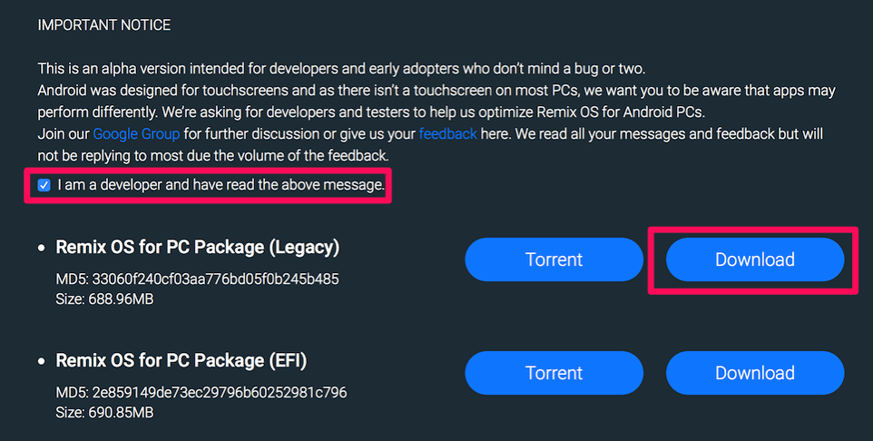

Remix OS は、Jide の公式サイトから ISO ファイル、または IMG ファイルのダウンロードができます。ダウンロードするためには、以下のリンクにアクセスします。今回は、VirtualBox にインストールことが目的であるため、ISO ファイルをダウンロードします。

http://www.jide.com/en/remixos-for-pc#downloadNow

「I am a developer and have read the above message.」をチェックし、「Remix OS for PC Package (Legacy)」の「Download」をクリックします。ZIP ファイルがダウンロードされるため、解凍しておきます。

### VirtualBox に Remix OS をインストールする

VirtualBox を開き、「新規」をクリックします。

「名前」は任意で構いません。今回は、「Remix OS 2.0」としました。「タイプ」は「Linux」、「バージョン」は「Other Linux (64-bit)」を選択してください。「続ける」をクリックします。

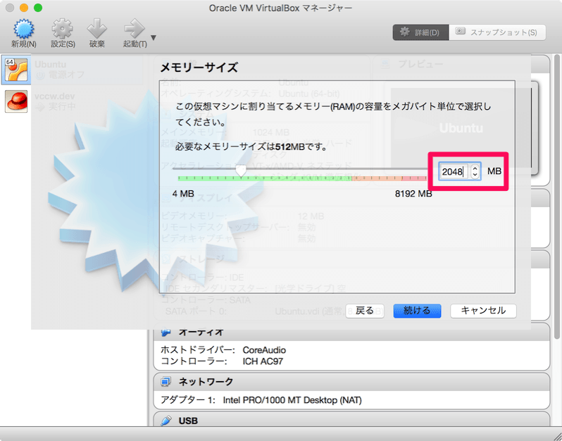

メモリサイズは、Remix OS の動作環境の最小要件である「2048MB」とします。「続ける」をクリックします。

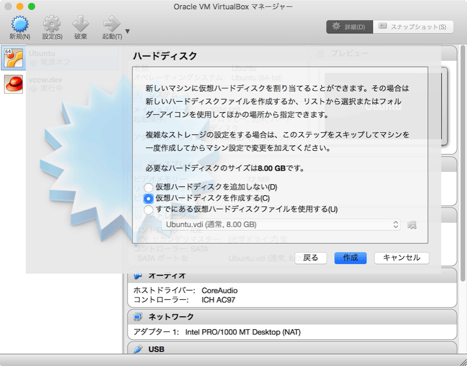

デフォルトのまま「作成」をクリックします。

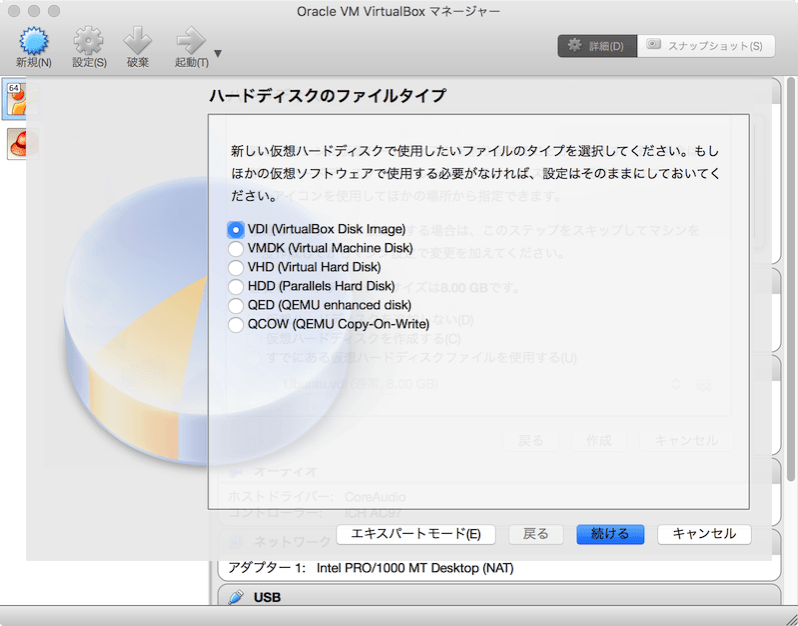

デフォルトのまま「続ける」をクリックします。

デフォルトのまま「続ける」をクリックします。

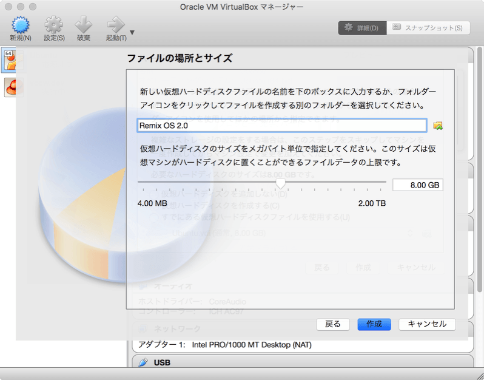

デフォルトのまま「作成」をクリックします。

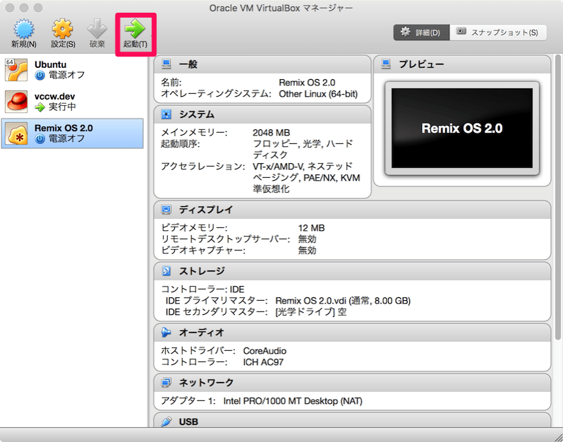

続いて、作成した仮想マシンを選択した状態で「起動」をクリックします。

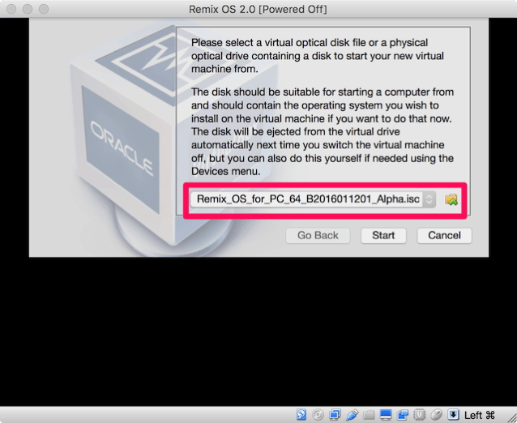

ダウンロードした ISO ファイルを選択し、「Start」をクリックします。

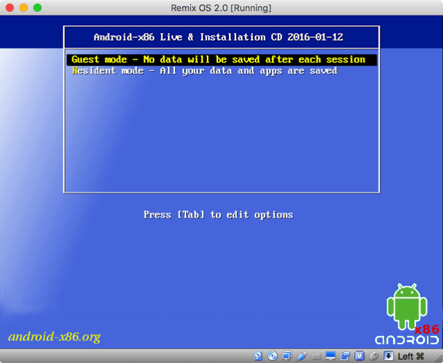

Remix OS では、「Guest Mode」または「Resident Mode」を選択できます。「Guest Mode」では Remix OS に対して行った変更は一切保存されません（Linux の Live CD と同様）。「Resident Mode」では Remix OS に対して行った変更を保存できます。「Resident Mode」では正常に起動できなかったため、今回は「Guest Mode」を選択します。

追記：後日、「Resident Mode」でインストールする方法を書きました。

* [Remix OSをResident modeでVMware Fusionにインストールし、Google Playストアを使用できるようにする - OTTAN.XYZ](/posts/2016/06/remix-os-resident-mode-install-vmware-fusion-4492/)

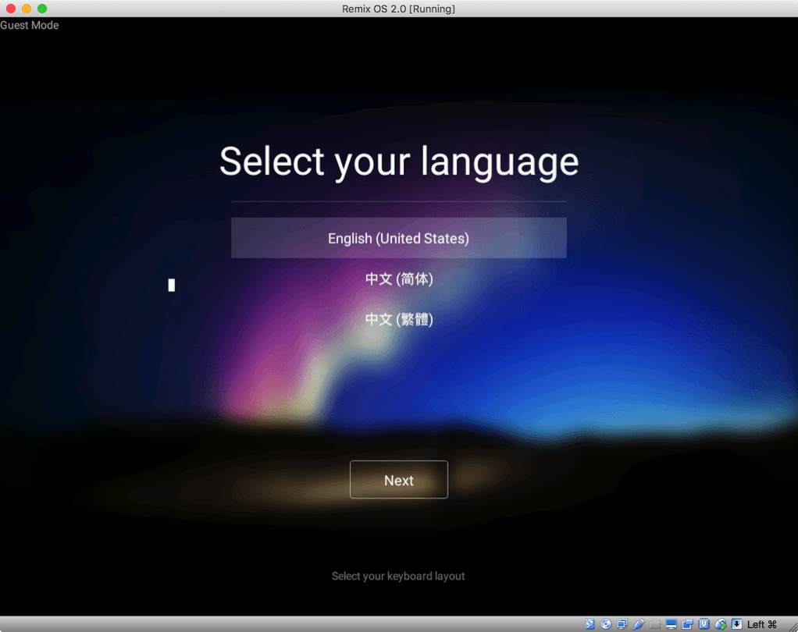

Remix OS が起動したら、「Language」を選択します。Mac のマウスカーソルの動きと、Remix OS のポインタの動きの同期が取れないため、ポインタの動作がわかりづらいですが、「English」を選択した状態で「Next」をクリックします。

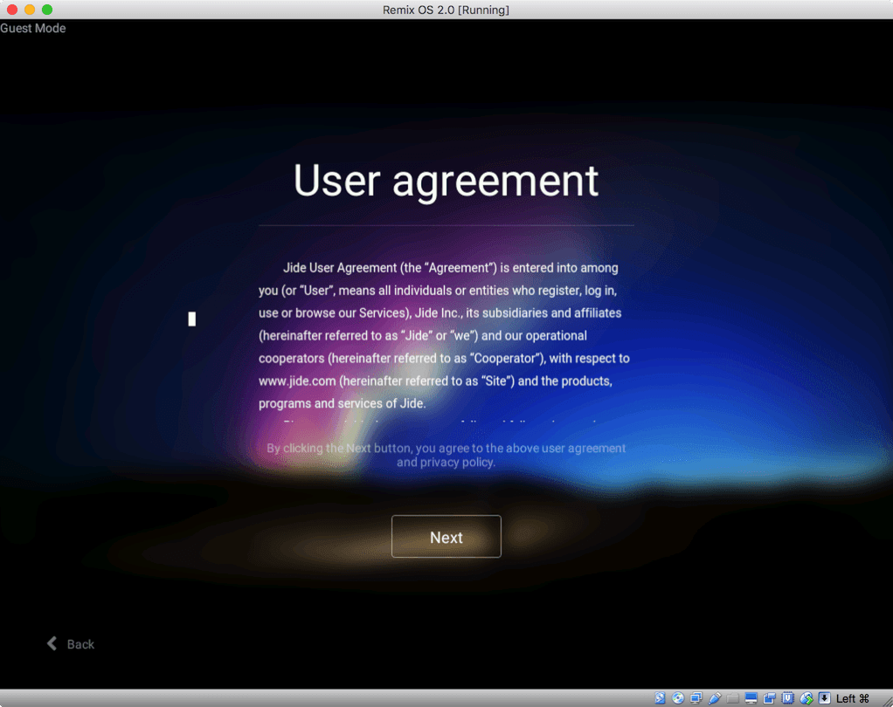

「Next」をクリックします。

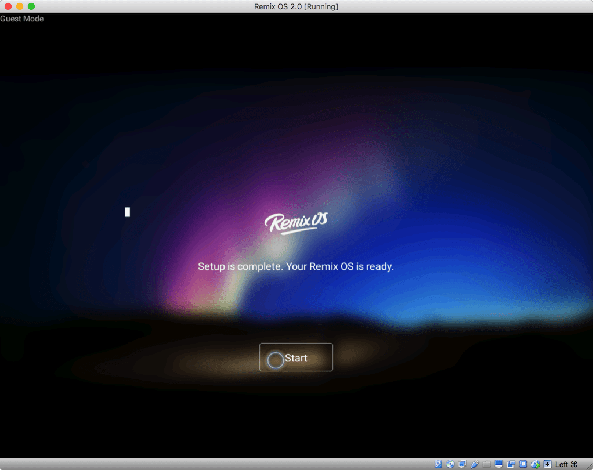

「Start」をクリックします。

### 言語を英語から日本語に変更する

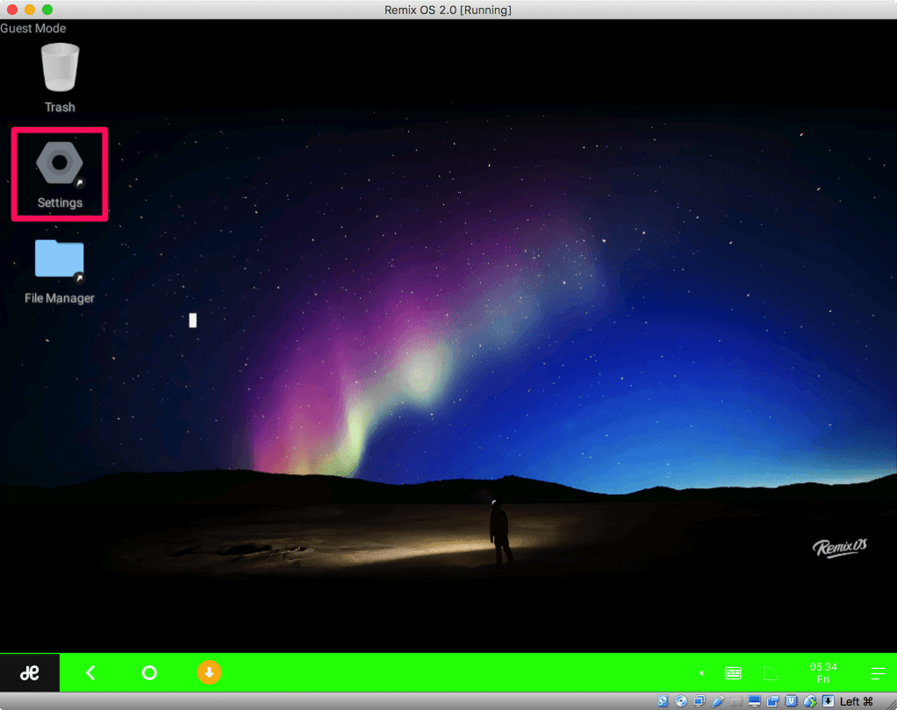

デスクトップ上の「Settings」をクリックします。

「Language & Input」をクリックします。

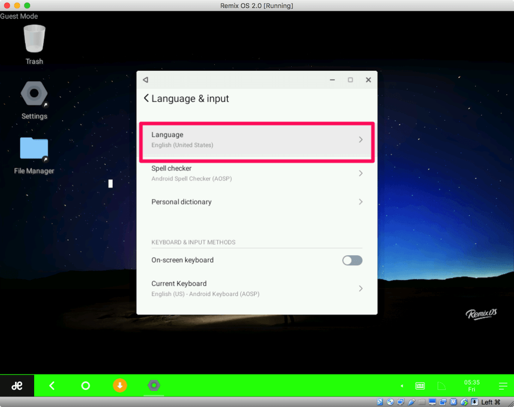

「Language」をクリックします。

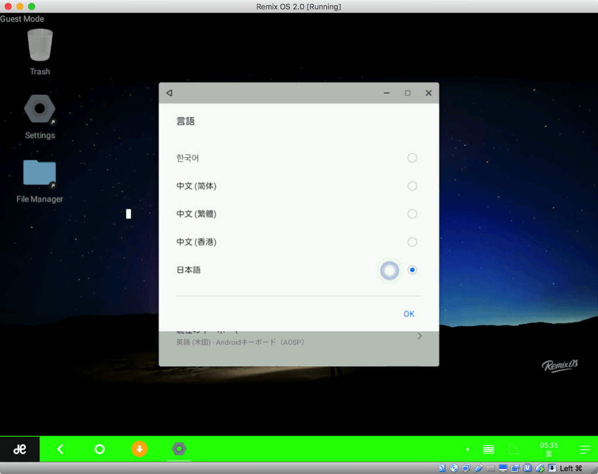

「言語」から「日本語」を選択して「OK」をクリックします。日本語を選択した状態においても、完全に日本語化されるわけではありませんが、雰囲気を味わうことはできると思います。

## まとめ

Google Play や、各種 Google アカウントを必要とするサービスが使用できないなど、まだまだ完全とは言えない Remix OS ですが、Remix OS がどのような OS であるか、雰囲気のみ味わいたい場合は、VirtualBox にインストールすることをオススメします。また、Mac のマウスカーソルと Remix OS のポインタの動作が同期できないため、VirtualBox 上ではやや扱いづらいかもしれません。以上の注意事項を念頭に入れて、新進気鋭の OS を体験してみてください。