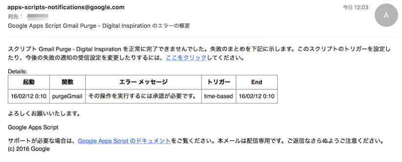
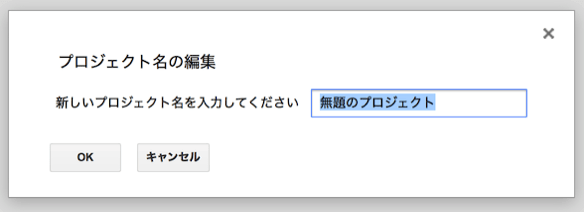
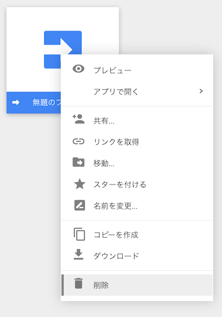

Google Apps Scriptは、開発環境の設定がなくてもすぐにコーディングができる優れもののサービスです。これは、以下のサイトからの引用文です。後述でもご紹介しますが、Google Apps Scriptを使用することで、Gmailの自動削除など、Googleが提供しているサービスにプログラムからアクセスすることができるものです。

https://engineer-intern.jp/archives/category/column/start/googleappsscript

## Google Apps Scriptのトリガーを削除する

Google Apps Scriptの実行方法には何種類かありますが、今回ご紹介する方法は、定期的（トリガー）に実行されるスクリプトを停止する方法です。なぜ、ご紹介する経緯に至ったかは、下記をご覧ください。

### Google Apps Scriptからのエラーメッセージ

ここ最近、Google Apps Scriptからの大量のエラーメッセージが送信されてくるようになりました。内容としては、時刻指定のトリガーで動作するスクリプトがGoogleアカウントによって許可されていないため、動作に失敗するというものです。

Amazonや楽天の買い物履歴などをGmailに残しているのですが、大量に買い物をするとGmailの容量がかさばるので、一定期間が過ぎたら大量に削除するGoogle Apps Scriptを[Gmail Auto Purge - Automatically Delete Older Messages in Gmail](http://www.labnol.org/internet/gmail-auto-purge/27605/)から入手して、実行していました。（実は、このスクリプトは、私が以前運営していたブログの中からご紹介したものです）

随分前の話のことなので、私自身すっかり忘れていたのですが、スクリプトの修正や何かのアクションをきっかけに、意図せぬ設定変更が行われ、今回のトラブルに見舞われたと考えています。さらに、条件が悪いことに前述のURLから取得したGoogle Apps Scriptは、すでにGoogleドライブから削除済みで、今回のエラーをどう乗り切るか考えた末に、Google Apps Scriptの定期実行（トリガー）を削除する方法が分かりましたので、共有したいと思います。

### Google Apps Scriptのトリガーをすべて削除する

まず、Google Apps Scriptのトリガーを削除するためには、以下のリンクからGoogleドライブにアクセスします。

https://www.google.co.jp/intl/ja/drive/

必要に応じてGoogleアカウントのログイン情報を入力してサインインしてください。

次に、**「マイドライブ」→「その他」→「Google Apps Script」**を選択します。

自動的に「無題のプロジェクト」が作成され、Google Apps Scriptのスクリプトエディターが、ブラウザの別ウインドウ（または、タブ）で起動します。スクリプトエディターが起動したら、**「リソース」→「すべてのトリガー」**を選択します。

トリガーを編集するためには、現在作業中のGoogle Apps Scriptをいったん保存する必要があります。自動的に「プロジェクト名の編集」ダイアログが表示されますので、「OK」をクリックします。これで、デフォルトでは「無題のプロジェクト」がGoogleドライブに保存されています。

すると、Google Apps Scriptで定期的（トリガー）に実行されているスクリプトの一覧が表示されます。前述のGmailの自動削除スクリプトのトリガーもここで発見することができました。トリガーを削除したい場合は、上図のように「×」をクリックします。削除したいトリガーの編集作業が完了したら「保存」をクリックします。ブラウザのウインドウ（または、タブ）を閉じます。

作業完了後は、Googleドライブに先ほど保存した「無題のプロジェクト」が残されたままになっています。もう必要ありませんので削除してしまいましょう。

対象のファイルを選択して、**「右クリック」→「削除」**を選択します。これで作業は完了です。

## まとめ

以上で、Google Apps Scriptの定期実行（トリガー）により発生していたエラーはおさまりました。上記のように、Google Apps Scriptのエラーで悩まされている方は、ぜひこの方法をお試しください。
