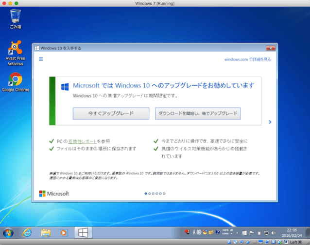
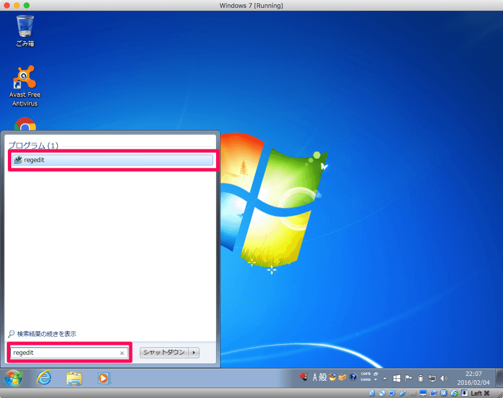
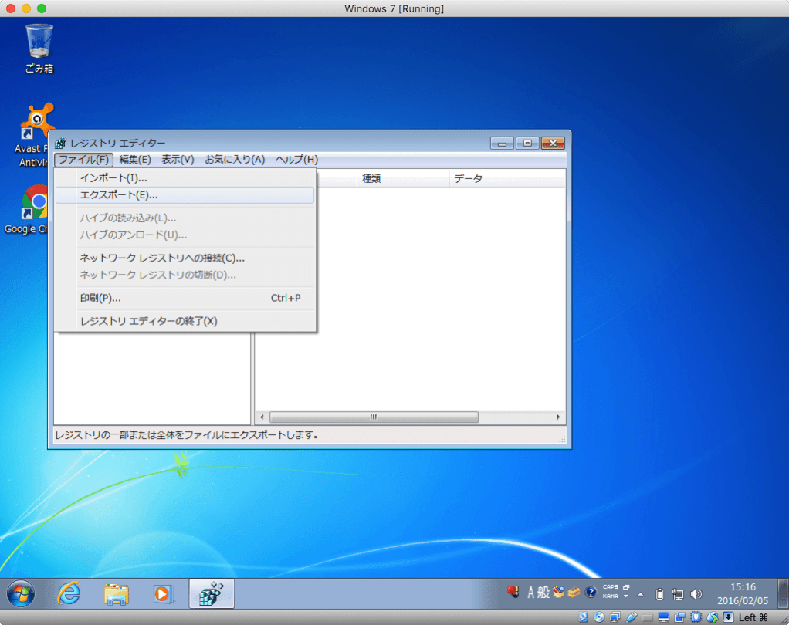
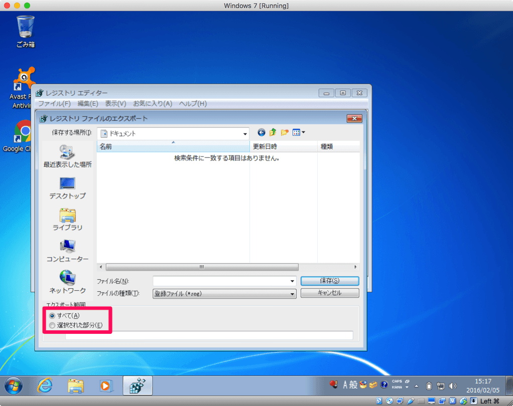
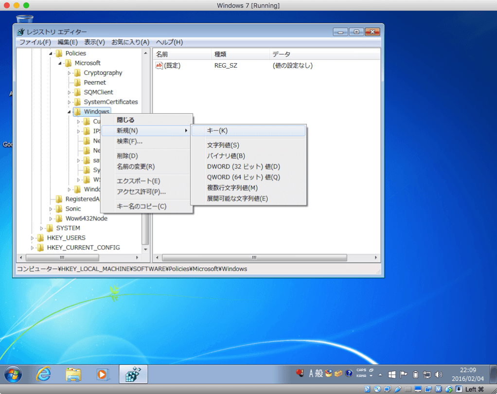
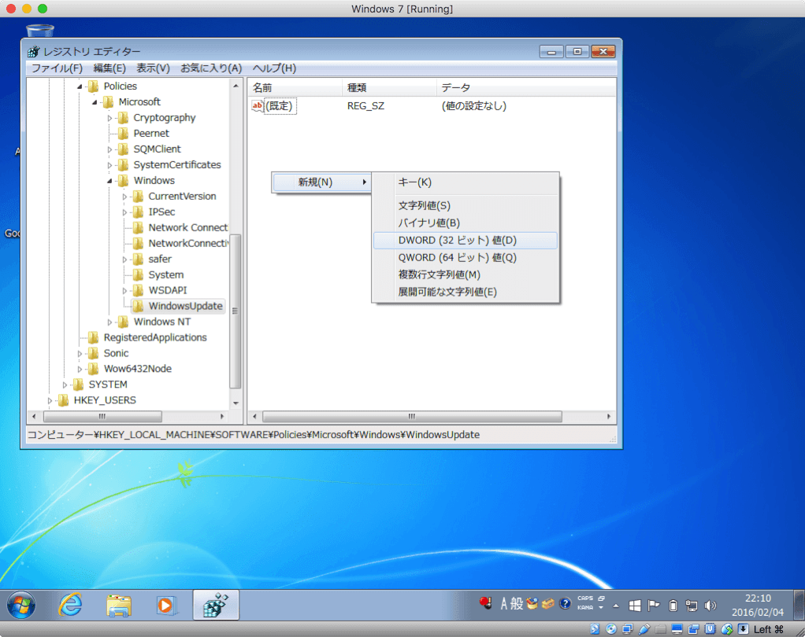
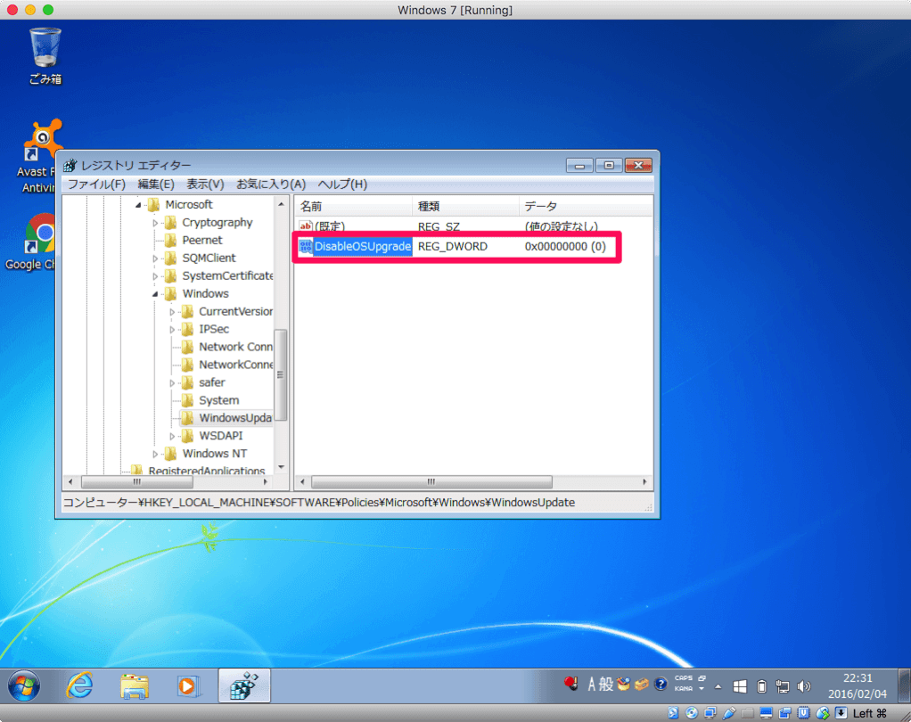
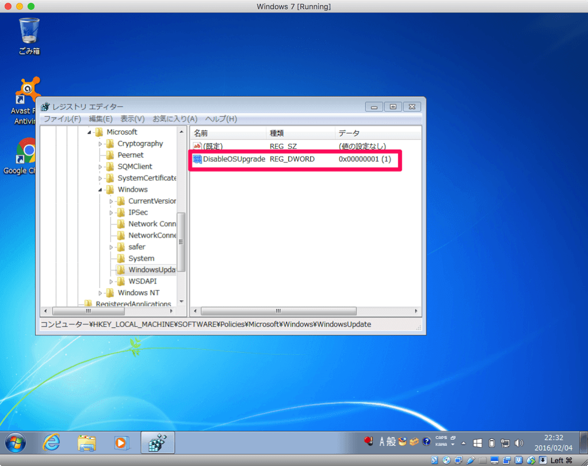
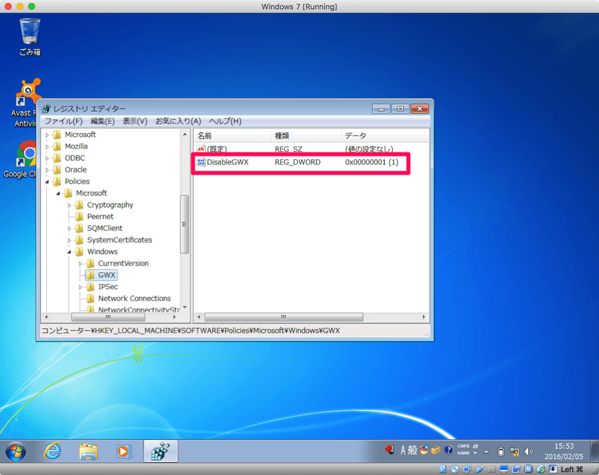
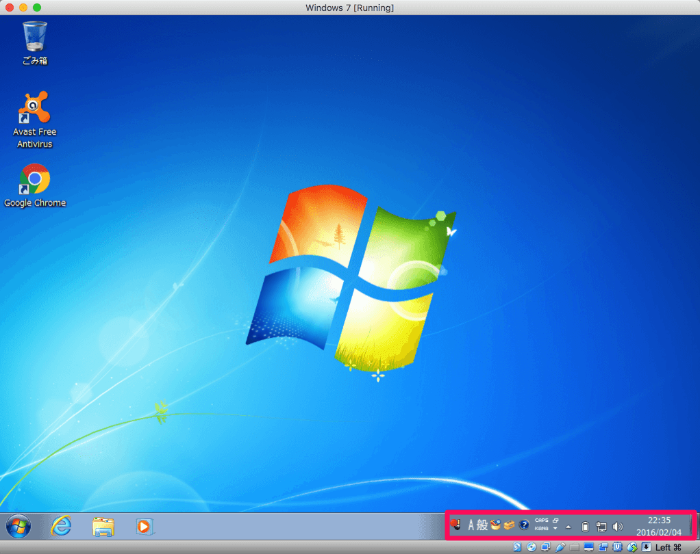

---
author:
- '@ottanxyz'
categories:
- Windows
date: 2016-02-05 00:00:00+00:00
draft: false
tags:
- windows
- レジストリ
- アップグレード
- キー
- レジストリエディター
title: Windows 7、8.1でWindows Update経由のWindows 10アップデート、またはアップデート通知ダイアログを無効にする方法
type: post
---

[Windows 8.1/7ユーザーは要注意!? Windows 10への自動アップグレードはどうすれば回避できるのか - 4Gamer.net](http://www.4gamer.net/games/276/G027669/20160202073/)や、[アップグレード促進：Windows 7／8.1のWindows UpdateでWindows 10が「推奨される更新」に格上げ - ITmedia PC USER](http://www.itmedia.co.jp/pcuser/articles/1602/02/news141.html)で報道されているように、現在 Windows 7、もしくはWindows 8.1を利用しているユーザを対象に、Windows 10へのアップグレードがWindows Updateの推奨更新プログラムになりました。そのまま放置すると、自動的にWindows Update経由でWindows 10へアップグレードされてしまうため、アプリケーションの互換性などの問題でWindows 10へアップグレードしたくないユーザにとっては注意が必要です。そこで、今回は、Windows 10へ自動アップデートしたくないユーザ向けに回避するための手順をご紹介します。なお、マイクロソフトの仕様変更等により本手順により回避できなくなる可能性があるため、あらかじめご了承ください。

## Windows 10へのアップグレードの抑止方法

Windows 7、もしくはWindows 8.1ユーザの場合、Windows Update経由でWindows Updateを抑止する方法は2種類あります。1点目は、Windowsのローカルポリシーエディターを使用する方法ですが、Windows 7 Professional、Windows 8 Pro以上のエディションを使用しているユーザしか使用することができません（Homeエディションを使用しているユーザは使用できません）。そこで、今回は、ローカルのレジストリエディターを変更して、この問題を回避する方法をご紹介します。

### Windows 7、Windows 8.1のレジストリを変更する

レジストリの変更は、誤って編集した場合、最悪のケースだとWindowsが動作しなくなるなど、危険が伴うため作業は慎重に行ってください。また、事前にバックアップを必ず取得しておきましょう。

以降のスクリーンショットではWindows 7ユーザーを対象に説明していますが、Windows 8.1ユーザーでも同様の対処が可能です。

レジストリを編集するためには、レジストリエディターを使用します。「ファイル名を指定して実行」やスタートメニューの検索窓から「**regedit**」と入力して、レジストリエディターを起動してください。

#### レジストリのバックアップ

次に、レジストリのバックアップを取得します。誤ってレジストリ値を編集した場合に元に戻すために必要な作業となるため、必ず実施するように心がけましょう。レジストリのバックアップを取得するためには、レジストリエディターで、「ファイル」→「エクスポート」を選択します。

「エクスポート範囲」が「すべて」となっていることを確認したら、任意の名称で任意の場所に保管しておいてください。もし、Windowsが正常に動作しなくなった場合は、バックアップしたレジストリファイル（拡張子が「.reg」のファイル）をダブルクリックすることで、元の状態に戻すことができます。

#### Windows UpdateによるOSのアップグレードを抑止する

レジストリのバックアップが終了したら、値の編集を行います。レジストリエディターで、下記の項目を開いてください。

    HKEY_LOCAL_MACHINE¥SOFTWARE¥Policies¥Microsoft¥Windows

「Windows」キー（フォルダー）を選択した状態で右クリックし、「新規」→「キー」を選択します。新しいキーが「Windows」キー配下に作成されるため、名称を**「WindowsUpdate」**に変更します。

正常にキーの作成が完了すると、上記のような画面になります。「Windows」フォルダーの下に「WindowsUpdate」キーが作成されていることを確認してください。

次に、前述の「WindowsUpdate」キーを選択した状態で右クリックし、「新規」→「DWORD (32 ビット) 値」を選択します。「WindowsUpdate」キー配下に新規の値が作成されるため、名称を「**DisableOSUpgrade**」に変更します。名称を変更するためには、値をクリックしてF2キーを押下します。

正常に値の作成が完了すると、上記のような画面になります。「WindowsUpdate」フォルダーの下に「DisableOSUpgrade」が表示されていることを確認してください。次に、「DisableOSUpgrade」をダブルクリックして値を編集します。

デフォルトでは、値は「0」になっていますが、「**1**」に変更してください。変更が完了すると、上記のように「DisableOSUpgrade」のデータが「0x00000001 (1)」に変更されていることがわかります。

#### タスクバーに常駐するWindows 10へのアップグレードを促すダイアログを無効化する

次に、Windowsタスクバーに常駐するWindows 10へのアップグレードを促すダイアログを抑止するための方法をご紹介します。Windows UpdateによるOSのアップグレードを抑止する方法と同様にレジストリの値を編集します。

    HKEY_LOCAL_MACHINE¥SOFTWARE¥Policies¥Microsoft¥Windows

「Windows」キーを選択した状態で、右クリックして、前述の手順通り、「キー」を選択します。キーの名称は「**GWX**」とします。

キーの作成が完了したら、「GWX」キーを右クリックして、「新規」→「DWORD (32 ビット) 値」を選択します。「GWX」キー配下に新規の値が作成されるため、名称を「**DisableGWX**」に変更します。

デフォルトでは、値は「0」になっていますが、「**1**」に変更してください。変更が完了すると、上記のように「DisableGWX」のデータが「0x00000001 (1)」に変更されていることがわかります。

以上で、レジストリの編集作業は完了です。ここでいったんOSを再起動します。

タスクバーに常駐しているWindows 10へのアップグレードを促すダイアログが表示されなくなっていることがわかります。

## まとめ

今回は、レジストリエディターにより、レジストリ値を編集して、Windows Update経由によるOSのアップグレード、また、Windowsタスクバーに常駐するダイアログを無効化する方法をご紹介しました。前述のように、レジストリはWindowsの重要なシステムファイルの一種です。誤って編集しないように、事前にバックアップを必ず作成してから、慎重に作業を行ってください。