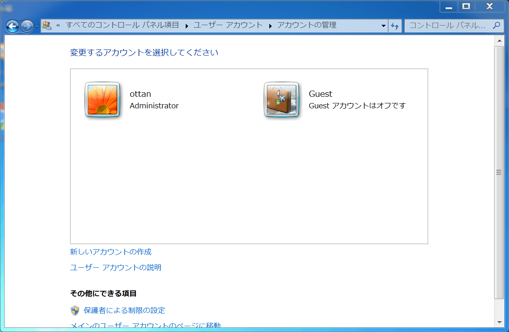
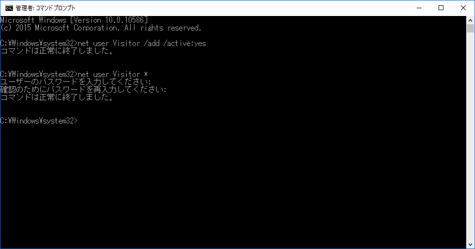
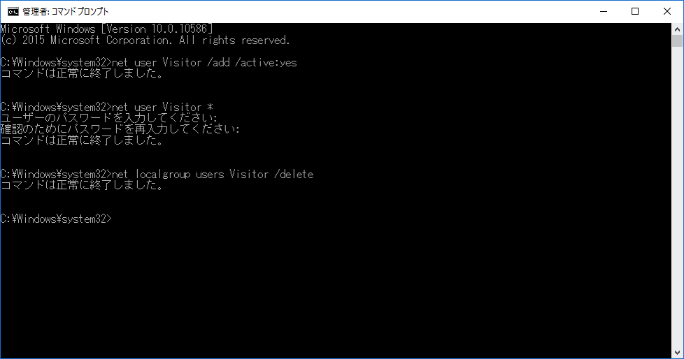
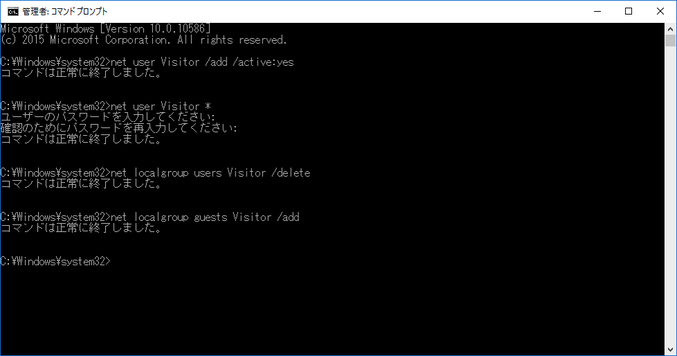
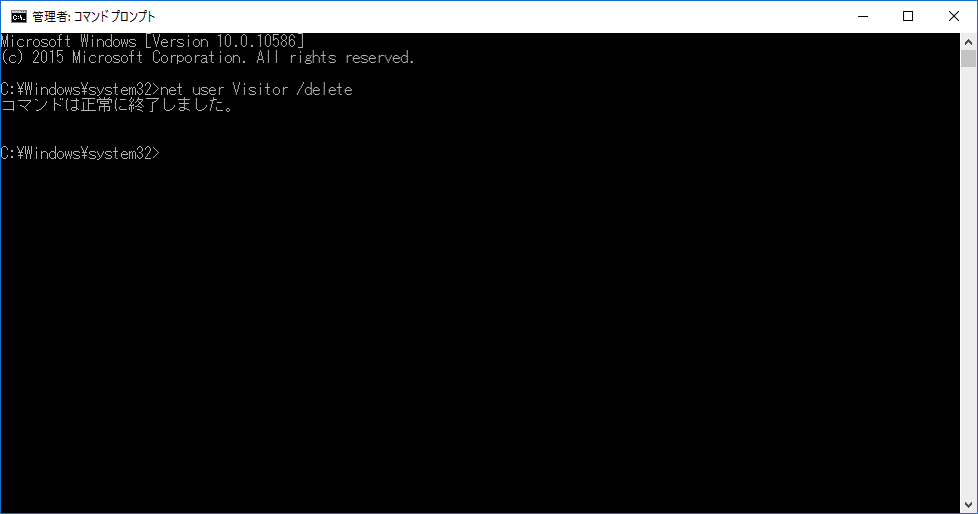

Windows 7、Windows 8.1まではデフォルトで作成されていた、Windowsの操作を最小限に制限する「ゲストアカウント」ですが、Windows 10の最新バージョンから「ゲストアカウント」は削除されてしまいました。

そこで、今回はWindows 10でも、Windows 7と同等のゲストアカウントを作成する方法をご紹介します。

## Windows 10でゲストアカウントを作成・削除する

Windows 10でゲストアカウントを有効化するためには、コマンドプロンプトを使用します。ゲストアカウントを一度作成してしまえば、あとは従来通りコントロールパネルからも操作できます。

### Windows 10でゲストアカウントを作成する

「スタート」ボタンを右クリックして、「コマンドプロンプト（管理者）」を実行します。

UAC（User Account Control）が有効になっている場合は、コマンドプロンプトを管理者権限で実行して良いかどうかプロンプトが表示されるため、「はい」をクリックします。

コマンドプロンプトで、以下のコマンドを実行します。「Visitor」はユーザアカウントの名称です。任意の名前で構いません。このコマンドを実行することにより、ユーザアカウントが作成され、有効化されます。

    
    net user Visitor /add /active:yes

次に、作成したユーザアカウントにパスワードを設定します。コマンドプロンプトで、以下のコマンドを実行します。パスワードの入力が求められるため、確認のためのパスワードも含めて、2回入力します。

    
    net user Visitor *

次に、作成したユーザアカウントがデフォルトで属する、Windowsのビルトイングループである「localgroup」から、所属を解除します。コマンドプロンプトで、以下のコマンドを実行します。

    
    net localgroup users Visitor /delete

最後に、作成したユーザアカウントに「ゲストアカウント」の権限を付与します。コマンドプロンプトで、以下のコマンドを実行します。

    
    net localgroup guests Visitor /add

### ゲストアカウントにスイッチする

作成したユーザアカウントにスイッチするためには、「スタート」ボタンをクリックして、現在ログオンしているアカウントをクリックして、作成したアカウントのアイコンをクリックします。ログオン画面が表示されますので、先ほど設定したパスワードを入力してログオンします。

### ゲストアカウントを削除する

作成したゲストアカウントを削除するためには、作成した時と同様に、コマンドプロンプトで、以下のコマンドを実行します。「Visitor」は作成したユーザアカウントの名称です。

    
    net user Visitor /delete

## まとめ

[Guest アカウントとは](http://windows.microsoft.com/ja-jp/windows-vista/what-is-a-guest-account)に記載されているように、ゲストアカウントを作成することで、第三者に自分のPCを使用してもらう際に、ソフトウェアやハードウェアの変更などを伴う権限を持たすことなく、安全に使用できます。共有のPCで、管理者権限を付与されたままのアカウントを使用することは、危険を伴います。ゲストアカウントを有効活用して、安全にPCを使用しましょう。

### 参考リンク

http://www.laptopmag.com/articles/create-guest-account-windows-10
