---
author:
- '@ottanxyz'
categories:
- Mac
date: 2016-04-30 00:00:00+00:00
draft: false
tags:
- ubuntu
- efi
- usbメモリ
- デュアルブート
- lts
title: macOS El CapitanとUbuntu 16.04 LTSのデュアルブート環境を構築する
type: post
---

以前、[macOS Yosemite と Ubuntu 14.04.2 LTS のデュアルブート環境を構築する](/posts/2015/05/os-x-ubuntu-dual-boot-2-1236/)で、macOS Yosemite と Ubuntu のデュアルブート環境を構築する方法をご紹介しましたが、公開してから記事の内容がだいぶ古くなってしまったので、今回は最新の OS である macOS El Capitan と Ubuntu 16.04 LTS を使用してデュアルブート環境を構築してみます。

* [macOS YosemiteとUbuntu 14.04.2 LTSのデュアルブート環境を構築する - OTTAN.XYZ](/posts/2015/05/os-x-ubuntu-dual-boot-2-1236/)

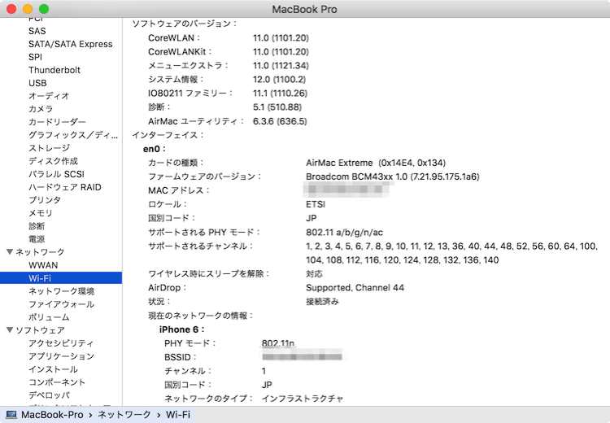

注意点としては、Ubuntu のデフォルトのインストール状態では Wi-Fi 接続を行うことができません。私が使用している Mac に搭載されているインターフェイスの情報は、上図の通りです。同一の「Broadcom BCM43xx」であれば、後述の手順で Wi-Fi に接続できるようになります。

## El Capitan と Ubuntu のデュアルブート環境を構築する

では、順を追って解説します。基本的には[macOS Yosemite と Ubuntu 14.04.2 LTS のデュアルブート環境を構築する](/posts/2015/05/os-x-ubuntu-dual-boot-2-1236/)でご紹介した方法を踏襲していますが、事前にドライバーのダウンロードなどは行いません。

### Ubuntu 16.04 LTS のダウンロード

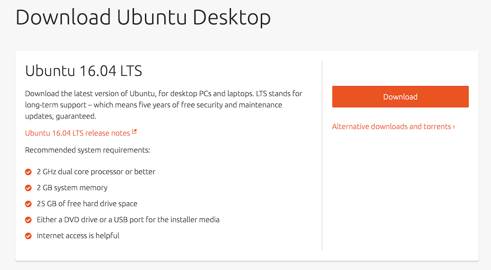

まず、以下のリンクから Ubuntu 16.04 LTS の ISO ファイルをダウンロードします。「Download」をクリックします。

http://www.ubuntu.com/download/desktop

画面最下部にある、「Not now, take me to the download」をクリックします。これで、ダウンロード完了です。

### インストールディスクの作成

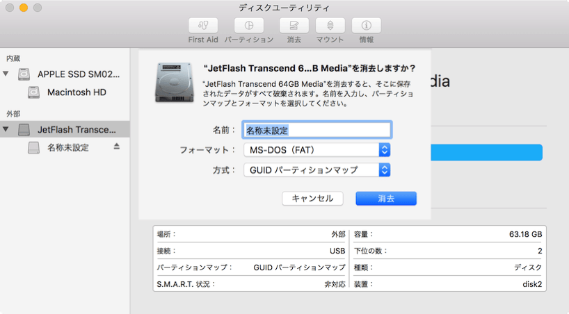

続いて、16GB 以上のフラッシュメモリ（USB メモリ）を用意します。あらかじめ、ディスクユーティリティからフォーマットを行っておきます。フォーマットする際に、「名前」は任意、「フォーマット」は「MS-DOS（FAT）」、「方式」は「GUID パーティションマップ」を選択します。

続いて、USB メモリを接続したまま、ターミナルを開きます。ターミナルは、「アプリケーション」→「ユーティリティ」フォルダーの中にあります。ターミナルを開いたら、以下のコマンドを実行します。

    $ diskutil list

    /dev/disk0 (internal, physical):
       #:                       TYPE NAME                    SIZE       IDENTIFIER
       0:      GUID_partition_scheme                        *251.0 GB   disk0
       1:                        EFI EFI                     209.7 MB   disk0s1
       2:                  Apple_HFS Macintosh HD            250.1 GB   disk0s2
       3:                 Apple_Boot Recovery HD             650.0 MB   disk0s3
    /dev/disk1 (external, physical):
       #:                       TYPE NAME                    SIZE       IDENTIFIER
       0:      GUID_partition_scheme                        *31.6 GB    disk1
       1:                        EFI EFI                     209.7 MB   disk1s1
       2:       Microsoft Basic Data                         31.4 GB    disk1s2

USB メモリのディスクの番号を控えておきます。ここでは「disk1」が該当の USB メモリです。誤って他のディスクを消去することがないよう注意しましょう。次に、ターミナルから以下のコマンドを実行します。「disk1」は該当の番号に置き換えてください。これで、アンマウントされます。

    $ diskutil unmountDisk /dev/disk1

続いて、ダウンロードした ISO ファイルの場所に移動します。たとえば、「ダウンロード」フォルダーに移動したい場合は、以下のコマンドを実行します。

    $ cd ~/Downloads

最後に、USB メモリに Ubuntu のインストールディスクの書き込みを行います。ターミナルから以下のコマンドを実行します。「ubuntu-16.04-desktop-amd64.iso」は実際にダウンロードしたファイル名、「/dev/rdisk1」は事前に控えたディスクの番号に読み替えてください。「/dev/disk1」でも良いのですが、「/dev/**r**disk1」とすると書き込みが速くなります。

    $ sudo dd if=ubuntu-16.04-desktop-amd64.iso of=/dev/rdisk1 bs=1m

USB メモリへの書き込み完了後に上記のような警告ダイアログが出る可能性がありますが、とりあえず無視しておきます。

### Ubuntu のパーティションの作成

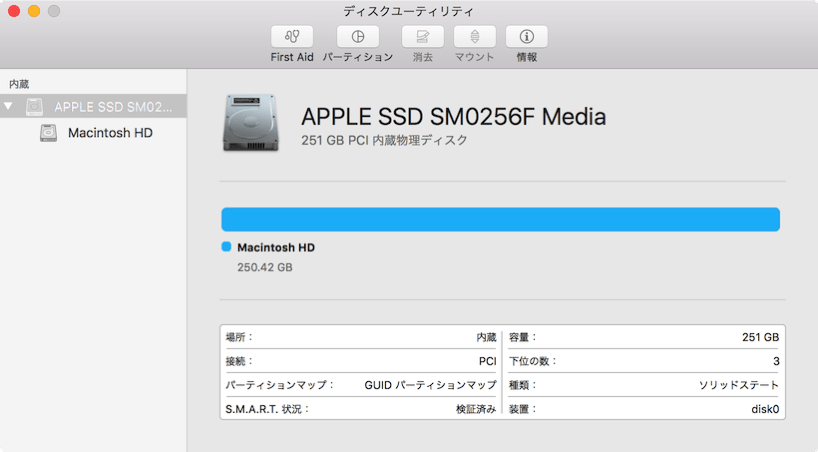

ディスクユーティリティを開き、「Macintosh HD」が含まれるディスクを選択します。選択した状態で「パーティション」をクリックします。

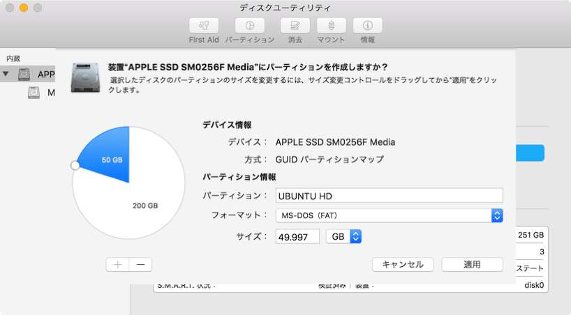

Ubuntu のパーティションを作成します。「パーティション」は任意、「フォーマット」は「MS-DOS（FAT）」、「サイズ」は任意です。50GB もあれば十分でしょう。

### ブートローダーの準備

次に、以下のリンクから「rEFInd」をダウンロードします。「A binary zip file」を選択してダウンロードしてください。ダウンロードしたら、任意のフォルダーに解凍しておいてください。「rEFInd」については、[macOS Yosemite と Ubuntu 14.04.2 LTS のデュアルブート環境を構築する](/posts/2015/05/os-x-ubuntu-dual-boot-2-1236/)
を参照してください。なお、ここでは「Downloads」フォルダーに解凍してあるものとします。

http://www.rodsbooks.com/refind/getting.html

さて、El Capitan からは「SIP」と呼ばれる新たなセキュリティ機構が導入され、デフォルトの状態では「rEFInd」をインストールすることができません。そこで、Mac をリカバリーモードで起動する必要があります。

Mac を再起動し、⌘+R を押し続けてください。Mac がリカバリーモードで起動します。リカバリーモードで起動したら、以下の手順で「rEFInd」をインストールします。

1. メニューの「ユーティリティ」→「ターミナル」をクリックします
2. ターミナルから、「rEFInd」を解凍しているフォルダーに移動します。以下のコマンドを参照。「ottan」、「Downloads」、「refind-0.10.2」は適宜読み替えてください
3. `./refind-install`を実行。「Installation has completed successfully.」と表示されればインストールは完了です
4. Mac を通常モードで再起動します

    # cd /Volumes/Macintosh\ HD/Users/ottan/Downloads/refind-0.10.2

通常では、「rEFInd」のインストールが完了した時点で、作業は完了なのですが、どうも El Capitan の環境ではこのままではうまく動作しないようです。Ubuntu のインストール完了後に、Mac を ⌥（option）を押したまま再起動し、Ubuntu の起動ディスクが見えないようでしたら、以下の手順を試してみてください。

https://wavisaviwasavi.amebaownd.com/posts/208897

こちらを参考に、少々小細工します。ターミナルを開いて、以下のコマンドを実行します。

    $ diskutil list

    /dev/disk0 (internal, physical):
       #:                       TYPE NAME                    SIZE       IDENTIFIER
       0:      GUID_partition_scheme                        *251.0 GB   disk0
       1:                        EFI EFI                     209.7 MB   disk0s1
       2:                  Apple_HFS Macintosh HD            250.1 GB   disk0s2
       3:                 Apple_Boot Recovery HD             650.0 MB   disk0s3

「EFI」の「IDENTIFIER」を控えておいてください。次に、ターミナルから以下のコマンドを実行します。

    $ mkdir /Volumes/efi
    $ sudo mount -t msdos /dev/disk0s1 /Volumes/efi

「/dev/disk0s1」は事前に確認した「EFI」の「IDENTIFIER」です。適宜読み替えてください。次に、Finder を開き、`/Volumes/efi`に移動します。具体的には、Finder で、⇧+⌘+G で、移動する場所に上記を指定してください。

その後の作業については上記リンクに書いてある通りです。

### Ubuntu のインストール

Ubuntu のインストールディスク（USB メモリ）を接続した状態で、Mac を再起動します。その際に、⌥（option）を押しっぱなしにします。画面に、「EFI Boot」という黄色いディスクがあわられますので、こちらを選択して起動します。

Ubuntu のインストールディスクから起動されます。「Try Ubuntu without installing」を選択して、Ubuntu を USB メモリから起動します。その後、デスクトップ上の「Install Ubuntu 16.04 LTS」をダブルクリックします。

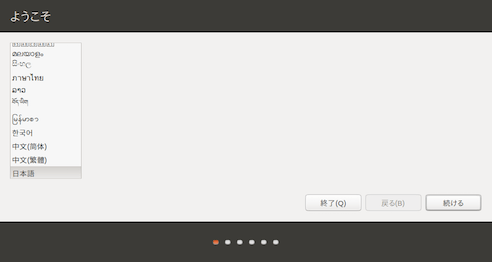

「日本語」を選択して、「続ける」をクリックします。

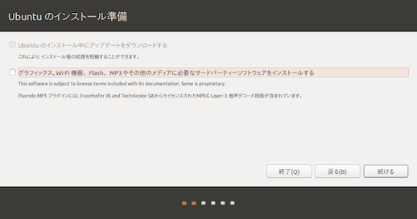

何もチェックせずに、そのまま「続ける」をクリックします。

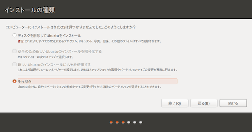

「それ以外」を選択して、「続ける」をクリックします。「ディスクを削除して Ubuntu をインストール」を選択すると、macOS の領域まで削除されてしまうため、要注意です。

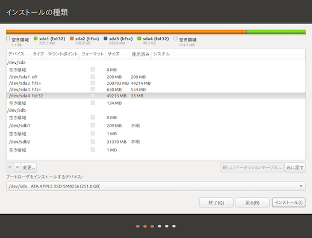

あらかじめ用意したパーティションを選択します。「タイプ」が「fat32」、「サイズ」があらかじめ指定したサイズになっているデバイスを選択してください。選択したら、「変更...」をクリックします。

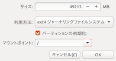

「利用方法」を「ext4 ジャーナリングファイルシステム」、「パーティションの初期化」をチェック、「マウントポイント」を「/」にして、「OK」をクリックします。

「続ける」をクリックします。

「インストール」をクリックします。

今回、スワップ領域を用意しなかったため、上記の警告ダイアログが表示されました。スワップ領域を用意する場合には、あらかじめディスクユーティリティでスワップ領域用のパーティションを用意してください。詳細は、[macOS Yosemite と Ubuntu 14.04.2 LTS のデュアルブート環境を構築する](/posts/2015/05/os-x-ubuntu-dual-boot-2-1236/)を参照してください。

「続ける」をクリックします。

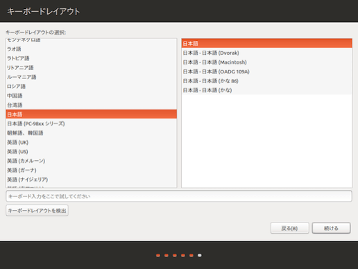

「続ける」をクリックします。

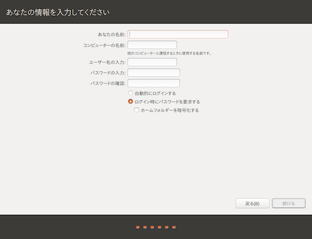

項目を入力して、「続ける」をクリックします。

インストールが開始されます。

「今すぐ再起動する」をクリックします。デフォルトの状態であれば、そのまま Ubuntu が起動します。

### ドライバーのインストール

さて、Ubuntu のデフォルトのインストールの状態の場合、Wi-Fi に接続することができないため、ドライバーをインストール必要があります。ドライバーは、インストールに使用した USB メモリに格納されています。

USB メモリの「/pool/main/d/dkms」に格納されているファイルを、「Home」にコピーしておきます。

続いて、同じく USB メモリの「/pool/restricted/b/bcmwl」に格納されているファイルを、「Home」にコピーしておきます。

「Home」にこのように格納されていれば OK です。続いて、「Terminal」（端末）を起動します。「Terminal」が起動したら、以下のコマンドを実行します。ドライバーを「Home」以外にコピーした場場合は、そのディレクトリに移動してからコマンドを実行してください。

    $ sudo dpkg -i *.deb

これで、Ubuntu が Wi-Fi に接続できるようになります。

## まとめ

macOS El Capitan になったことにより、「SIP」と呼ばれるセキュリティ機構が導入されたことに伴い、再起動を何回も行う必要があり、若干手順が面倒くさくなっていますが、基本的には前回お伝えした手順と変更はありません。Wi-Fi ドライバーは簡単にインストールできたんですね。前回も同様の手順でできたのかもしれません。（もう手元に環境がないので分からないのが残念なのですが）