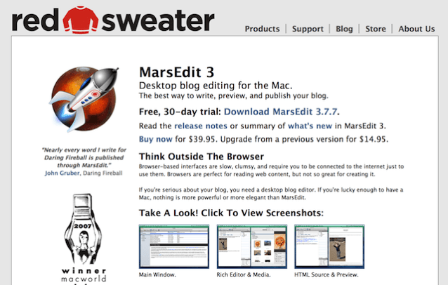
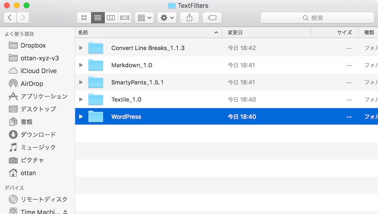
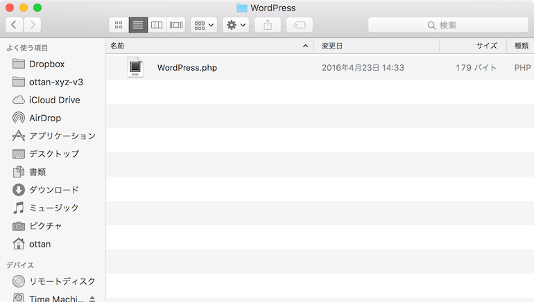
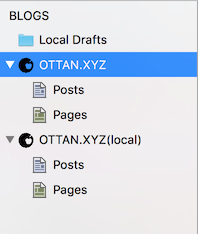
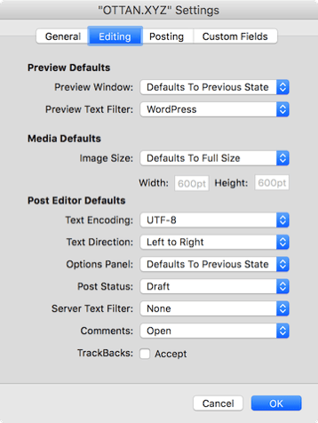

Mac で WordPress を使ってブログを書くなら使いたい「MarsEdit」、弊サイトでも、度々その使い方についてご紹介してきました。過去記事については、[MarsEdit のプレビュー画面で、「highlight.js」のシンタックスハイライトをリアルタイムでプレビューする](/posts/2016/04/marsedit-preview-syntax-highlight-6853/)、[WordPress のテーマ開発、ブログの執筆作業を効率化する方法のまとめ](/posts/2014/12/efficiency-blog-736/)などをご覧いただくとして、今回は MarsEdit の要でもあるプレビュー画面に、WordPress のショートコードをリアルタイムに展開するための方法をご紹介します。

## MarsEdit のプレビュー画面にリアルタイムにショートコードを反映する

ショートコードについては、[ショートコード API - Blog Codex 日本語版](https://wpdocs.osdn.jp/ショートコード_API)などをご覧いただくとして、ここでは MarsEdit に特化してご紹介します。また、MarsEdit のプレビュー画面のカスタマイズについては、[MarsEdit のプレビューをブログデザインと同じようにするための参考記事＆快適に書くための注意点 | なまら春友流](https://harutomo-ryu.com/archives/2012-09-02/132614.html)などをご覧ください。

### 下準備

さて、MarsEdit のプレビュー画面にリアルタイムにショートコードを反映させるためには、ちょっとした下準備が必要です。今回は、手っ取り早い方法をご紹介しますが、他にも何か良い案をお持ちの方がいらっしゃれば、是非教えてください。

手っ取り早い方法とは、**ローカル環境に WordPress の開発環境を用意する**ことです。そして、WordPress の開発環境を手っ取り早く用意するためには、Vagrant をオススメしています。Vagrant の中でも[VCCW - A WordPress development environment.](http://vccw.cc/)は構築が簡単でオススメです。ここでは、VCCW を使用していることを前提として書きますので、読み替えてください。なお、VCCW については、[gulp.js と Browser Sync で快適な WordPress 開発環境を手に入れる](/posts/2014/09/gulp-browser-sync-476/)で詳しくご紹介しています。

### MarsEdit のテキストフィルター（TextFilters）を用意する

VCCW を使用して WordPress の開発環境を構築した場合は、WordPress インストールディレクトリ直下の「wp-config.php」ファイルの中身を修正してください。具体的には、`DB_HOST`の値を`vccw.dev`に修正します。

**wp-config.php**

    /** MySQL hostname */
    define('DB_HOST', 'vccw.dev');

続いて、テキストエディターなど、普段 PHP ファイルを編集しているエディターを開いて、以下の内容を記述し、「WordPress.php」という名前で保存します。コード中の[WordPress Install Path]は、実際の WordPress のインストールディレクトリの絶対パスに置き換えてください。相対パスではなく絶対パスにしてください。

**WordPress.php**

    #!/usr/bin/env php
    <?php
    require_once '[WordPress Install Path]/wp-load.php';

    $content = file_get_contents('php://stdin', 'r');

    echo apply_filters('the_content', $content);
    ?>

続いて、保存したファイルを移動します。Finder の場合、⇧+⌘+G で、パスを入力してください。

    ~/Library/Application Support/MarsEdit/TextFilters

このフォルダーに、新規フォルダーを作成します。名前は「WordPress」とします。

作成した「WordPress」フォルダーに、先ほど作成した「WordPress.php」を移動します。ここまできたら、MarsEdit を開いている場合は、一度 MarsEdit を再起動します。

### MarsEdit で WordPress フィルターを使用する

続いて、編集するブログを選択した状態で「右クリック」→「Edit Settings」を開きます。

「Editing」タブの、「Preview Text Filter」で「WordPress」が選択できるようになっているので、こちらを選択します。「OK」ボタンをクリックします。

続いて、記事の編集画面を開きます。プレビュー画面も開いておきます。記事の編集画面に任意のショートコードを入力します。たとえば、代表的なショートコードとして、ここでは`[[article]]`を例にあげます。`[[article]]`については、[WordPress のショートコード入門](/posts/2016/04/wordpress-shortcode-getting-start-6855/)をご覧ください。

入力すると同時に、リアルタイムにプレビュー画面にショートコードの内容が展開されました！

## まとめ

今回用意した MarsEdit のテキストフィルター（TextFilters）は、

1. 外部の PHP ファイルから WordPress の関数を使用できるよう「wp-load.php」を読み込む 2. MarsEdit の記事の編集画面の内容を取得する 3. WordPress の関数を使用して、画面出力用に変換する

ということをやっています。WordPress のことなんで、入力したものを WordPress の実際の出力内容に変換してやれば、たいていのことは何とでもなります。ただし、JavaScript を使用するもの、たとえば、Twitter や YouTube などの oEmbed 系は、正しく変換できてもプレビュー画面にはうまく出力されません。この辺りについてはまだ改良の余地がありそうですが、MarsEdit の限界かもしれません。独自のショートコードを使用している場合も、たいていの場合は動作しますので、ぜひお試しあれ！

もちろん、DB の向き先はローカルの開発環境なので、ショートコードから記事の内容を取得するようなものは、ローカルの DB にその内容が反映されている必要がありますので、ご注意ください。
