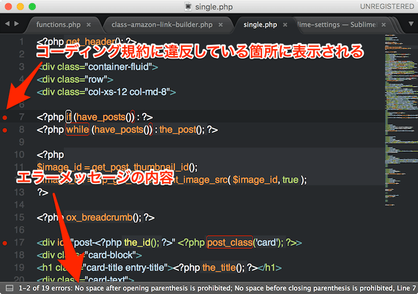

---
author:
- '@ottanxyz'
categories:
- Mac
- Blog
date: 2016-05-21 00:00:00+00:00
draft: false
tags:
- php
- sublime
- コーディング
- インストール
- 規約
title: Sublime TextでWordPressのコーディング規約に遵守したコーディングを効率的に行おう！
type: post
---

Sublime Text はお気に入りのエディターです。プラグインを使用することで拡張することができ、さまざまな用途で使用することができるようになります。また、多数のテーマも開発されており、自分の好みにあった外観に仕上げることも可能です。今回は、この Sublime Text を使用して WordPress のコーディング規約に沿ったコーディングが行われているか簡単に確認できるようにしてみます。

## Sublime Text で PHP CodeSniffer を使用する

Sublime Text のパッケージに「SublimeLinter-phpcs」がありますが、そのためには事前の準備がいろいろと必要です。初回のみですので頑張りましょう。

### Composer のインストール

PHP CodeSniffer を使用するには、PHP のパッケージ管理ソフトウェアである「Composer」をあらかじめインストールしておく必要があります。その他の PHP のパッケージ管理にも使用できますので、これを機に導入しておくと後々便利になります。

https://getcomposer.org/download/

インストールは上記のリンクから行います。具体的には、ターミナルを開いて以下のコマンドを実行します。なお、Composer のアップデートによりハッシュ値等が変更になる場合がありますので、最新情報は上記のサイトで確認するようにしてください。

    php -r "copy('https://getcomposer.org/installer', 'composer-setup.php');"
    php -r "if (hash_file('SHA384', 'composer-setup.php') === '92102166af5abdb03f49ce52a40591073a7b859a86e8ff13338cf7db58a19f7844fbc0bb79b2773bf30791e935dbd938') { echo 'Installer verified'; } else { echo 'Installer corrupt'; unlink('composer-setup.php'); } echo PHP_EOL;"
    php composer-setup.php
    php -r "unlink('composer-setup.php');"

カレントディレクトリに`composer.phar`というファイルが生成されますので、以下のコマンドを実行して、この実行ファイルを移動します。

    mv composer.phar /usr/local/bin/composer

ターミナルを閉じて、再度ターミナルを開き直します。以下のコマンドを実行して、Composer がインストールされていることを確認してください。

    composer -V

### PHP CodeSniffer のインストール

続いて、PHP CodeSniffer をインストールします。ターミナルを開いて以下のコマンドを実行します。

    composer global require "squizlabs/php_codesniffer=*"

インストールが完了すると、`~/.composer/vendor/bin`配下に`phpcs`という実行ファイルがインストールされます。`/usr/local/bin`配下にシンボリックリンクを作成します。

    ln -s ~/.composer/vendor/bin/phpcs /usr/local/bin

ターミナルを閉じて、再度ターミナルを開き直します。以下のコマンドを実行して、PHP CodeSniffer がインストールされたことを確認してください。

    phpcs --version

### WordPress Coding Standard のインストール

次に、PHP CodeSniffer でチェックする WordPress Coding Standard をインストールします。

https://github.com/WordPress-Coding-Standards/WordPress-Coding-Standards

具体的にはターミナルを開いて以下のコマンドを実行します。

    git clone -b master https://github.com/WordPress-Coding-Standards/WordPress-Coding-Standards.git ~/.composer/vendor/squizlabs/php_codesniffer/CodeSniffer/Standards/WordPress

PHP CodeSniffer でダウンロードした WordPress Coding Standard が使用できるように、PHP CodeSniffer に認識させます。

    phpcs --config-set installed_paths ~/.composer/vendor/squizlabs/php_codesniffer/CodeSniffer/Standards/WordPress

以下のコマンドを実行して、「WordPress」が表示されることを確認してください。

    phpcs -i

### SublimeLinter-phpcs のインストール

事前準備は完了です。続いて、Sublime Text を開き、PHP CodeSniffer が使用できるようにします。Package Control を開き、「SublimeLinter-phpcs」パッケージをインストールしてください。なお、「Package Control」の使い方については、以下のリンクを参照してください。また、「SublimeLinter-phpcs」を使用するためには、事前に「SublimeLinter」パッケージをインストールしておく必要があります。

* [Sublime Textに導入しているオススメのプラグイン23選 - OTTAN.XYZ](/posts/2014/09/sublime-text-plugin-321/)

次に、Sublime Text のメニューから「Sublime Text」→「Preferences」→「Package Settings」→「SublimeLinter」→「Settings - User」を開きます。（一部内容を省略しています）

    {
        "user": {
            "debug": false,
            "delay": 0.25,
            "error_color": "D02000",
            "gutter_theme": "Packages/SublimeLinter/gutter-themes/Default/Default.gutter-theme",
            "gutter_theme_excludes": [],
            "lint_mode": "background",
            "linters": {
                "phpcs": {
                    "@disable": false,
                    "args": [],
                    "excludes": [],
                    "standard": "WordPress-Core"
                }
            },
            "mark_style": "outline",
            "no_column_highlights_line": false,
            "passive_warnings": false
        }
    }

「user」→「linters」→「phpcs」→「standard」の内容を「WordPress-Core」に書き換えてください。書き換えたら Sublime Text を再起動します。

### SublimeLinter-phpcs を使用してコーディング規約を確認する

このように WordPress コーディング規約に違反する箇所に「赤い丸」が表示されるようになります。また、該当行にカーソルを合わせると、ステータスバーに具体的なエラーメッセージが表示されるようになります。

https://make.wordpress.org/core/handbook/best-practices/coding-standards/php/

WordPress のコーディング規約に従い、可読性のあるコーディングを心がけましょう！

## おまけ

PHP CodeSniffer はコマンドラインからも使用できます。ターミナルを開いて以下のコマンドを実行すると、一括で PHP ファイルの内容を確認できます。

    phpcs -p -s -v --standard=WordPress-Core ./*.php