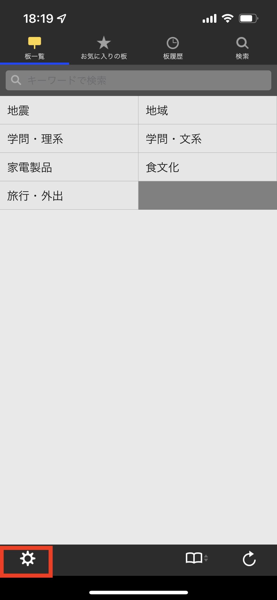
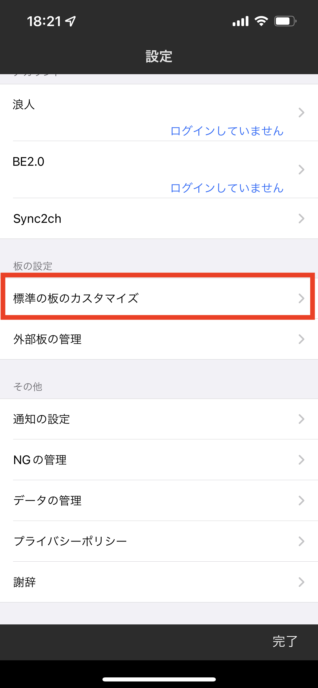
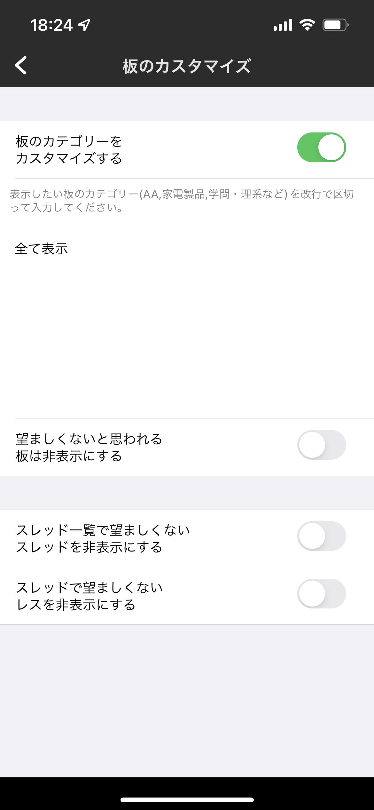
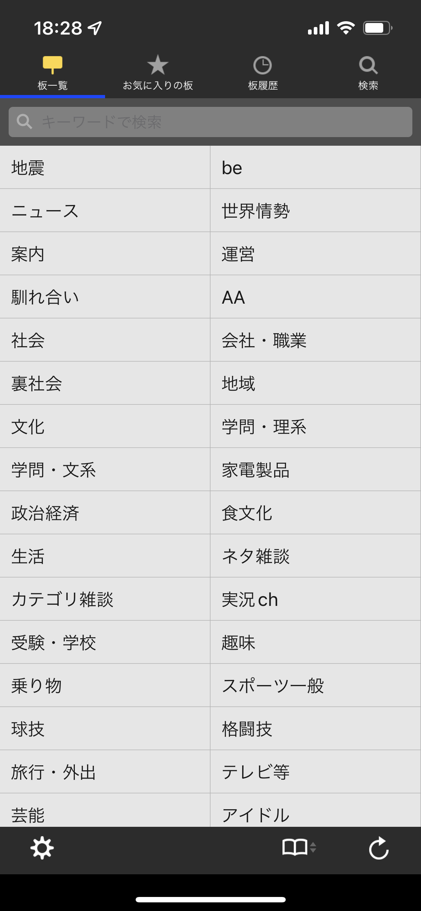

---
author:
- '@ottanxyz'
categories:
- iPhone
date: 2016-05-26 00:00:00+00:00
draft: false
tags:
- twinkle
- スレッド
- 非表示
- 2ちゃんねるブラウザ
- タップ
title: iPhoneの高機能2ちゃんねるブラウザ「twinkle」で板がすべて表示されない問題の対処法
type: post
---

{}
2022年1月8日時点の情報にもとづき、記事を更新しました。
{}

iPhoneの2ちゃんねるブラウザ「twinkle」導入時に、初期設定のままではすべての「板」が表示されないという問題があります。これは、2ちゃんねるという特性上、それを閲覧するためのアプリをApp Storeの審査に通すための対策と思われますが、はじめて導入する人は戸惑うかもしれません。最近、BB2Cからtwinkleに乗り換えたため、初期設定についての覚書です。



## twinkleですべての板を表示する

twinkleを起動したら、左下の設定をタップします。

「その他」→「標準の板のカスタマイズ」をタップします。

「板のカテゴリーをカスタマイズする」をチェックし、「全て表示」とそのまま入力してください。また、「望ましくないと思われる板は非表示にする」のチェックを外します。また、「スレッド一覧で望ましくないスレッドを非表示にする」「スレッドで望ましくないレスを非表示にする」のチェックを外します。

「板一覧」タブに戻り、右下のリロードをタップすると、すべての板が表示されるようになります。

