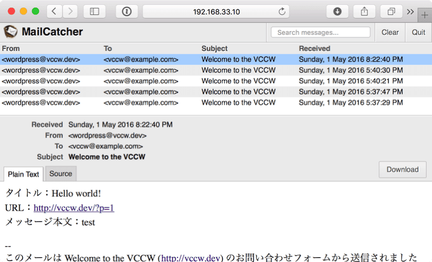

---
author:
- '@ottanxyz'
categories:
- Mac
- Blog
date: 2016-05-01 00:00:00+00:00
draft: false
tags:
- mailcatcher
- vccw
- 環境
- wordpress
- virtualbox
title: VCCW（Vagrant＋VirtualBox＋Chef＋WordPress）のメール送信テスト環境には、MailCatcherが最適！
type: post
---

ローカルの WordPress の開発環境を用意するのであれば、[VCCW - A WordPress development environment.](http://vccw.cc/)を使用しましょう。Vagrant と VirtualBox さえあれば、なんでもそろった無償の開発環境を迅速に構築できます。VCCW の構築方法については、[gulp.js と Browser Sync で快適な WordPress 開発環境を手に入れる](/posts/2014/09/gulp-browser-sync-476/)をご参照ください。

* [gulp.jsとBrowser Syncで快適なWordPress開発環境を手に入れる - OTTAN.XYZ](/posts/2014/09/gulp-browser-sync-476/)

## VCCW の開発環境でメール送信テストを行う

VCCW を使用すれば簡単にローカルホストに WordPress の開発環境を構築できるので、独自のテーマ、プラグイン、ウィジェットの開発に非常に役に立っているのですが、唯一困っていたのが「Contact Form」などのメール送信テストを行う環境。

たとえば、弊サイトでは最近ページごとにご意見を匿名で簡単に送っていただける送信フォームを用意したのですが、いきなり本番環境に適用するわけにもいかず、どうしてもローカルでテストをしたかったのです。

しかし、そこは天下の VCCW、ちゃんとメール送信テストを行うための環境もデフォルトで用意されていました。それは、[MailCatcher](https://mailcatcher.me/)というソフトウェア。シンプルな SMTP サーバで、WordPress から送信されたメールを、独自の Web インタフェースで簡単に確認を行うことができるようになります。ちょっとしたテストに十分すぎるほど充実した機能！

### VCCW（Vagrant）で MailCatcher を使用する

VCCW では、デフォルトで MailCatcher は有効化されていません。有効化するためには、VirtualBox の仮想マシンにログインして、MailCatcher を起動する必要があります。

    $ cd ~/Documents/vccw-2.19.0
    $ vagrant ssh

MailCatcher を起動するために仮想マシンにログインします。上記のパスは、VCCW の Vagrantfile が置いてある場所です。ログインしたら、以下のコマンドを実行します。

    $ curl -L https://raw.githubusercontent.com/vccw-team/activate-mailcatcher/master/setup.sh | bash

これで、自動的に MailCatcher がセットアップされ、起動します。MailCatcher が起動したら、ブラウザから`http://192.168.33.10:1080`にアクセスします。

これが、MailCatcher の Web インタフェースです。WordPress で送信したメールはすべて MailCatcher が受け取ります。これで、メール送信テストも手軽に行うことができますね。

もし、MailCatcher のデーモン（プログラム）が落ちたりした場合や、次回以降の起動には、仮想マシンにログインした状態で、以下のコマンドを実行します。

    $ mailcatcher --ip=0.0.0.0

## まとめ

ローカルのメール送信テスト環境をどうしようかずっと悩んでいたのですが、まさかデフォルトで VCCW に組み込まれていたとは…。これでしばらく WordPress の開発環境に困ることはなさそうです。