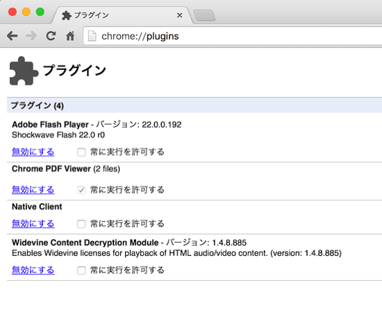
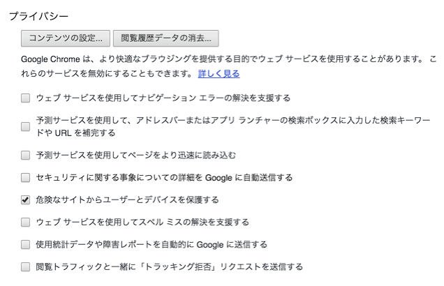
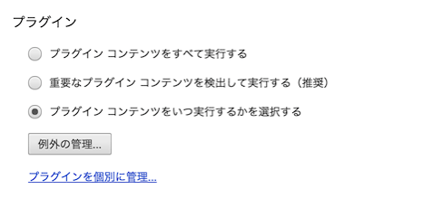
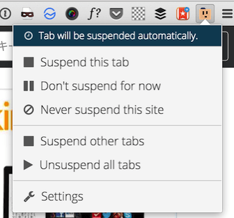
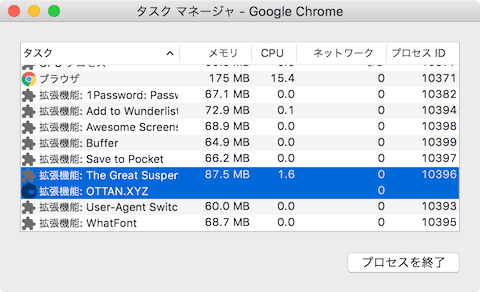

---
author:
- '@ottanxyz'
categories:
- Mac
- Windows
date: 2016-06-25 00:00:00+00:00
draft: false
tags:
- chrome
- google
- タブ
- メモリ
- テクニック
title: Google Chromeを高速化する6つのテクニック
type: post
---

Google Chrome は、多種多様な拡張機能の数々、使いやすいデベロッパーコンソール、高速なタブブラウジングと、優秀な機能を数多く備えているブラウザであるため、メインブラウザとして使用している方々も多いはず。

しかし、その反面、[Chrome がノート PC のバッテリーをもっとも減らすブラウザであるということが Microsoft のテストで判明 - GIGAZINE](http://gigazine.net/news/20160621-power-efficient-browser/)という記事で紹介されているようなイメージを持っている人も多いはず。

* [Google Chromeのメモリ使用量を50%以上削減する魔法のコマンド](/posts/2014/09/chrome-memory-reduce-219/)

過去に、Google Chrome のメモリ使用量を抑える方法をご紹介しましたが、この方法はいわば Chrome のメリットも同時に殺しています。そこで、今回は、上記でご紹介した方法以外に、Google Chrome をより快適に使用するための 6 つのテクニックを紹介します。

## Google Chrome を高速化する 6 つのテクニック

Google Chrome の高速化、PC の高速化に焦点を当て、6 つのテクニックに絞ってご紹介します。

### 不要なプラグインを無効化する

Google Chrome に組み込まれている不要なプラグインを無効化してしまいましよう。Google Chrome のアドレスバーに以下のアドレスを入力してみてください。

    chrome://plugins

Google Chrome で有効化されているプラグインの一覧が表示されます。Google Chrome には、デフォルトで Flash Player が組み込まれていますが、使用しないのであれば無効化してしまいましょう。

### プラグインの実行タイミングを制御する

Google Chrome を開いて、設定を開きます。設定の最下部に「詳細設定を表示...」とありますので、こちらをクリックします。

詳細設定の「プライバシー」から「コンテンツの設定」をクリックします。

「プラグイン」の項目から、「プラグインコンテンツをいつ実行するかを選択する」をチェックしておきます。これで、ユーザーが必要に応じてプラグインをロードできるようになります。いつでもプラグインを実行したいサイトの場合は、例外の管理で許可しておくことも可能です。

### 使用していない拡張機能を削除する

拡張機能は非常に便利ですが、有効化しているだけで大量のメモリを消費します。使用する拡張機能は厳選し、滅多に使用する機会のない拡張機能は思い切って断捨離しましょう。

### 使用していないタブをサスペンドする

Google Chrome でメモリを大量消費する原因は、**タブの開きすぎか、拡張機能のロードのしすぎ**です。とくに、前者のタブに関しては顕著で、通常、1〜2 個のタブを開いている程度では問題ありませんが、10 個以上のタブを開くと非常にメモリ消費が激しくなります。そこで、使用していないタブはサスペンドしてしまいましょう。

<https://chrome.google.com/webstore/detail/the-great-suspender/klbibkeccnjlkjkiokjodocebajanakg>

サスペンドとは、直前の状態を保存して、必要に応じて復旧できるようにしておくことです。使用していないタブのサスペンドは、「The Great Suspender」が便利です。例をご覧ください。

弊サイトをタブで開いている状態です。「197MB」のメモリを消費していることがわかります。

「The Great Suspender」でサスペンドしてみます。

「The Great Suspender」の陰に隠れて、メモリが解放されました。また、設定で使用していないタブを自動的にサスペンドすることもできます。デフォルトでは「1 時間」ですが、最短「20 秒」に設定することもできます。

### 使用しているタブをセッションとして保存しておく

Google Chrome のタブを制御するもう 1 つの方法が、開いているタブの情報をセッションとして保存しておくことです。

<https://chrome.google.com/webstore/detail/session-buddy/edacconmaakjimmfgnblocblbcdcpbko?hl=ja&gl;=JP>

「Session Buddy」を使用すれば、開いているタブの情報を「セッション」として保存し、いつでも情報を復元できるようになります。一度、セッションとして保存してしまえば、もはやタブを開いておく必要がなくなるため、タブを閉じることができて、結果的にメモリ使用量を抑えることができるわけです。

### Google 提供のデータセーバーを使用する

<https://chrome.google.com/webstore/detail/data-saver/pfmgfdlgomnbgkofeojodiodmgpgmkac>

Google が自ら提供する拡張機能である「データセーバー」を使用することにより、通信量を軽減し、高速な通信を行うことができるようになります。結果的に、ページの読み込み速度が上がり、体感速度が向上することに繋がります。

## まとめ

Google Chrome を高速化するテクニックを 6 点紹介しました。Google Chrome により、快適なブラウジングをお楽しみください。
