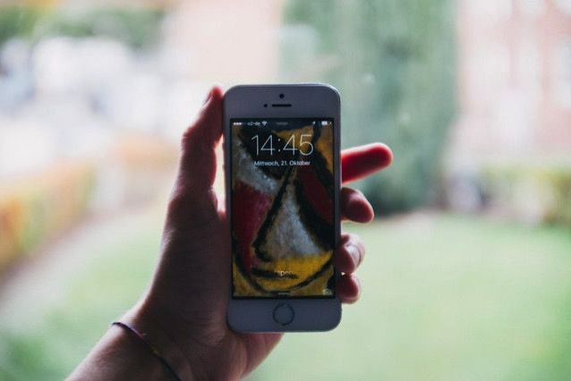
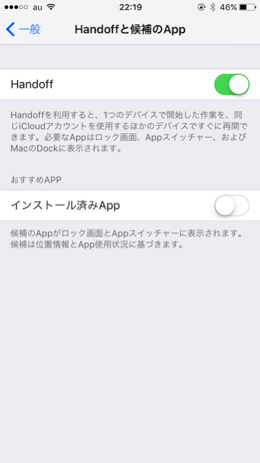
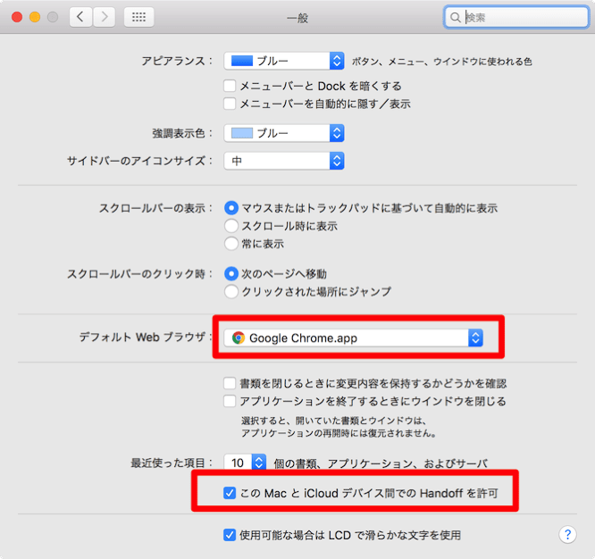
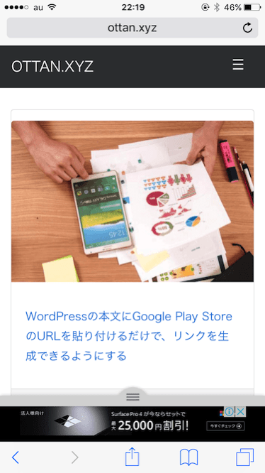
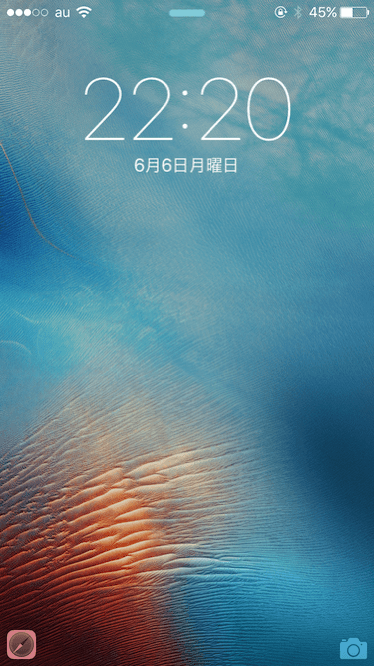

---
author:
- '@ottanxyz'
categories:
- iPhone
- Mac
date: 2016-06-06 00:00:00+00:00
draft: false
tags:
- handoff
- chrome
- google
- iphone
- デフォルトブラウザ
title: iPhoneのSafariと、MacのGoogle ChromeをHandoffで連携する
type: post
---

知っている人にとっては当たり前のお話をします。私は気付きませんでした。

iOS、macOSデバイス間でシームレスに作業を引き継ぐためのHandoff機能、何気に便利で使用しています。とくに、iOSのSafariで閲覧していたWebページを、macOSのSafariに引き継いで同じページを見ることが良くあります。

https://support.apple.com/ja-jp/HT204689

**HandoffはApple純正アプリケーションでしか使用できない？**、そう思っていたため、上記の要件を満たすためには、iPhone、Macともに、ブラウザは必然的にSafariを使用するしかないと思っていたのですが…。

拡張機能、デベロッパーツールの点に関して言えば、SafariはGoogle Chromeには到底及ばないレベルという認識のため、できればMacではGoogle Chromeを使いたかったんです。でも、iPhoneとも連携したい。

## iPhoneのSafariと、MacのGoogle Chromeを連携する

準備は至って単純です。**MacのデフォルトブラウザをGoogle Chromeに変更するだけ**です。知っている人にとっては、当たり前の話です。たったこれだけのことです。あとは、冒頭のHandoffを使用できる環境が整っていること、これだけです。

### Handoffの使用方法

iPhoneで、「設定」→「一般」→「Handoffと候補のApp」から「Handoff」を有効にします。

Macで、「システム環境設定」→「一般」から、デフォルトブラウザを「Google Chrome」に、「このMacとiCloudデバイス間でのHandoffを許可」をチェックします。あとは、iPhoneとMacで同一のApple IDでiCloudにサインインしておきます。

iPhoneのSafariで閲覧していたページは…

MacのDockにひょこりと現れます、Google Chromeが。

逆に、MacのGoogle Chromeを開いていると、iPhoneのロック画面にSafariのアイコンが表示されます。このアイコンを上にスライドさせると、MacのGoogle Chromeで開いていたWebページを、iPhoneのSafariで開くことができます。

## まとめ

iOSは、その制約上、デフォルトブラウザを変更することができません。そのため、純正のアプリケーション（たとえば、メール）からリンクを開くと、自ずとSafariが起動します。そのため、iPhoneでGoogle Chromeだけで運用するということは、なかなか困難です。

そうは言っても、MacではGoogle Chromeのデベロッパーツール、豊富な拡張機能を使用したい。両者が連携できれば一番いいんですけど…。なんて考えていたら、あっさりとHandoffで連携できましたね。

あとは、iOSの制約が緩くなり、デフォルトブラウザが変更できるようになれば、よりシームレスな連携ができるようになるでしょう。