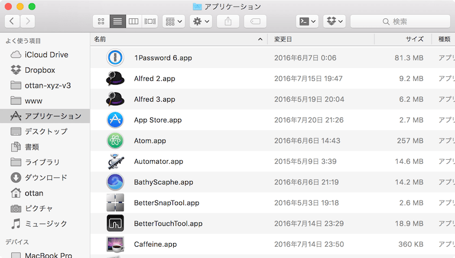
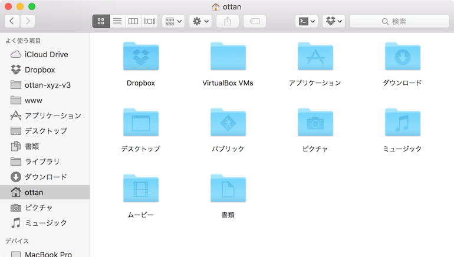
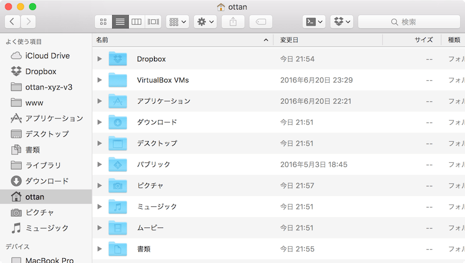

MacのFinderは、Macを使用する限り切っても切り離せない存在です。そのため、Finderは自分の使いやすいようにカスタマイズしたいですよね。Finderを拡張する製品も登場していますが、El Capitanから導入されたセキュリティ機構であるSIP（System Integrity Protecton）の登場により対応していないアプリケーションも増えています。そこで、Macの標準アプリケーションであるFinderをそのままカスタマイズする方法を考えましょう。

今回は、Finderのフォルダーやファイルの表示方法に絞ってご紹介します。

## Finderの表示オプションの「デフォルトを使用」？

Finderには、表示オプションと呼ばれる項目があります。文字通り、Finderに表示するフォルダーやアイコンの並べ替え順や、アイコンの表示の大きさを設定できるオプションです。

たとえば、私の場合、デフォルトの「アイコン表示」と呼ばれる表示方法が、変更日、サイズ、種類といった情報が欠けているので、「リスト表示」にしたいんです。Finderのメニューバーから「リスト表示」に切り替えてみます。

アイコンが整然と並んだ上に、変更日、サイズといった付加情報が
見やすく表示されました。私は、この「リスト表示」を好んで使います。ここは好みだと思いますので、「アイコン表示」「リスト表示」「カラム表示」「Cover Flow表示」から好きなものを選べばいいと思います。

そして、好きな表示方法が決まれば、それをすべてのフォルダーに適用したいわけです。その時には、どうするか。好きな表示方法を選択した後、⌘（command）+Jを押して、「表示オプション」を表示します。

「並び順序」「表示順序」「アイコンサイズ」「テキストサイズ」など、Finderで情報を表示する上で、カスタマイズできる方法がずらっと並びます。そして、注目すべきは最下部です。「デフォルトとして使用」というボタンがあります。ここをクリックすると、すべてのフォルダーに適用される、という流れです、普通は。

### すべてのウインドウに適用されない？

意気揚々と「デフォルトとして使用」を選択して、別のフォルダーを開いてみます。きっと「リスト表示」されるに違いない、という淡い期待を込めて、たとえばここではホームフォルダーを選択してみました。…アイコン表示のままですね。

#### 「デフォルトとして使用」の適用範囲は、それ以降にはじめて開いたウインドウのみ

これは、Finderの仕様です。「デフォルトとして使用」でデフォルトの表示方法が変更されるのは、「デフォルトとして使用」というボタンをクリックして、それ以降にはじめて開いたウインドウのみです。全然、デフォルトじゃない。予想と違う。

### 対処策

では、どのように解決するか。Finderの情報は、`.DS_Store`と呼ばれる隠しファイルに保存されています。この中に、表示方法の情報が保存されています。この隠しファイルは、すべてのフォルダーに存在します。ネットワークフォルダー上には、このファイルを作成しないようにすることもできます。Windowsなど、別のOSと共有したい場合、必要ないですよね、このデフォルトでできるファイル。ここでは、その方法は割愛するとして。

逆に言えば、この`.DS_Store`さえ、抹殺できればいいわけです。ターミナルを開いて、以下のコマンドを実行します。

    
    $ sudo find / -name ".DS_Store" -exec rm {} \;
    $ killall Finder

すべてのフォルダーから「.DS_Store」という名前のファイルを探し出して、`rm`（remove）するというコマンドです。現在のユーザで権限のないフォルダーに対して適用するために、`sudo`をつけて実行します。現在のユーザのパスワードを聞かれますので、入力してください。その後、`killall`コマンドでFinderのプロセスを再起動します。

とても便利ですが、一歩間違えると非常に危険なコマンドです。特権ですべてのフォルダーからファイルを探し出して削除するわけですから、削除対象を間違えると大変です。コマンドを打ち間違わないように注意してください。

以降、開いたウインドウは、先ほど設定した「デフォルト」になります。これでホームフォルダーも見やすくなりました。今後、「デフォルト」を変更したくなった場合は、上記コマンドを改めて実行してください。
