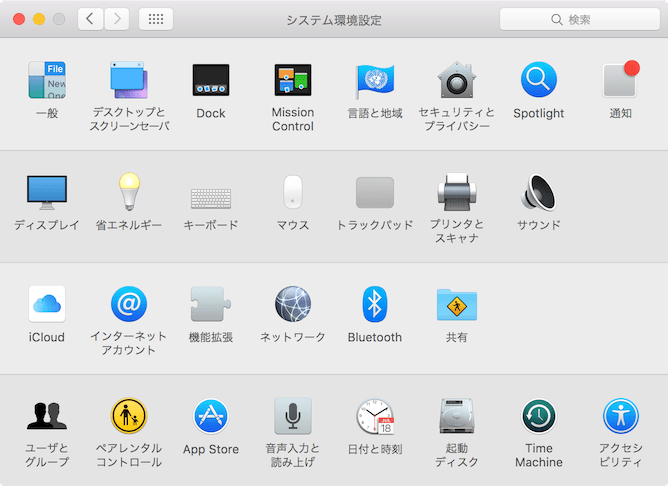
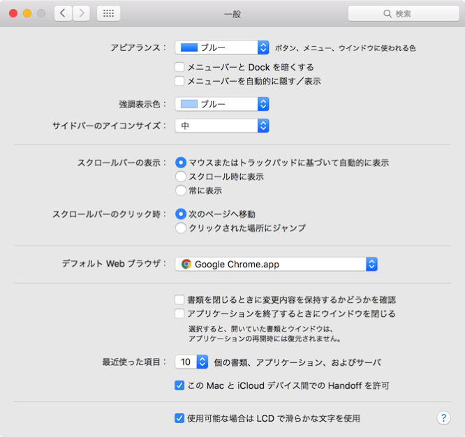

---
author:
- '@ottanxyz'
categories:
- Mac
date: 2016-07-10 00:00:00+00:00
draft: false
tags:
- コマンド
- write
- delete
- txt
- defaults
title: システム環境設定をターミナル（defaultsコマンド）から設定する方法（一般）
type: post
---

#### defaultsコマンドの設定値の調べ方

システム環境設定のdefaultsコマンドで設定できる値の情報元を開示してほしいというお問い合わせをいただいたため、本文中に調べ方を追記しました。（2016/7/11）

新しいMacを購入した場合、OSをクリーンインストールした場合、毎回毎回「システム環境設定」から設定を変更するのは面倒くさいですよね。将来的には完璧な自動化を目指しているのですが、そのためには各項目がどのように内部で値を保持しているのか把握しておかなければなりません。

そこで、今回は「システム環境設定」の「一般」に絞り、各項目がどのような形式で保持されているのか確認して見たいと思います。

## システム環境設定をターミナルから設定する（一般編）

`defaults`コマンドで設定値を確認する方法と、その値の調べ方からご紹介します。

### defaultsコマンドで設定できる値の調べ方

調査方法は至って単純です。人海戦術のようなものです。システム環境設定で、設定値を変更する前に、事前に以下のコマンドを実行します。

    $ defaults read > defaults_bef.txt
    $ defaults -currentHost read > defaults_currentHost_bef.txt

システム環境設定で設定値を変更後、以下のコマンドを実行します。

    $ defaults read > defaults_aft.txt
    $ defaults -currentHost read > defaults_currentHost_aft.txt

設定値の変更前後で差分がないか確認します。

    $ diff defaults_aft.txt defaults_bef.txt
    $ diff defaults_currentHost_aft.txt defaults_currentHost_bef.txt

差分が発生した場合は、`defaults`コマンドで設定反映可能ということなので、ファイルの内容をエディターで開き、差分箇所を確認します。というわけで、基本的にすべての設定値はこうして調査しています。`-currentHost`は、`~/Library/Preferences/ByHost`に格納されている値を取得するために必要です。

設定値を確認して、それが「Apple Global Domain」に属する値の場合は、`defaults`コマンドに`-g`（NSGlobalDomain）を付与する必要があります。

### システム環境設定（一般）

では、順番に行きましょう。今回は、`defaults`コマンドを使用して変更することができる項目のみを対象とします。それ以外の項目については不明です。

### アピアランス

アピアランスは、「ブルー」（デフォルト）、「グラファイト」から選択可能です。「グラファイト」に変更するためには、ターミナルから、以下のコマンドを実行します。

    $ defaults write -g AppleAquaColorVariant 6

デフォルトに戻す場合は、以下のコマンドを実行します。

    $ defaults delete -g AppleAquaColorVariant

### メニューバーと Dock を暗くする

チェックボックスをオンにする場合は、以下のコマンドを実行します。

    $ defaults write -g AppleInterfaceStyle -string "Dark"

デフォルトに戻す場合は、以下のコマンドを実行します。

    $ defaults delete -g AppleInterfaceStyle

### メニューバーを自動的に隠す／表示

チェックボックスをオンにする場合は、以下のコマンドを実行します。

    $ defaults write -g _HIHideMenuBar -bool true

デフォルトに戻す場合は、以下のコマンドを実行します。

    $ defaults delete -g _HIHideMenuBar

### 強調表示色

強調表示色を変更するためには、以下のコマンドを実行します。

    $ defaults write -g AppleHighlightColor -string "0.752941 0.964706 0.678431"

不思議な数字が登場しました。3つの数字を指定していることはお分かりいただけるかと思います。各々の数字は、RGB（Red、Green、Blue）の数値を表しています。具体的には、Red、Green、Blueに指定する値（0〜255）を255で割った数値を指定することになります。黒を指定する場合は、"0 0 0"ということになります。

デフォルトに戻す場合は、以下のコマンドを実行します。

    $ defaults delete -g AppleHighlightColor

### スクロールバーの表示

「スクロール時に表示」を選択するには、以下のコマンドを実行します。

    $ defaults write -g AppleShowScrollBars -string "WhenScrolling"

「常に表示」を選択するには、以下のコマンドを実行します。

    $ defaults write -g AppleShowScrollBars -string "Always"

デフォルトに戻すには、以下のコマンドを実行します。

    $ defaults delete -g AppleShowScrollBars

### スクロールバーのクリック時

「クリックされた場所にジャンプ」を選択するには、以下のコマンドを実行します。

    $ defaults write -g AppleScrollerPagingBehavior -bool true

デフォルトに戻すには、以下のコマンドを実行します。

    $ defaults delete -g AppleScrollerPagingBehavior

### デフォルトWebブラウザ

わかりません。

### 書類を閉じるときに変更内容を保持するかどうかを確認

チェックボックスをオンにするには、以下のコマンドを実行します。

    $ defaults write -g NSCloseAlwaysConfirmsChanges -bool true

デフォルトに戻す場合は、以下のコマンドを実行します。

    $ defaults delete -g NSCloseAlwaysConfirmsChanges

### アプリケーションを終了するときにウインドウを閉じる

チェックボックスをオンにするには、以下のコマンドを実行します。

    $ defaults write -g NSQuitAlwaysKeepsWindows -bool true

デフォルトに戻す場合は、以下のコマンドを実行します。

    $ defaults delete -g NSQuitAlwaysKeepsWindows

### 最近使った項目

わかりません。

### この Mac と iCloud デバイス間での Handoff を許可

チェックボックスをオフにするには、以下のコマンドを実行します。

    $ defaults -currentHost write com.apple.coreservices.useractivityd ActivityAdvertisingAllowed -bool false
    $ defaults -currentHost write com.apple.coreservices.useractivityd ActivityReceivingAllowed -bool false

デフォルトに戻す場合は、以下のコマンドを実行します。

    $ defaults -currentHost delete com.apple.coreservices.useractivityd

### 使用可能な場合は LCD で滑らかな文字を使用

チェックボックスをオフにするには、以下のコマンドを実行します。

    $ defaults -currentHost write -g AppleFontSmoothing -bool false

デフォルトに戻す場合は、以下のコマンドを実行します。

    $ defaults -currentHost delete -g AppleFontSmoothing

## まとめ

ターミナルからすべての設定を管理することで、Ansible等を使用して自動化することが可能になります。自動化することで、すべてのMacで同一の設定を使用することができるようになるため、初期設定が楽チンになりますね。