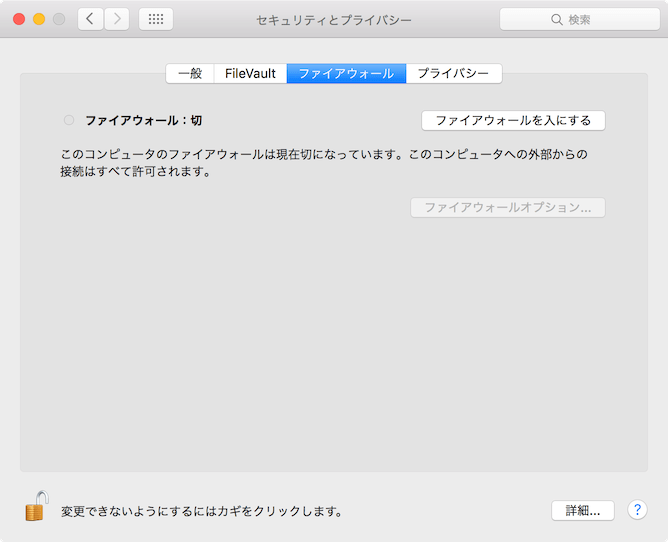
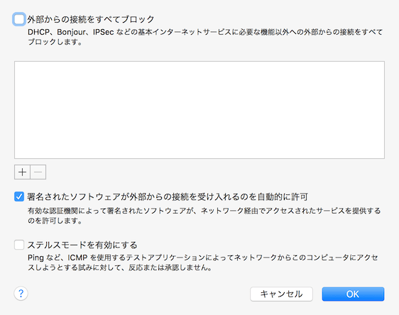

---
author:
- '@ottanxyz'
categories:
- Mac
date: 2016-07-24 00:00:00+00:00
draft: false
tags:
- defaults
- pple
- コマンド
- sudo
- write
title: システム環境設定をターミナル（defaultsコマンド）から設定する方法（セキュリティとプライバシー）
type: post
---

[システム環境設定をターミナル（defaults コマンド）から設定する方法（一般） – OTTAN.XYZ](/posts/2016/07/system-preferences-terminal-defaults-2-4643/)に引き続き、`defaults`コマンドシリーズです。今回は、「セキュリティとプライバシー」編です。

## システム環境設定をターミナルから設定する（セキュリティとプライバシー編）

「セキュリティとプライバシー」で、`defaults`コマンドを使用して設定できる項目は多くありません。また、システム全体に関わる設定のため、`sudo`を多用します。管理者権限を有するユーザで作業してください。

### 一般

#### このユーザのログインパスワードが設定されています

`defaults`コマンドでは設定を変更できませんので割愛します。

#### スリープとスクリーンセーバーの解除にパスワードを要求

チェックボックスをオンにするためには、以下のコマンドを実行します。

    $ defaults write com.apple.screensaver askForPassword -bool true

スリープ、スクリーンセーバーに遷移したあと、パスワードを要求するまでの時間を設定します。単位は秒です。以下のコマンドを実行します。

    $ defaults write com.apple.screensaver askForPasswordDelay -int 5

デフォルト（オフ）に戻すためには、以下のコマンドを実行します。

    $ defaults delete com.apple.screensaver askForPassword

#### 画面がロックされているときにメッセージを表示

メッセージを表示するためには、以下のコマンドを実行します。[message]には、任意の文字列を入力してください。

    $ sudo defaults write /Library/Preferences/com.apple.loginwindow LoginwindowText -string "[message]"

デフォルト（オフ）に戻すためには、以下のコマンドを実行します。

    $ sudo defaults delete /Library/Preferences/com.apple.loginwindow LoginwindowText

#### 自動ログインを使用不可にする

チェックボックスをオンにするためには、以下のコマンドを実行します。現在ログインしているユーザで自動ログインを可能にします。

    $ sudo defaults write /Library/Preferences/com.apple.loginwindow autoLoginUser -string ${USER}

デフォルト（オフ）に戻すためには、以下のコマンドを実行します。

    $ sudo defaults delete /Library/Preferences/com.apple.loginwindow autoLoginUser

### FileVault

`defaults`コマンドでは設定を変更できませんので割愛します。

### ファイアウォール

ファイアウォールを「入」にするためには、以下のコマンドを実行します。

    $ sudo defaults write /Library/Preferences/com.apple.alf globalstate -int 1

デフォルト（切）に戻すためには、以下のコマンドを実行します。

    $ sudo defaults delete /Library/Preferences/com.apple.alf globalstate

#### ファイアウォールオプション

##### 外部からの接続をすべてブロック

チェックボックスをオンにするためには、以下のコマンドを実行します。

    $ sudo defaults write /Library/Preferences/com.apple.alf globalstate -int 2

デフォルト（オフ）にするためには、以下のコマンドを実行します。

    $ sudo defaults write /Library/Preferences/com.apple.alf globalstate -int 1

##### 署名されたソフトウェアが外部からの接続を受け入れるのを自動的に許可

チェックボックスをオフにするためには、以下のコマンドを実行します。

    $ sudo defaults write /Library/Preferences/com.apple.alf allowsignedenabled -bool false

デフォルト（オン）に戻すためには、以下のコマンドを実行します。

    $ sudo defaults delete /Library/Preferences/com.apple.alf allowsignedenabled

##### ステルスモードを有効にする

チェックボックスをオンにするためには、以下のコマンドを実行します。

    $ sudo defaults write /Library/Preferences/com.apple.alf stealthenabled -bool true

デフォルト（オフ）に戻すためには、以下のコマンドを実行します。

    $ sudo defaults delete /Library/Preferences/com.apple.alf stealthenabled

### プライバシー

`defaults`コマンドでは設定を変更できませんので割愛します。

## まとめ

セキュリティとプライバシーについては、再ログイン、再起動は不要のようです。今回、ご紹介できなかった機能についても、`defaults`コマンド以外で設定可能ですが、今回は`defaults`コマンドをマスターすることが目的であるため、割愛させていただきました。