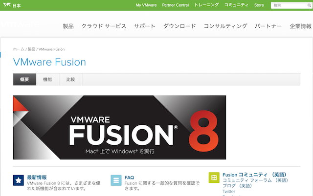
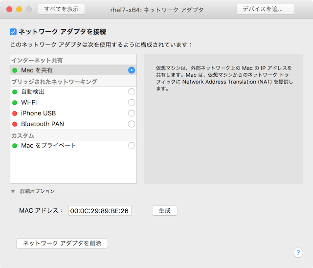

---
author:
- '@ottanxyz'
categories:
- Mac
date: 2016-07-02 00:00:00+00:00
draft: false
tags:
- 仮想マシン
- ipアドレス
- vmware
- 名前
- rhel
title: VMware Fusion 8で作成した仮想マシンで静的IPアドレスを使用する方法
type: post
---

VMware Fusion 8で仮想マシンを構築する場合、仮想マシンの再起動の都度、DHCPにより動的にIPアドレスを割り当てられるのですが、たとえば、Macの`/etc/hosts`ファイルで名前解決を行いたい場合、毎回IPアドレスが変わってしまうのは不便です。

私の場合、VMware Fusion 8に、Red Hat Enterprise Linux 7をインストールして使用していますが、MacのターミナルからSSHでアクセスする場合に、毎回仮想マシンのIPアドレスを探さなくてはなりませんでした。そこで、今回は、仮想マシンに静的IPアドレスを割り当て、Macの`/etc/hosts`で名前解決する方法をご紹介します。

## VMware Fusion 8の仮想マシンに静的IPアドレスを使用する

仮想マシンに静的IPアドレスを使用する方法をご紹介します。

### 仮想マシンの名前を取得する

まず、静的IPアドレスを使用したい仮想マシンの、仮想マシンの名前を取得します。VMware Fusionを起動し、一覧に表示されている仮想マシンの名前を控えておいてください。

詳しくは検証していませんが、仮想マシン名にマルチバイト文字（日本語）が含まれている場合、以下の設定変更が正しく機能しませんでしたので、仮想マシン名は英数字のみの方が良さそうです。仮想マシンの名前は、仮想マシンを右クリックして「名前を変更」で変更できます。

### ネットワークアダプターのMACアドレスを取得する

仮想マシンを選択した状態で、「設定」を開きます。「設定」の「ネットワークアダプター」を選択します。

「詳細オプション」をクリックします。

表示される「MACアドレス」をコピーしておきます。

### 仮想マシンに静的IPアドレスを割り当てる

ターミナルから、以下のコマンドを実行し設定ファイルを書き換えます。

    sudo vi /Library/Preferences/VMware\ Fusion/vmnet8/dhcpd.conf

以下のような記述を探します。`subnet`が仮想マシンのネットワークアドレスです。たとえば、以下の場合、`192.168.201.0/24`が仮想マシンに割り当てられるネットワークアドレスです。

    subnet 192.168.201.0 netmask 255.255.255.0 {
     range 192.168.201.128 192.168.201.254;
     option broadcast-address 192.168.201.255;
     option domain-name-servers 192.168.201.2;
     option domain-name localdomain;
     default-lease-time 1800;                # default is 30 minutes
     max-lease-time 7200;                    # default is 2 hours
     option netbios-name-servers 192.168.201.2;
     option routers 192.168.201.2;
    }

次に、`range`に注目します。この、`range`に記述されているIPアドレスの範囲内で仮想マシンにIPアドレスが割り当てられます。仮想マシンに静的IPアドレスを使用したい場合は、ここに記述されているネットワークアドレスの範囲内で、`range`の範囲外のIPアドレスを使用します。

次に、同ファイルの末尾に以下の記述を追加します。

    host rhel7-x64 {
     hardware ethernet 00:0c:29:89:be:26;
     fixed-address 192.168.201.102;
    }

`rhel7-x64`は、事前に控えておいた仮想マシン名、`hardware ethernet`は、事前に控えておいたネットワークアダプターのMACアドレス、`fixed-address`には、割り当てたい静的IPアドレスを指定します。`range`の範囲外のIPアドレスを指定していることに注意してください。

### 設定を反映させる

ターミナルから以下のコマンドを実行し、設定を反映させます。

    sudo /Applications/VMware\ Fusion.app/Contents/Library/services/services.sh --stop

    sudo /Applications/VMware\ Fusion.app/Contents/Library/services/services.sh --start

### /etc/hostsに名前解決したい仮想マシンのIPアドレスを追記する

ターミナルから以下のコマンドを実行し、`/etc/hosts`を書き換えます。

    sudo vi /etc/hosts

末尾に、以下を追記します。名前は任意で構いません。

    192.168.201.102 rhel7-x64.local

### 仮想マシンを起動する

静的IPアドレスを割り当てた仮想マシンを起動します。続いて、ターミナルから、以下のコマンドを使用して仮想マシンにアクセスできることを確かめます。

    ping -c 1 rhel7-x64.local

これで、仮想マシンに割り当てるIPアドレスを固定化することができました。
