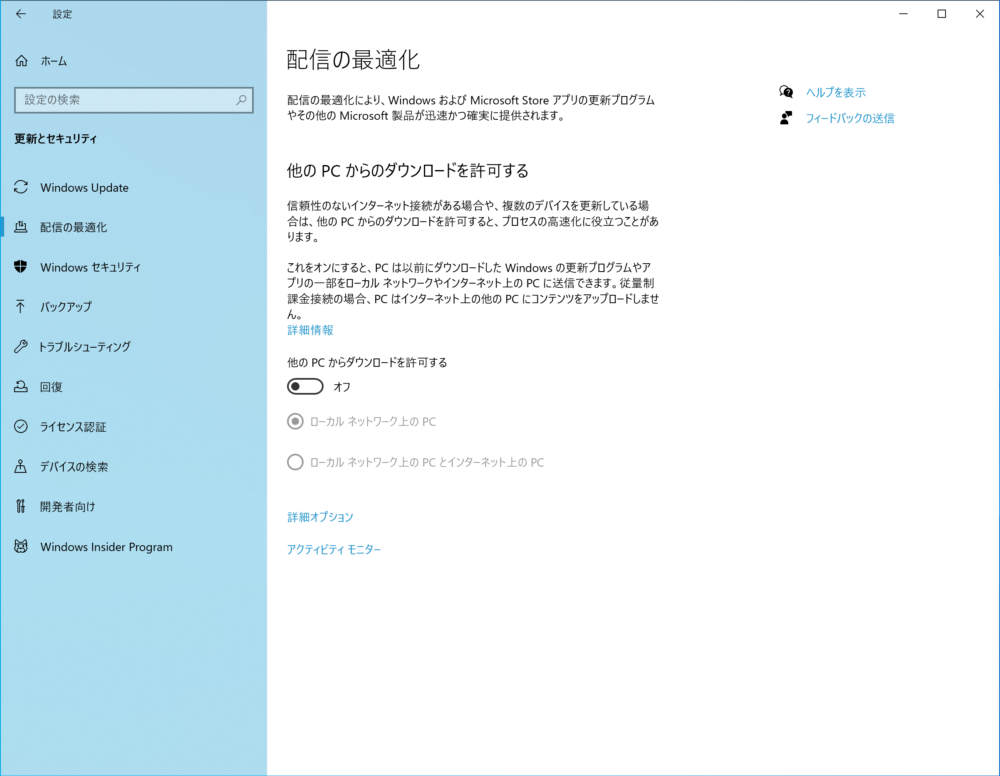

---
author:
- '@ottanxyz'
categories:
- Windows
date: 2016-07-03 00:00:00+00:00
draft: false
tags:
- windows
- オフ
- '10'
- プライバシー
- コルタナ
title: Windows 10で無効化しておきたい7つの設定
type: post
---

{}
2021年11月8日時点の情報にもとづき、記事を更新しました。
{}

Windows 10はまだまだ現役という方も多いのではないでしょうか。Windows 10には機能が多数搭載されていますが、その中にはあなたのプライバシーを脅かすもの、また残念ながら利便性が損なわれてしまいそうな機能もあります。そこで、今回は、このように無効化しても問題ない機能についていくつかご紹介します。これらを無効化して安全にWindows 10を使用しましょう。

## Windows 10にアップグレードしたら無効化しておきたい7つの設定

個々人のプライバシーを守るために、またWindows 10の利便性を最大限有効活用するために、無効化しておきたい7つの設定をご紹介します。なお、今回は、「バージョン21H1」で確認しています。

### 「配信の最適化」を無効化する

更新プログラムの提供方法として、MicrosoftのWindows Updateサーバのみならず、ローカルネットワーク上、もしくは **インターネット上** の他のPCからP2Pで更新プログラムの提供を受けとれます。この新しい「配信の最適化」により、MicrosoftのWindows Updateサーバが利用できない環境においても、他のPCから更新プログラムの提供を受けることができるようになりました。

この方法の安全面については、既存のWindows Update、およびWindows Storeと同等のセキュリティ対策が施されている（更新プログラムの配信を行う側、行われる側のプライバシーが侵害されることはない）とのこと。しかし、ローカルネットワークならまだしも、インターネットを経由してそういった配信のルートに加わることができるのはなんだか気持ち悪いですよね。そういった懸念点がある場合は、無効化してしまいましょう。

「設定」→「更新とセキュリティ」を開き、「他PCからのダウンロードを許可する」をオフにします。

### 不必要な通知を停止する

Windows 10には、アクションセンターと呼ばれる、通知を管理する機能が追加されています。しかし、デフォルトの状態では、何でもかんでも通知される状態になっており、アクションセンターが受け取りたくもない通知で埋まってしまう可能性も考えられます。そこで、不要な通知はすべて無効化してしまいましょう。

「新機能とオススメを確認するために、更新の後と、サインイン時にときどき、Windowsへようこその情報を表示する」「Windowsを使う上でのヒントやオススメの方法を取得する」をオフにします。

また、アプリごとの通知をオフにできます。「フィードバックHub」は、Microsoftにフィードバックを送信するためのアシスタントで、必要ない場合は、オフにしておきましょう。

### スタートメニューから広告を削除する

Windows 10のスタートメニューは「タイル」と呼ばれる形式を採用しています。デフォルトでは、この「タイル」に、Microsoftのオススメする広告が表示されます。これは鬱陶しいので無効化しておきましょう。（Candy Crush Sagaみたいなやつ）

「設定」→「個人用設定」→「スタート」を開き、「ときどきスタート画面にオススメを表示する」をオフにします。

### 広告識別子をオフにする

最適な広告を配信するために、Windows 10で動作するアプリケーションには各デバイスに固有な広告識別子がデフォルトで提供されます。このような追跡型広告のために情報を提供したくない場合は、オフにしておきましょう。

「設定」→「プライバシー」→「全般」を開き、「アプリのアクティビティに基づいてユーザーに合わせた広告を表示するために、広告識別子の使用をアプリに許可します。」をオフにします。

### コルタナによるプライバシー情報の収集を停止する

コルタナは、Microsoftが開発したパーソナルアシスタントです。コルタナは、あなたのことをよく知るためにあなたの音声入力情報や、手書き入力情報を収集しています。コルタナにこれらの事を知られたくない場合は、設定でオフにできます。なお、コルタナさんは、Windows 11から削除されます。（イルカと同じ運命を辿るのか）

「設定」→「プライバシー」→「手書き入力と入力の個人用設定」を開き、チェックボックスをオフにします。「あなたに関する情報の収集」と明記されており、かなり潔い感じの情報収集ではあります。

### アプリのバックグラウンドの動作を制御する

Windows 10のほとんどのアプリはバックグラウンドで動作します。つまり、アプリを使用しなくても、自動的に情報を収集し通知したり、更新プログラムをインストールしたりします。バックグラウンドで動作することにより、ラップトップを使用している場合は、バッテリーに影響が、また勝手にネットワークの帯域を占有してしまうかもしれません。このような場合には、バックグラウンドでの動作を制限してしまいましょう。

「設定」→「プライバシー」→「バックグラウンドアプリ」を開き、「アプリのバックグラウンドを許可する」をオフにします。任意のアプリのバックグラウンドによる動作をオフにできます。

さすがに、すべてのアプリのバックグラウンド動作をオフにすると利便性に欠けてしまう、という場合は、任意のアプリの動作のみをオフにすることもできます。

### 設定の同期を無効化する

複数デバイスを持つのが当たり前の時代になりつつあります。Microsoftアカウントを使用している場合、Windows 10では自動的にテーマ、Windowsの設定、パスワードを、同じMicrosoftアカウントを使用しているデバイス間で同期するようになっています。とはいえ、デバイス間でパスワードなんて同期する必要はありますか。ない場合は、設定の同期を無効化してしまいましょう。

### エクスペリエンス調整をオフにする

パーソナライズされたヒント、広告、オススメを提供してくれるらしいのですが、とくに必要としていないため、こちらもオフにします。どうも、Windows 10になってからお節介な機能が増えたようです。

「設定」→「プライバシー」→「診断＆フィードバック」を開き、「エクスペリエンス調整」をオフにします。

## まとめ

Windows 11が登場しましたが、Windows 10もまだまだ現役です。使い慣れたWindows 10をより心地よく利用すためにも、設定を今一度見返してみてはいかがでしょうか。