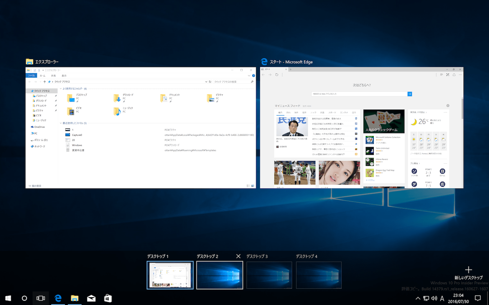
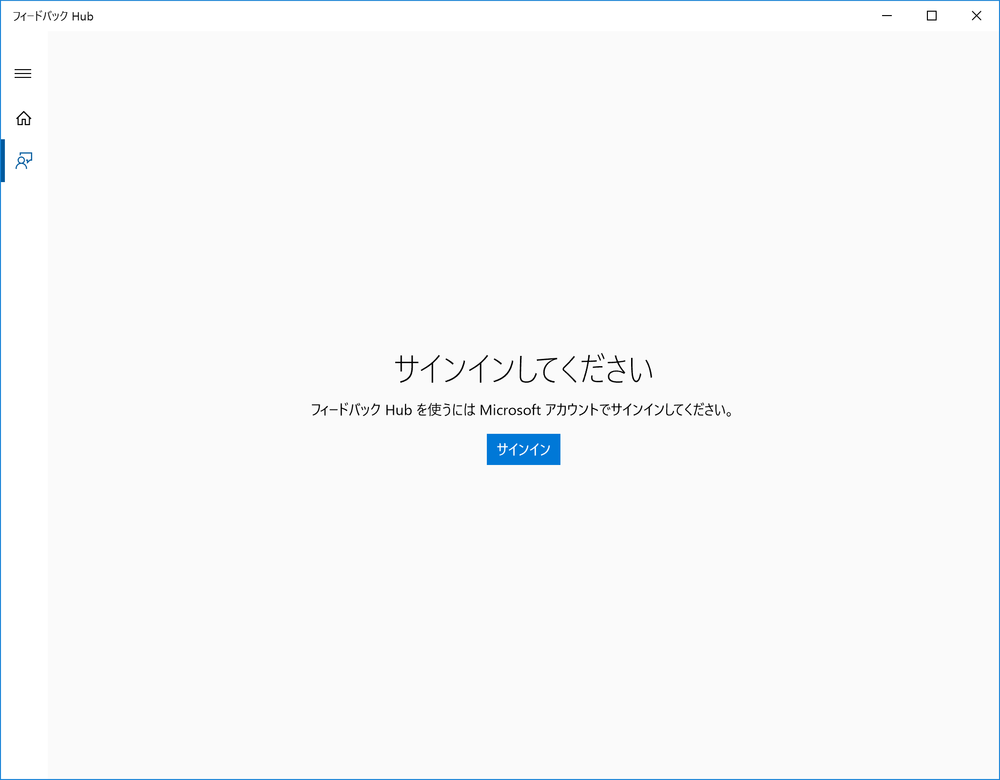
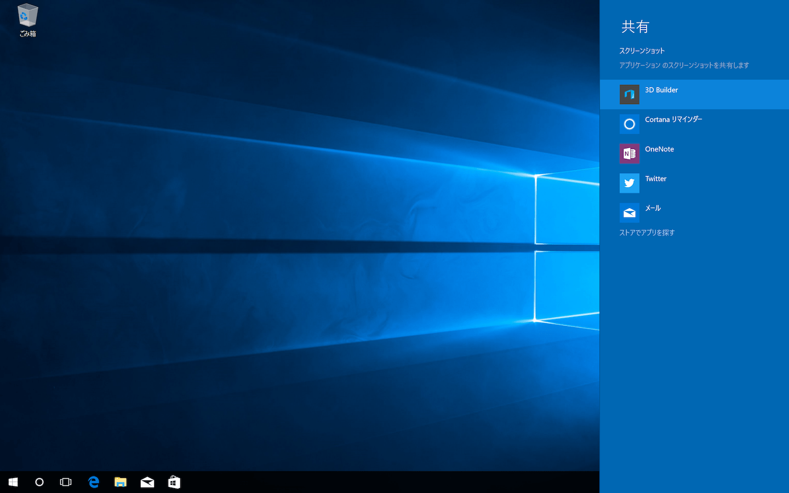
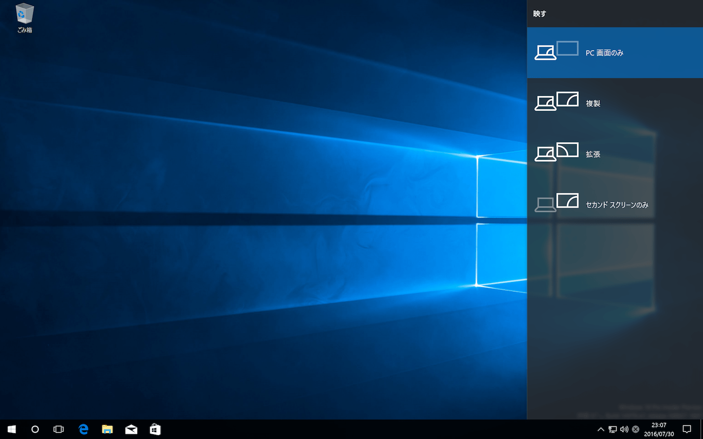
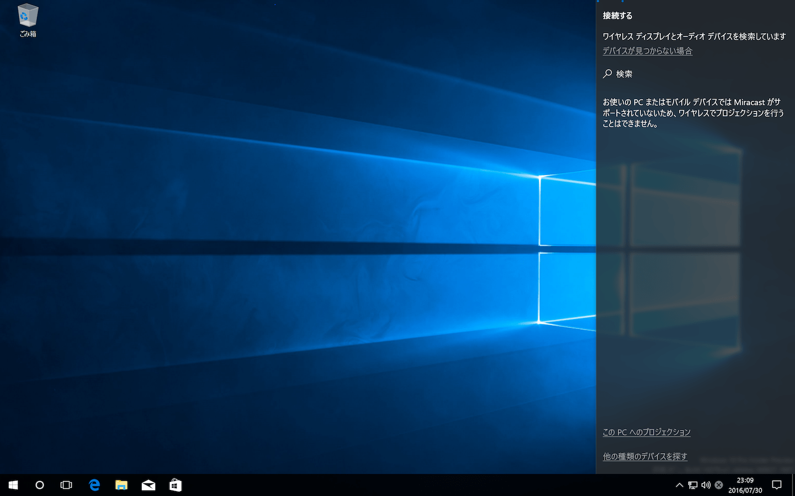

無料アップデート期間がついに終了するWindows 10ですが、この先Windows 10を効率良く業務やプライベートで使いこなすために欠かせない、キーボードショートカットをご紹介します。

## Windows 10のさまざまなキーボードショートカット

基本的なWindowsの操作から、意外と知られていないにもかかわらず便利なキーボードショートカットをご紹介します。

### 基本操作

Windowsの基本的な操作に関わる部分です。

| ショートカット                | 内容                                                                  |
| ----------------------------- | --------------------------------------------------------------------- |
| Ctrl + A                      | ウインドウのすべての項目を選択                                        |
| Ctrl + Shift Ctrl + Insert | 選択した項目をコピー                                                  |
| Ctrl + V Shift + Insert    | 選択した項目を貼り付け                                                |
| Ctrl + X                      | 選択した項目をカット                                                  |
| Ctrl + Z                      | 前回のアクションを取り消す                                            |
| Ctrl + Y                      | 前回のアクションをやり直す                                            |
| Windows + F1                  | デフォルトブラウザでBingで「windows 10 でヘルプを表示する方法」を検索 |
| Alft + F4                     | アクティブなウインドウやアプリケーションを閉じる                      |
| Alt + Tab                     | アクティブなウインドウやアプリケーションを切り替える                  |
| Shift + Delete                | 選択した項目をゴミ箱を経由せずに完全に削除                            |
「Windows + F1」以外はすべて覚えておきましょう。効率向上間違いなし！

### スタートメニューとタスクバー

スタートメニューとタスクバーを操作するショートカットです。

| ショートカット         | 内容                                                                                                     |
| ---------------------- | -------------------------------------------------------------------------------------------------------- |
| Windows Ctrl + Esc  | スタートメニューを開く                                                                                   |
| Windows + T            | タスクバーに表示されているアプリケーションの切り替え（タスクバーに固定されているアプリケーションを含む） |
| Windows + [数字]       | タスクバーに固定されているアプリケーションを開く（左から1、2、3…）                                       |
| Windows + Alt + [数字] | タスクバーに固定されているアプリケーションのコンテキストメニュー（右クリック）を開く（左から1、2、3…）   |
| Windows + D            | デスクトップの表示／非表示                                                                               |
| Windows + ,            | デスクトップの表示                                                                                       |

「Windows + D」は覚えておきましょう！

### ウインドウ、スナップ、仮想デスクトップ

Windows 10では、ウインドウ操作がより便利になりました。とくに、Windowsのスナップや仮想デスクトップ、タスクビューは注目です！

| ショートカット                                 | 内容                                                                                                                                             |
| ---------------------------------------------- | ------------------------------------------------------------------------------------------------------------------------------------------------ |
| Windows + M                                    | すべてのウインドウを最小化                                                                                                                       |
| Windows + Shift + M                            | 最小化したウインドウを元に戻す                                                                                                                   |
| Windows + Home                                 | アクティブなウインドウを除き最小化                                                                                                               |
| Windows + ↑                                    | アクティブなウインドウを最大化                                                                                                                   |
| Windows + ↓                                    | アクティブなウインドウを最小化                                                                                                                   |
| Windows + ← Windows + →                     | アクティブなウインドウを左寄せ、または右寄せ（すでに、左寄せ、または右寄せされている場合は、Windows + ↑で左上、右上、Windows + ↓で左下、右下に） |
| Windows + Shift + ← Windows + Shift + →     | マルチモニター環境時に、アクティブなウインドウを移動                                                                                             |
| Windows + Tab                                  | タスクビューを表示                                                                                                                               |
| Windows + Control + D                          | 新しい仮想デスクトップを追加                                                                                                                     |
| Windows + Control + → Windows + Control + ← | 仮想デスクトップ間を移動                                                                                                                         |
| Windows + Control + F4                         | アクティブな仮想デスクトップをクローズ                                                                                                           |

「Windows + 矢印」系のショートカットは是非マスターしましょう！また、「Windows + Tab」によるタスクビュー表示も覚えておくと便利です。「Windows + Home」は、現在のウインドウに作業を地集中したい時に便利ですよ。

#### タスクビュー

「Windows + Tab」を押すと、現在開いているウインドウの一覧がこのように表示され、簡単に切り替えることができます。

#### 仮想デスクトップ

Macにはずっと実装されていた仮想デスクトップ、ついにWindows 10にもやってきました。作業内容に応じてデスクトップを切り替えることができるようになります。アプリケーションを仮想デスクトップ毎に割り当てておくことで作業効率の大幅向上間違いなし！

### Windowsキー

Windowsキーに関わる操作は基本ですね。

| ショートカット                 | 内容                                                 |
| ------------------------------ | ---------------------------------------------------- |
| Windows + A                    | アクションセンターを表示                             |
| Windows + S Windows + Q     | Cortanaの検索ボックスを開く                          |
| Windows + C                    | Cortanaに質問する                                    |
| Windows + E                    | エクスプローラーを開く                               |
| Windows + F                    | フィードバックHubを開く                              |
| Windows + Control + F          | ネットワーク上のPCを検索                             |
| Windows + G                    | ゲームバーを開く                                     |
| Windows + H                    | 共有サイドバーを開く                                 |
| Windows + I                    | 設定を開く                                           |
| Windows + K                    | ワイヤレスディスプレイとオーディオデバイスを検索する |
| Windows + L                    | Windowsをロックする                                  |
| Windows + O                    | ロック画面の自動回転のオン／オフの切り替え           |
| Windows + P                    | 投影する画面を選択するサイドバーを表示               |
| Windows + R                    | 「ファイル名を指定して実行」を開く                   |
| Windows + U                    | 「設定」の「簡単操作」を開く                         |
| Windows + Space                | 入力ソースの切り替え                                 |
| Windows + (+) Windows + (-) | 拡大鏡による拡大／縮小                               |
| Windows + Esc                  | 拡大鏡を閉じる                                       |

「Windows + S」「Windows + E」「Windows + I」「Windows + L」「Windows + R」は是非覚えましょう。「Windows + L」は、急に上司が近くに寄って来た時に便利です（？）。

#### フィードバックHub

MicrosoftにWindowsに関するフィードバックが簡単に行えるようになりました。

#### 共有サイドバー

#### 投影する画面

#### ワイヤレスディスプレイとオーディオデバイスの検索

### コマンドプロンプト

コマンドプロンプトで使える基本操作です。

| ショートカット                            | 内容                                                                               |
| ----------------------------------------- | ---------------------------------------------------------------------------------- |
| Ctrl + C Ctrl + Insert                 | 選択したテキストをコピー                                                           |
| Ctrl + V Shift + Insert                | 選択したテキストを貼り付け                                                         |
| Ctrl + A                                  | 現在の行のテキストをすべて選択（2回押すと、ウインドウ内のすべてのテキストを選択） |
| Ctrl + ↑ Ctrl + ↓                      | スクリーンを1行上に移動、または下に移動                                           |
| Ctrl + F                                  | コマンドプロンプト内を検索                                                         |
| Ctrl + M                                  | コマンドプロンプトをマークモードに移行                                             |
| Shift + ↑ Shift + ↓                    | テキストを選択しながらカーソル行を移動                                             |
| Shift + ← Shift + →                    | テキストを選択しながら1文字ずつ左、または右に移動                                 |
| Ctrl + Shift + ← Ctrl + Shift + →      | 単語を選択しながら左、または右に移動                                               |
| Shift + Page Up Shift + Page Down      | テキストを選択しながら1スクリーンずつ上、または下に移動                           |
| Shift + Home Shift + End               | 現在の行の最初、または最後に移動                                                   |
| Ctrl + Shift + Home Ctrl + Shift + End | スクリーンバッファの最初、または最後に移動                                         |

意外と知られていない便利なショートカットが揃っています。使用していくうちに、その便利さに気がつくはずです。徐々に覚えていきましょう！
