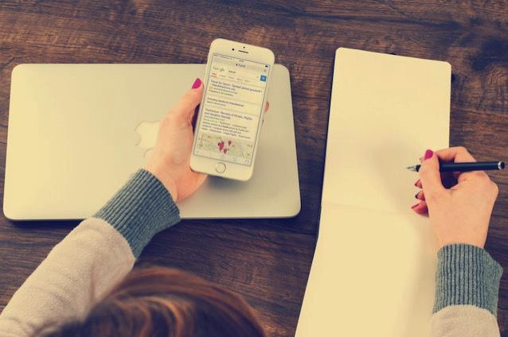
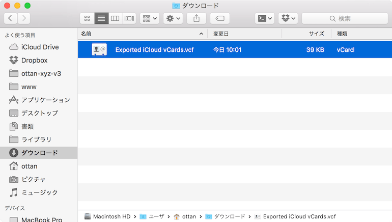
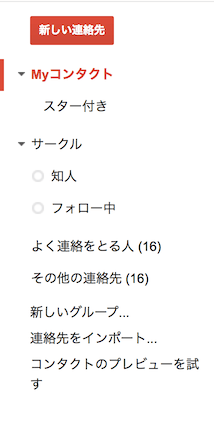
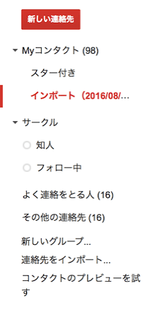
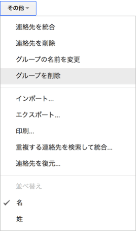
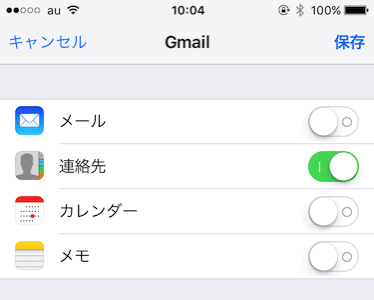
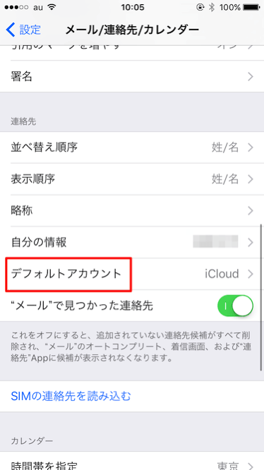
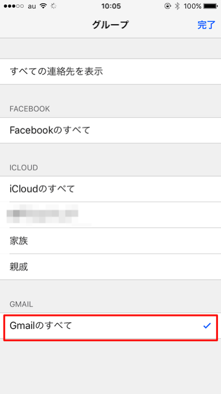

---
author:
- '@ottanxyz'
categories:
- iPhone
date: 2016-08-20 00:00:00+00:00
draft: false
tags:
- 連絡先
- コンタクト
- google
- icloud
- gmail
title: Inboxで連絡先情報を有効活用するために、iCloud.comの連絡先をGoogleコンタクトに移行する方法
type: post
---

[iPhone で Gmail をプッシュ通知！すべてのメールアドレスを Gmail に転送し、Gmail からすべて送受信する方法](/posts/2016/08/phone-gmail-push-inbox-4770/)で、Gmail にすべてのメールアカウントを集約する方法をご紹介しました。その中で、「Inbox by Gmail」という Google 謹製のアプリをご紹介したのですが、iPhone を使用するユーザーにとって、このアプリには 1 点問題があります。それは、**連絡先情報が Google コンタクトからしか取得できない**ということです。「Gmail」アプリは、iPhone の連絡先を使用できるのですが…。



iPhone では、何も意識していなければ iCloud で連絡先を管理しているのがデフォルトだと思いますが、「Inbox」を使用するためには、連絡先を「Google コンタクト」に移行しなければなりません。そこで、今回は、iCloud の連絡先を「Google コンタクト」に移行する方法をご紹介します。

なお、記事執筆時点では、iCloud と Google コンタクトの連絡先情報を常に同期させるためには、サードパーティ製のサービスやアプリケーションの力を利用するしか方法がありません。今回は、「Google コンタクト」に一本化する方法をご紹介します。ただし、Google と心中する覚悟が必要です。

## iCloud の連絡先を Google コンタクトに移行する

基本的な流れは、iCloud から連絡先をエクスポート、Google コンタクトにインポートという流れです。また、今後 iPhone で作成する連絡先を Google コンタクトに追加する手順をご紹介します。

### iCloud から連絡先情報をエクスポートする

<https://www.icloud.com>

PC、Mac から iCloud.com にログインし「連絡先」をクリックします。

⌃+A ですべての連絡先を選択した状態にします（背景が薄い水色になります）。この状態で、左下の歯車アイコンから「vCard を書き出す」をクリックします。

ブラウザのデフォルトのダウンロードフォルダーに設定されたフォルダーに、「vcf」と呼ばれる拡張子のファイルがダウンロードされます。

### Google コンタクトに連絡先情報をインポートする

<https://www.google.com/contacts/>

続いて、PC、Mac から Google コンタクトにアクセスします。なお、Google コンタクトには、プレビュー版が用意されていますが、プレビュー版は、「vCard」のインポートに対応していません。また、プレビュー版から、サードパーティ製のサービス経由で連絡先を直接 iCloud.com からインポートする方法もありますが、ふりがな等が正しくインポートされなかったため、ここでは方法は割愛します。

「連絡先をインポート」をクリックします。

「ファイルを選択」から、iCloud.com からダウンロードした「vCard」ファイルを選択します。「インポート」をクリックします。

インポートが完了すると、「インポート〜」というグループが自動的に作成され、そのグループにすべての連絡先が振り分けられます。

そのようなグループは不要、ということであれば、グループを選択した状態で、画面上部のチェックボックスをクリックします。

その状態で、「その他」→「グループを削除」をクリックします。これでグループ情報が削除され、すべての連絡先が「My コンタクト」に移行します（連絡先情報は削除されないので安心してください）。

### iPhone で Google コンタクトを使用する

続いて、iPhone で Google コンタクトを使用する方法です。「設定」→「メール/連絡先/カレンダー」→「アカウントを追加」から、「Google」を選択し、Google アカウントを追加します。

「連絡先」のみ「オン」にし、他はすべてオフにしておきます。カレンダーやメモも同期したい場合は「オン」にしてください。「メール」は、「Inbox」で管理するため同期は不要です。

続いて、「メール/連絡先/カレンダー」の「連絡先」の項目から「デフォルトアカウント」を選択します。この項目が表示されない場合は、ホームボタンを 2 回続けて押して、**「設定」アプリを再起動します**。

デフォルトアカウントを「Gmail」にします。iCloud から Gmail に変更することで、今後 iPhone で新規作成した連絡先はすべて「Google コンタクト」に作成されることになります。iCloud には追加されませんので注意してください。

### iPhone の連絡先を更新する

最後に、「連絡先」アプリを開いて、「グループ」を選択します。上から下にスワイプして画面を更新します。表示する連絡先として「Gmail のすべて」をタップします。これで、iPhone 上では「Google コンタクト」の情報のみ表示されるようになります。「iCloud」の情報も表示すると、連絡先が重複して表示されることがありますのでご注意ください。

## まとめ

「Inbox by Gmail」は iOS 向けに提供されているアプリケーションです。本来であれば、アプリケーション側で、iPhone の連絡先を使用できるように対応していただきたいところですが、記事執筆時点ではこの方法しかありません。iCloud で管理したい方にはやや不便な方法ですね。「Inbox」が対応してくれることを祈りましょう。アプリケーション側で iPhone の連絡先を使用できるようになると、「Google コンタクト」に移行する必要も無くなります。「Gmail」アプリは対応しているのですが…。
