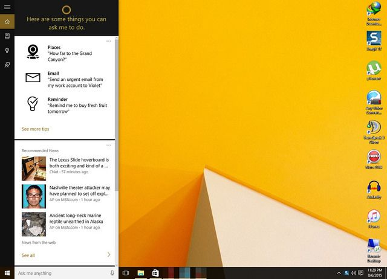
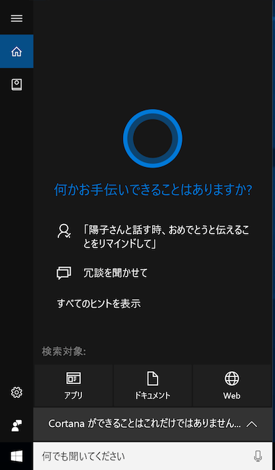
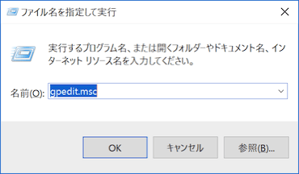
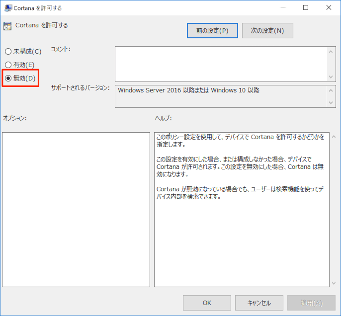
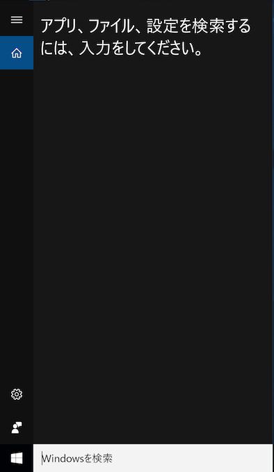
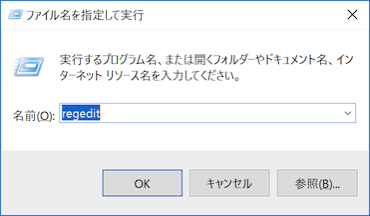
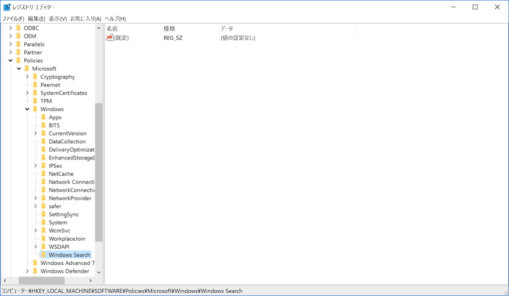
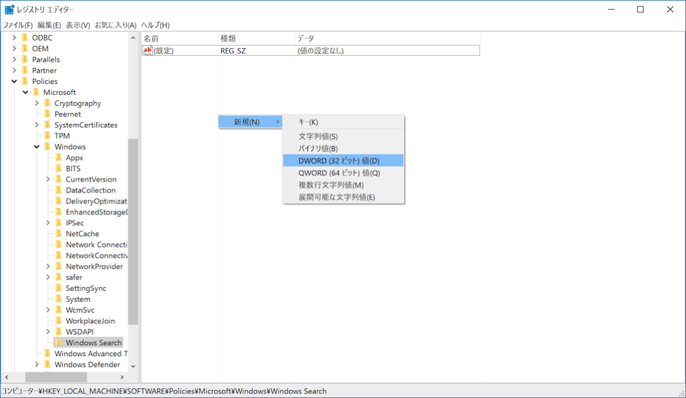
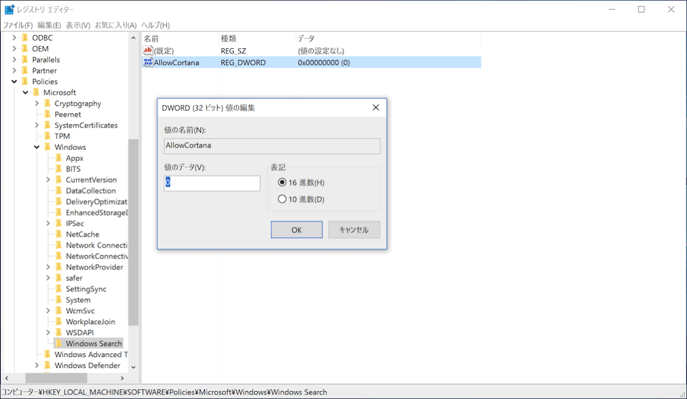
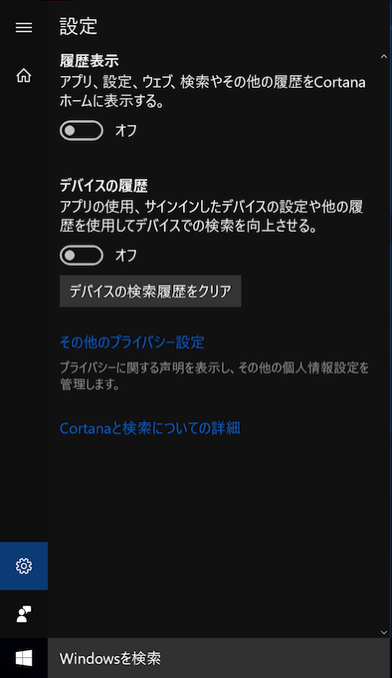

---
author:
- '@ottanxyz'
categories:
- Windows
date: 2016-08-25 00:00:00+00:00
draft: false
tags:
- cortana
- windows
- グループポリシー
- キー
- エディター
title: Windows 10（Anniversary Update）で、Cortanaを恒久的に無効化する方法
type: post
---

Windows 10からMicrosoftのパーソナルアシスタントである「Cortana」が標準で搭載されるようになりました。Windows 10の大型アップデートである「Anniversary Update」以前は、「Cortana」を使用したくない場合は、「設定」から簡単にオフにすることができたのですが、同アップデート後はその項目は削除されてしまいました。今回は、「Anniversary Update」後に「Cortana」を恒久的にオフにする方法をご紹介します。（Microsoftに余計な情報収集されたくないしね！）

## Windows 10でCortanaをオフにする

タスクバーに表示されている検索ボックスをクリックすると、このように「Cortana」が語りかけてきます。ただ、ファイルやアプリケーションを検索したいだけなのに…。ちょっと、冗談を聞いてみたい気もしますが、ここでは心を鬼にして無効化してしまいます。

### 「ローカルグループポリシーエディター」を使用できる場合

「ローカルグループポリシーエディター」が使用できるかどうかで、無効化する方法が異なります。「Windows 10 Professional」以上のエディションには、標準でインストールされていると思います。「ローカルグループポリシーエディター」を使用しない方法は後述します。

「ファイル名を指定して実行」を開き、「gpedit.msc」と入力します。

「ローカルグループポリシーエディター」が起動したら、「コンピューターの構成」→「管理用テンプレート」→「Windowsコンポーネント」→「検索」と進み、「Cortanaを許可する」をダブルクリックします。デフォルトでは「未構成」となっています。

「無効」にして、「OK」をクリックします。Windows 10を再起動します。

「Cortana」の面影が無くなりました。

### レジストリエディターで編集する場合

「ローカルグループポリシーエディター」が使用できない場合は、レジストリを直接編集します。「ローカルグループポリシーエディター」も、結果的にはレジストリを編集しています。**レジストリを誤って編集すると、最悪の場合OSが起動できなくなる可能性があります**。事前にバックアップを取得するなど、十分注意して作業を行ってください。

「ファイル名を指定して実行」で「regedit」と入力します。

「HKEY_LOCAL_MACHINE」→「SOFTWARE」→「Policies」→「Microsoft」→「Windows」と進みます。「Windows」キーの配下に「Windows Search」というキーがあるかどうか確認します。キーが存在しない場合は、「Windows」キーを「右クリック」→「新規」→「キー」で「Windows Search」というキーを新規作成してください。

「Windows Search」というキーが作成できました。デフォルトでは何も設定されていません。

「Windows Search」キー内で「右クリック」→「新規」→「DWORD（32ビット）値」をクリックします。

「値の名前」を「AllowCortana」とし、「値のデータ」を「0」にします（デフォルトで、「値のデータ」は「0」になっています）。「OK」をクリックしたら、Windowsを再起動します。

「設定」からも、何事もなかったかのように「Cortana」が消え失せました。