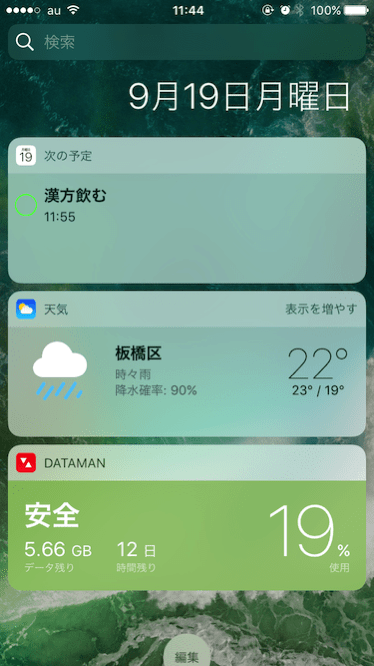
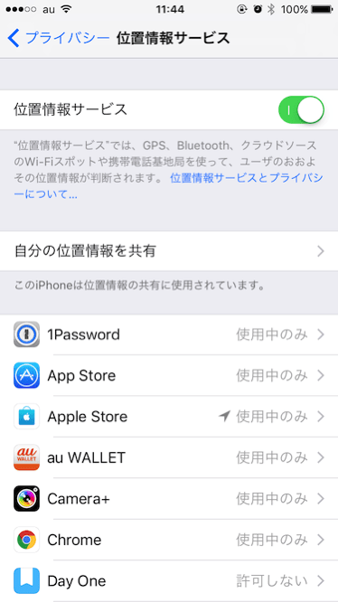
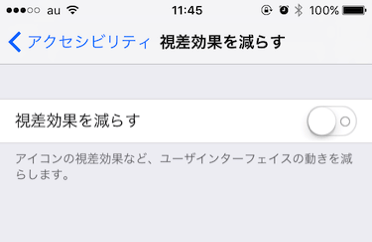
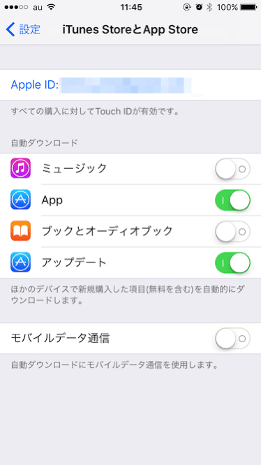
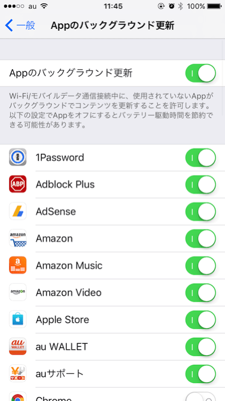
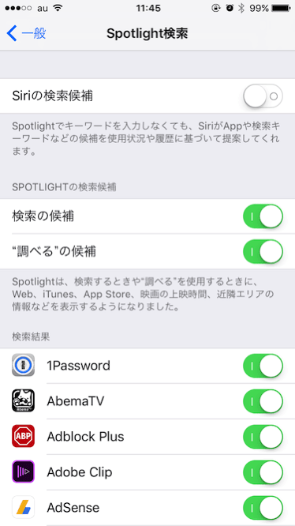
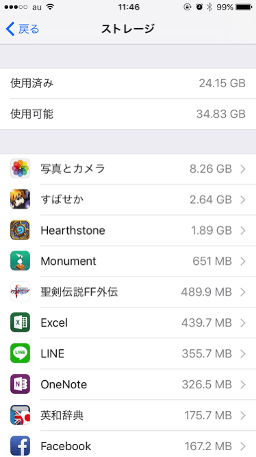

iOS 10 にアップデート後に動作が遅くなったと感じたことはありますか？iOS 10 のみならず、iOS デバイスでパフォーマンスを改善するための、一般的ないくつかの方法をご紹介します。とくに、iPhone 6 以前のデバイスを使用している場合に有効な方法です。

## iOS 10 で iPhone の動作が遅い時に試したいこと

ここでは、一般的な方法をご紹介します。まずは、これらを試してみてください。それでも遅いと感じた場合には、iOS デバイス自体に問題を抱えている可能性があります。Apple サポートに問い合わせてみましょう。

### 再起動

まず、試してみたいこと、それは iOS デバイスの再起動です。iPhone 6s 以前のデバイスでは、電源ボタンとホームボタンを同時に長押しします。また、iPhone 7 以降のデバイスでは、電源ボタンと音量を下げるボタンを同時に長押しします。しばらくすると、Apple のロゴがあらわれます。これで再起動は完了です。

### iOS 10 のクリーンインストール

再起動しても事象が改善されない場合は、iOS 10 のクリーンインストールを試してみましょう。工場出荷時の状態から復元することで、内部に保持している余計なキャッシュ等もすべて削除され、内蔵ストレージをスッキリさせることもできます（iTunes のいわゆる「その他」）。クリーンインストールの方法については、以下を参照してください。

* [iPhoneの動作が遅い、バッテリーの減りが早いと感じた時はiOSのクリーンインストールを試してみよう！ - OTTAN.XYZ](/posts/2016/09/iphone-clean-install-4955/)

### 使用していないウィジェットの使用を停止する

iOS 10 からロック画面から、ホーム画面から、すぐにウィジェットにアクセスできるようになりました。また、iOS 9 以前と比較し、ウィジェットに表示できる情報量も大幅に増えました。しかし、ウィジェットを大量に同時に処理しようとすると、iOS デバイスのパフォーマンスに影響を与える可能性もあります。使用していないウィジェットがないかどうか、今一度チェックして、不要なウィジェットについては使用を停止しましょう。

### 使用していない位置情報サービスをオフにする

今や多くのアプリケーションが位置情報の追跡のために、位置情報サービスを使用しています。アプリケーションの中には、アプリケーションの使用中のみならず、バックグラウンドで動作している間も、常に位置情報の許可を求めてくることがあります。しかし、本当にすべてのアプリケーションで位置情報サービスは必要ですか？位置情報が不要なアプリケーションがないかどうか今一度確認してみましょう。「設定」→「プライバシー」→「位置情報サービス」で、アプリケーション毎にオフにできます。

### 視差効果を減らすをオンにする

動作が遅いと感じた時には、不要なアニメーションをオフにすることで、動作が改善する場合があります。効果的な方法は、「設定」→「一般」→「アクセシビリティ」→「視差効果を減らす」を「オン」にすることです。

ただし、「視差効果を減らす」を「オン」にすることで、以下の記事でご紹介した iMessage のエフェクト機能が使用できなくなります。普段、iMessage を使用しないのであれば、「オン」にしておくと良いでしょう。

* [iOS 10で大幅に進化したiMessageを楽しもう！快適に使用するための設定方法もご紹介 - OTTAN.XYZ](/posts/2016/09/ios10-imessage-enjoy-4939/)

※iOS 10.1 へのアップデートで改善されました。詳細は上記の関連記事をご覧ください。

### バックグラウンドのアップデートを停止する

iTunes Store と App Store の自動ダウンロードは便利な機能です。他の iOS デバイスや、PC、Mac の iTunes でダウンロードしたミュージック、アプリやブックを自動的にダウンロードできます。また、自動的に App Store からダウンロードしたアプリケーションをバックグラウンドでアップデートすることもできます。便利な機能ですが、バックグラウンドで動作するため、これらの機能をオフにすることで動作が一時的に改善する可能性があります。また、使用する場合も、通信量を削減するために「モバイルデータ通信」はオフにしておきましょう。これで、Wi-Fi 以外でこれらの機能は動作しなくなります。

### 不要なバックグラウンド更新を停止する

iOS では、アプリケーションがバックグラウンドで動作できる時間に厳しい制限が設けられていました。ミュージックなど、一部のアプリケーションのみがバックグラウンドによる動作を許可されていましたが、iOS 10（ないし、iOS 9）ではバックグラウンドの更新が緩和されています。対応しているアプリケーションであれば、常にバックグラウンドで動作させることができるようになりました。常に情報が更新されるため便利な機能ではありますが、iOS デバイスのパフォーマンスに影響を与える可能性があります。このような場合には、個別にバックグラウンド更新をオフにしましょう。「設定」→「一般」→「App のバックグラウンド更新」で、アプリケーション毎に個別にオフにできます。

### Spotlight 検索の対象を絞る

Spotlight 検索は非常に便利です。高速なインデックス検索により、即座に求める情報にたどり着くことができます。また、Spotlight 検索に、アプリケーションのデータも含めることができるようになりました。しかし、Spotlight 検索のためのインデックス構築には、エネルギーを消費します。不要なインデックス構築を停止することによりパフォーマンスを改善できます。「設定」→「一般」→「Spotlight 検索」で、アプリケーション毎に個別にオフにできます。

### 不要なアプリケーションを削除して空き容量を増やす

Mac でも Windows でも iOS でも、内蔵ストレージが枯渇すると、動作が重くなります（たとえば、メモリが枯渇した場合に、内蔵ストレージにメモリの内容を退避することができなくなります）。ストレージの空き容量を増やすことで、動作が改善する場合があります。また、今後の iOS アップデート等に備えて、十分な空き容量を確保しておくと良いでしょう。「設定」→「一般」→「ストレージと iCloud の使用状況」から、「ストレージ」の「ストレージを管理」から、どのアプリケーションがどれくらいの容量を占めているかどうかがわかります。不要なアプリケーションがあれば断捨離しましょう。

## まとめ

以上、iOS デバイスのパフォーマンスを改善するための一般的な Tips をご紹介しました。
