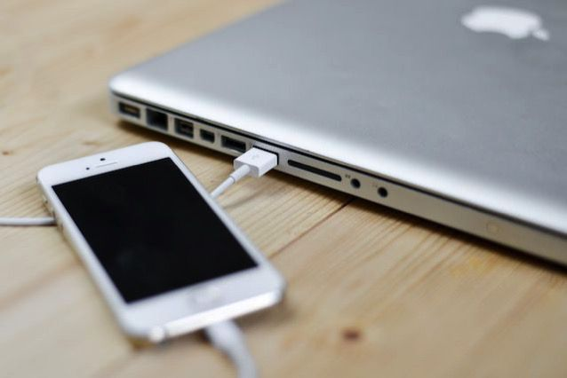
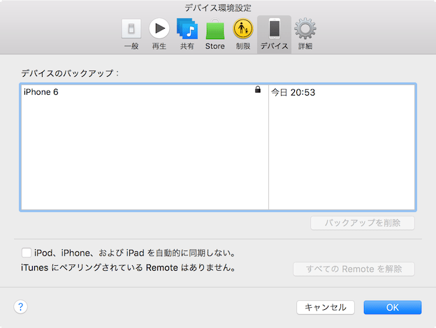
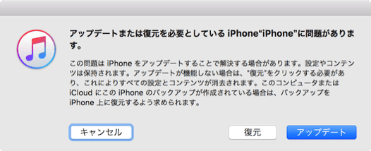
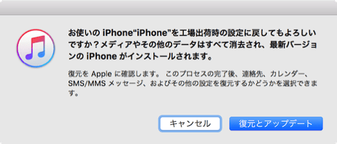
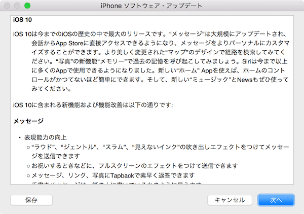
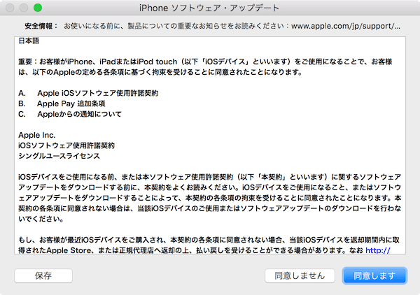
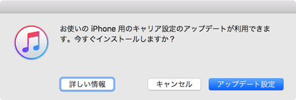
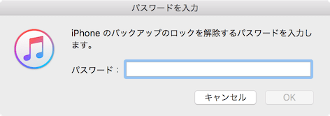
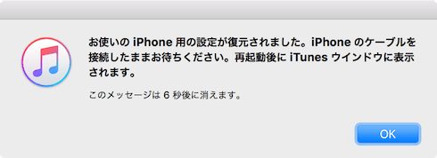
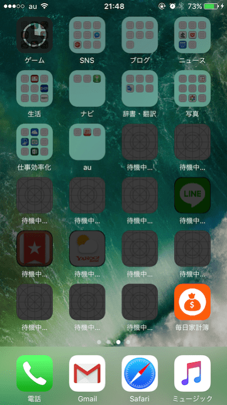

---
author:
- '@ottanxyz'
categories:
- iPhone
- Mac
date: 2016-09-18 00:00:00+00:00
draft: false
tags:
- ios
- iphone
- リカバリー
- クリーンインストール
- itunes
title: iPhoneの動作が遅い、バッテリーの減りが早いと感じた時はiOSのクリーンインストールを試してみよう！
type: post
---

iPhone 6s以前のiOSデバイスで、iOS 10へのOTA（Over-The-Air）によるアップデート後に、iPhoneの動作がもたつく、遅い、バッテリーの減りが早いと感じた時には、一度iOS 10のクリーンインストールを試してみることをオススメします。OTAとは、無線通信経由、すなわち「設定」→「一般」→「ソフトウェアアップデート」からの、Wi-Fi経由でのアップデートになります。

なお、iOS 10へのアップデート直後は、Spotlight検索のためのインデックスの再構成など、バックグラウンドで動作する作業が多くなるため、バッテリーの減りが早く感じたり、動作が遅いと感じる場合もあります。2〜3時間程度様子を見てみることをオススメします。

## iOS 10をクリーンインストールする

iOS 10をクリーンインストールする前に、必ずiTunesでバックアップを取得しましょう。「iCloud」バックアップからの復元でも問題はありませんが、「iCloud」へのバックアップに対応していないアプリケーションや、メールアカウントのパスワードの情報などは保存されませんので注意が必要です。完全なバックアップを取得するためには、必ずiTunesを使用しましょう。

なお、暗号化された状態で保存されるとはいえ、iPhoneのロジックボード（基盤）に直接保存されている指紋情報など、復元できない情報もありますので、復元後に再セットアップが必要です。

### iTunesでバックアップを取得する

まず、iOS 10をクリーンインストールする前に、iTunesで必ずバックアップを取得しましょう。

iTunesを起動したら、iPhoneのアイコンをクリックして、「バックアップ」の項目から、「このコンピューター」をチェック、「iPhoneのバックアップを暗号化」をチェックします。**暗号化のために指定するパスワードは必ず覚えておきましょう**。パスワードを忘れてしまうと、二度と復元することはできません。復旧する手段もありません。Macの場合は、キーチェーンに保管しておくと安心です。チェックが完了したら、「今すぐバックアップ」をクリックします。

バックアップが完了したら、iTunesの環境設定（Macの場合は、⌘+,を押す）を開き、「デバイス」タブに最新時刻のバックアップが取得できていることを確かめておきます。

### iPhoneをリカバリーモードで起動し、バックアップから復元する

iPhoneを、工場出荷時の状態に復元するために、iPhoneをリカバリーモードで起動します。この手順を実行すると、iPhoneは工場出荷時の状態にリセットされます。必ず、バックアップが取得できていることを確認してください。また、iPhone 7以降、リカバリーモードでの起動方法が変更されています。今回は、iPhone 6s以前のデバイスを対象としています。

  1. iOSデバイスの電源をオフにする
  2. MacにLightning-USBケーブルを接続する
  3. iOSデバイスでホームボタンを押し続けます
  4. LightningケーブルをiOSデバイスに接続します
  5. iTunesのアイコンが表示されるまでホームボタンを押し続けます

iPhoneをリカバリーモードで起動するためには、上記の手順を順番に実行します。正常にリカバリーモードで起動すると、黒い画面にiTunesのアイコンとケーブルのアイコンが表示されるようになります。

リカバリーモードについては、iOSのダウングレードを行う手順にも応用できます。iOSのダウングレードが可能な期間はAppleによって定められていますので注意が必要です。

iTunesを起動すると、iPhoneが認識されます。「復元」「アップデート」を選択できますが、今回は「復元」を選択します。「復元」するためには、AppleのサーバからiOS 10のファームウェア（ipsw）をダウンロードする必要があります。ダウンロードには時間を要しますので気長に待ちましょう。

「復元とアップデート」を選択します。

iOS 10の更新内容が表示されます。「次へ」をクリックします。

利用規約が表示されます。利用規約を読み終えたら「同意します」をクリックします。ここから、iOS 10のファームウェアのダウンロード、および復元作業が始まります。前述のようにダウンロード、復元には時間を要しますので、気長に待ちましょう。

復元が完了したら、iTunesにiPhoneが認識されるようになります。「iPhoneを探す」をオンにした状態で、リカバリーモードで復元した場合、iPhoneにはアクティベーションロックがかかっている状態になります。アクティベーションロックを解除するためには、復元前に使用していたApple IDとパスワードを入力します。2段階認証を有効にしている場合でも、パスワードのみでロック解除できますので安心してください。

キャリア設定の情報が古い場合は、このような画面が表示されることがあります。「アップデート設定」をクリックします。

最後に、「このバックアップから復元」をチェックして、最新のバックアップを選択します。バックアップした時刻に問題がないことを確認したら「続ける」をクリックします。

ここで、事前に暗号化されたバックアップを作成する際に指定したパスワードが必要になります。パスワードを忘れてしまうと復元できなくなります。念押しですが注意してください。

このダイアログが表示されると設定の復元完了です。自動的にiPhoneが再起動され、引き続きiPhoneのセットアップ画面が表示されますので、画面の表示にしたがって進めていきましょう。なお、Apple IDの2段階認証を有効化していて、かつ信頼できるデバイスとして復元対象の端末しか保持していない場合は、確認コードが受信できないため、手順をスキップしてください。

App Storeからダウンロードしていたアプリは、復元作業完了後に、自動的に最新版がダウンロードされます。

## まとめ

今回は、iOSをクリーンインストールする方法をご紹介しました。iPhoneの調子が悪い場合には、一度iOSをクリーンインストールしてみることをオススメします。クリーンインストールすることで、内部にたまった不要なキャッシュファイル等も削除できるので、内蔵ストレージの整理にも有効です。ぜひお試しください！