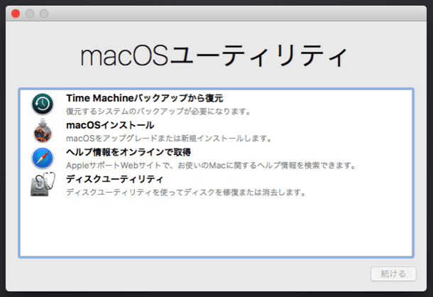
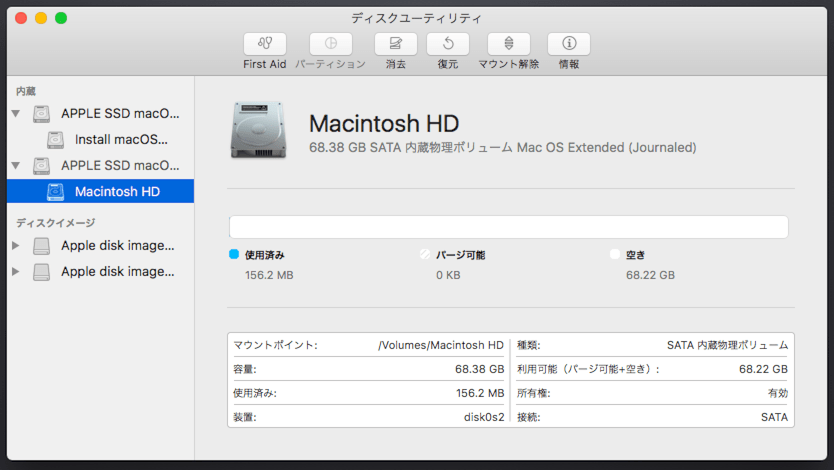
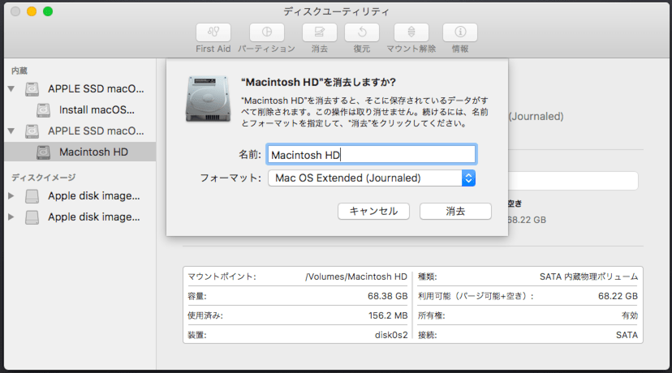
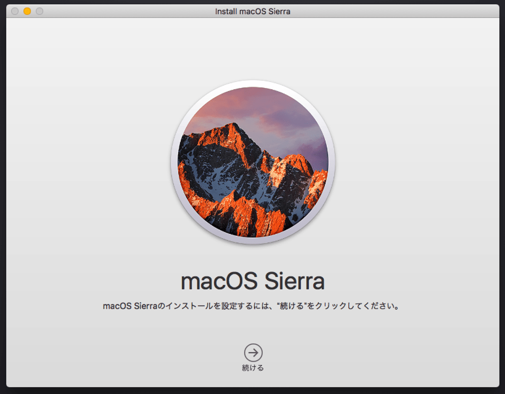
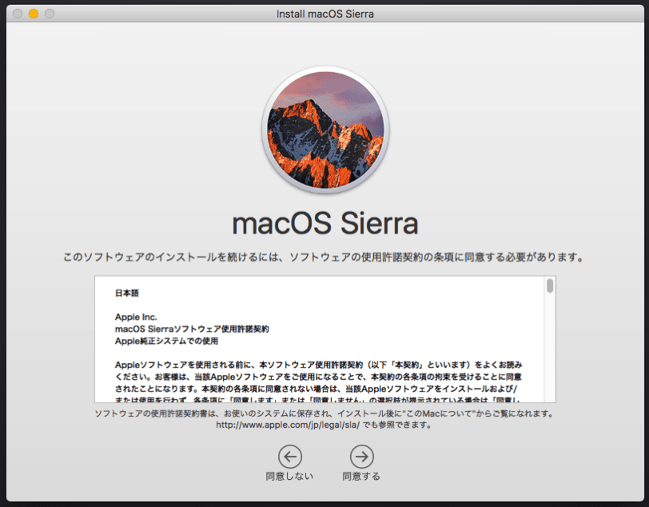
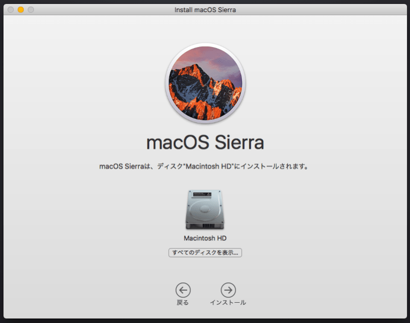

---
author:
- '@ottanxyz'
categories:
- Mac
date: 2016-09-28 00:00:00+00:00
draft: false
tags:
- sierra
- macos
- クリーンインストール
- リカバリー
- ディスク
title: macOS Sierraをクリーンインストールするための2つの方法
type: post
---

macOS Sierra へのアップデート後に不具合に見舞われた、macOS Sierra へのアップデート後に動作が遅くなった、macOS Sierra を綺麗な状態でインストールし直したい、という場合には、macOS Sierra のクリーンインストールを試しましょう。今回は、クリーンインストールする 2 つの方法をご紹介します。

## macOS Sierra をクリーンインストールする

macOS Sierra をクリーンインストールするためには、すでにアップデートを完了した人向け（リカバリーモード）と、これからアップデートする人向け（USB メモリを使用）があります。まずは、前者からご紹介します。

### リカバリーモードからクリーンインストールする

たとえば、macOS El Capitan から macOS Sierra にインストールすると、Sierra に不具合が発生した場合に備えて、自動的にリカバリーパーティション（Apple_Boot Recovery HD）が作成されます。このリカバリーパーティションを用いてクリーンインストールする方法です。この方法の利点は、手元に USB メモリがなくても可能ですが、いったん macOS Sierra にアップデートしなくてはなりません。

    /dev/disk0 (internal, physical):
       #:                       TYPE NAME                    SIZE       IDENTIFIER
       0:      GUID_partition_scheme                        *251.0 GB   disk0
       1:                        EFI EFI                     209.7 MB   disk0s1
       2:          Apple_CoreStorage Macintosh HD            250.1 GB   disk0s2
       3:                 Apple_Boot Recovery HD             650.0 MB   disk0s3

macOS Sierra をリカバリーモードで起動するためには、電源をオフにした状態で、⌘（command）+R を押しながら、電源をオンにします。

しばらくすると、「macOS ユーティリティ」が起動します。この状態で、「ディスクユーティリティ」を選択して、「続ける」をクリックします。

左側の内蔵ストレージから、すでに macOS Sierra がインストールされているディスクを選択します。ここでは、「Macintosh HD」が macOS Sierra がインストールされているディスクです。このディスクを選択した状態で、「消去」をクリックします。

フォーマットを「Mac OS Extended (Journaled)」を選択して、「消去」をクリックします（※環境によっては「Mac OS 拡張 (ジャーナル)」と表示されます）。消去が完了したら「ディスクユーティリティ」を終了します。

「macOS ユーティリティ」に戻ったら、「macOS インストール」を選択して、「続ける」をクリックします。

macOS Sierra のインストーラーが起動します。「続ける」をクリックします。

「同意する」を選択します。

先ほど消去した「Macintosh HD」を選択して「インストール」をクリックします。

後はインストーラーウィザードの内容にしたがってセットアップを進めてください。インストール中に 1 回自動的に再起動されます。

### macOS Sierra の起動可能なインストールディスクを使用する

さて、リカバリーモードを使用する場合、一度 macOS Sierra にアップデートする必要がありました。わざわざ macOS Sierra にアップデート後に再びインストールするのも手間がかかります。そこで、手元に 8GB 以上の USB メモリがあれば、Mac App Store から macOS Sierra をダウンロードして、起動可能なインストールディスクを作成できます。下記のリンクを参照してください。

* [macOS Sierraの起動可能なインストーラー（USBメモリ）を作成する方法](/posts/2016/09/macos-sierra-bootable-disk-5007/)

インストールディスクを使用して、macOS Sierra をクリーンインストールするためには、いったん Mac をシャットダウンします。電源をオフにした状態で、⌥（option）を押したまま Mac を起動します。起動ディスクの選択画面が表示されるため、「Install macOS Sierra」と書かれた黄色いディスクを選択して起動してください。

その後、「macOS ユーティリティ」が起動した後のインストール手順については、前述のリカバリーモードで起動した場合と同様です。

## まとめ

macOS Sierra のクリーンインストール手順についてまとめておきましょう。

### リカバリーモードを使用する

リカバリーモードを使用してクリーンインストールする手順は以下の通りです。

1. macOS Sierra にアップデートする
2. いったん Mac の電源をオフにし、⌘+R を押しながらリカバリーモードで起動する
3. ディスクユーティリティでディスクの内容を消去する
4. macOS Sierra をインストールする

### USB メモリを使用する

1. いったん Mac の電源をオフにし、⌥ を押しながら起動し、「Install macOS Sierra」を選択する
2. ディスクユーティリティでディスクの内容を消去する
3. macOS Sierra をインストールする

クリーンインストールしてスッキリした状態で、アプリケーションを断捨離していくのも、OS アップデート作業の醍醐味ですね！
