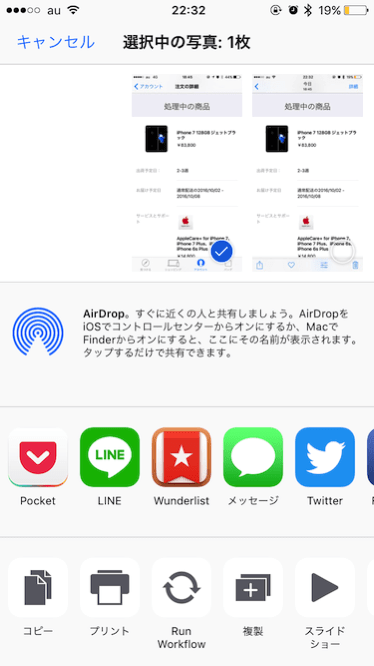
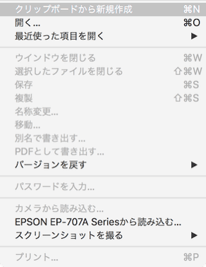
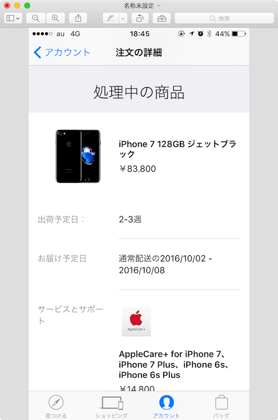
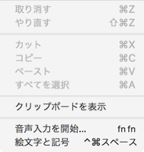
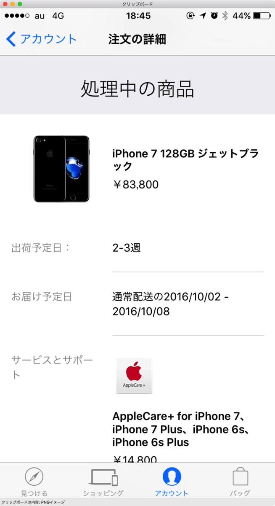

---
author:
- '@ottanxyz'
categories:
- iPhone
- Mac
date: 2016-09-21 00:00:00+00:00
draft: false
tags:
- クリップボード
- ユニバーサル
- sierra
- macos
- ios
title: MacとiPhoneでクリップボードを共有する「ユニバーサルクリップボード」が使用できない場合の対処法
type: post
---

ついに、名称を「macOS」から「macOS」に改名した、「macOS Sierra」がリリースされましたね！「macOS El Capitan」や「macOS Yosemite」を使用されている皆様は、Mac App Store から無償アップデートできます。ただし、使用しているソフトウェアによっては、macOS Sierra で正常に動作しないものもありますので注意が必要です（とくに、Adobe 系）。必須のソフトウェアの互換性は必ず確認してからアップデートしましょう。iOS と異なり、macOS で動作するソフトウェアは環境にかなり依存します。



さて、macOS Sierra の中でも、個人的に目玉機能と思っているのが「ユニバーサルクリップボード」です。非常に便利な機能なのですが、この機能のおかげで Finder でレインボーカーソルがぐるぐる回るわ、Finder のコピー、ペーストが遅くなるわ、iPhone でコピー、ペーストが遅くなるわで、散々振り回されました。

というわけで、今回は機能の簡単なご紹介（と言っても、本当に単純な機能です）と、私のような目に合わないためのトラブルシューティングをご紹介します。

## ユニバーサルクリップボード

「ユニバーサルクリップボード」とは、macOS Sierra、および iOS 10 が動作する iOS デバイス間で、「共有できるクリップボード」です。macOS Sierra でコピーしたテキストを iOS デバイスに、iOS デバイスでコピーしたテキストや写真を macOS Sierra に、クリップボードを共有することで、何も意識することなく利用できます。共有クリップボードの有効時間は 2 分間のみであり、有効時間を超過した場合には、ローカルのクリップボードの最新の履歴に置き換えられます。

### ユニバーサルクリップボードを使用してみよう

では、実際に使ってみましょう。今回の場合は、iPhone 6 (iOS 10.0.1) から macOS Sierra に写真をコピーしてみます。

まず、手元の iPhone 6（iOS 10.0.1）で、共有したい写真を選択して、左下の共有アイコンをタップします。

「コピー」をタップします。

続いて、macOS Sierra 側で、「プレビュー.app」を開きます。⌘+N を押すか、メニューから「ファイル」→「クリップボードから新規作成」をクリックします。

「プレビュー.app」で、iPhone 6 でコピーした写真をそのまま貼り付けることができました。

また、「Finder」からも確認できます。メニューの「編集」→「クリップボードを表示」をクリックします。

クリップボードに、iPhone 6 でコピーした写真が貼り付けられていることがわかります。

### ユニバーサルクリップボードが使用できない場合の対処法

このように、ユニバーサルクリップボードは非常に有用な機能です。共有クリップボードを提供するサードパーティ製のアプリケーション泣かせの機能ではありますが、OS のネイティブでサポートされるため使い勝手は良いです。

が、**このユニバーサルクリップボードが有効に動作しない場合、macOS Sierra、iOS の動作に支障をきたす可能性があります**。MacBook Pro (15-inch, Late 2013)、macOS Sierra の環境下では、ユニバーサルクリップボードが機能しない場合に、Finder でカーソルのレインボー状態がずっと続く事態に遭遇し、Finder の再起動をせざるを得ない状況でした（ちなみに、強制再起動は、⌘+⌥+⎋（escape）で行います）。では、対処法を見ていきましょう。

#### Mac が対応機種に含まれるか確認する

**macOS Sierra に対応している ≒ ユニバーサルクリップボードが使用できる、というわけではない**ため注意が必要です。ユニバーサルクリップボードが使用できる Mac の機種は以下に限定されます（Bluetooth が関係しているのかもしれませんね）。

- Mac Pro (Late 2013) 以降
- Mac mini (Late 2012) 以降
- iMac (27-inch, Late 2012) 以降
- iMac (21.5-inch, Late 2012) 以降
- MacBook Pro (15-inch, Mid 2012) 以降
- MacBook Pro (13-inch, Mid 2012) 以降
- MacBook Air (13-inch, Mid 2012) 以降
- MacBook Air (11-inch, Mid 2012) 以降
- MacBook (12-inch, Early 2015) 以降

#### iOS 10 以降であることを確認する

iPhone で、「設定」→「一般」→「ソフトウェアアップデート」を開き、「iOS 10.0.1」（記事執筆時点）であることを確認しましょう。ユニバーサルクリップボードは、iOS 10 以降で有効です。iPhone 側に制限はありません。iOS 10 が動作する iOS デバイスであれば、iPad、iPod touch でも有効です。

#### iCloud に同一の Apple ID でサインインしていることを確認する

ユニバーサルクリップボードを使用する場合、macOS Sierra と iOS 10 で同一の Apple ID を使用してサインインしている必要があります。

macOS Sierra の場合、「システム環境設定」→「iCloud」から Apple ID を確認できます。iOS 10 の場合、「設定」→「iCloud」から Apple ID を確認できます。

#### iCloud のサインアウト／サインインを試す

同一の Apple ID で iCloud にサインインしている場合でも機能しない場合は、iCloud のサインアウト、サインインを行います。

macOS Sierra の場合、「システム環境設定」→「iCloud」から、いったん「サインアウト」します。サインアウトする際に、Mac に情報を残す、残さないを問われますが、どちらでも構いません。iCloud 上から削除しない限り、サインイン後に復活します。「サインアウト」が完了したら、再び「サインイン」してください。「サインイン」には、「Apple ID」と「パスワード」が必要です。

iOS 10 の場合、「設定」→「iCloud」から「サインアウト」をタップします。一時的に「iPhone を探す」をオフにする必要があるため、サインアウト時に Apple ID のパスワードを問われますので注意してください。Mac 同様に、情報を残す、残さないはどちらでも構いません。「サインアウト」が完了したら、再び「サインイン」してください。

#### macOS Sierra、iOS を再起動する

上記でも解決しない場合は、macOS Sierra、iOS をそれぞれ再起動してみてください。事象が改善される場合があります。

#### Wi-Fi を切／入にする

macOS Sierra の場合、メニューバーの Wi-Fi から「Wi-Fi を切にする」を選択したあと、再び「Wi-Fi を入にする」を選択します。メニューに表示されない場合は、「システム環境設定」→「ネットワーク」から、同一の操作を行ってください。

iOS 10 の場合、コントロールセンターが便利です。一度、「機内モード」に設定後、「機内モード」を解除してください。コントロールセンターが使用できない場合は、「設定」→「機内モード」からオン、オフを繰り返してください。

#### Bluetooth を切／入にする

macOS Sierra の場合、メニューバーの Bluetooth から「Bluetooth を切にする」を選択したあと、再び「Bluetooth を入にする」を選択します。メニューに表示されない場合は、「システム環境設定」→「Bluetooth」から同一の操作を行ってください。

iOS 10 の場合、Wi-Fi と同様です。「機内モード」のオン、オフを繰り返してください。

### トラブルシューティングまとめ

以上の点を、簡潔にまとめておきましょう。下記の手順は順番通りに行う必要はありません。順不同で繰り返し実施してみてください。私の場合、効果的だったのは意外にも Wi-Fi のオフ、オン、Bluetooth のオフ、オンでした。しかし、すべての手順を検証しているので、この手順だけで実施できるようになったかどうかは不明です。

- Mac がユニバーサルクリップボードに対応している機種か確認する
- iOS が最新の OS であることを確認する
- macOS Sierra と iOS 10 で同一の Apple ID を使用して iCloud にサインインしていることを確認する
- macOS Sierra と iOS 10 で iCloud の再サインインをしてみる
- macOS Sierra と iOS 10 で Wi-Fi、Bluetooth のオフ、オンをしてみる

ユニバーサルクリップボードが使用できない状況は、Handoff が使用できない状況、AirDrop が使用できない状況に似ています。過去の記事もご参照ください。おそらく、Handoff が使用できない状況では、ユニバーサルクリップボードも正常に機能しません。

- [インタスタントホットスポットとHandoffが使用できない場合の対処法](/posts/2015/05/instant-hotspot-handoff-disable-1397/)

## まとめ

私の場合、macOS Sierra にアップデート後に、Handoff は使用できるが、ユニバーサルクリップボードが正常に動作せず、Finder でレインボーカーソルがぐるぐる回り続けている状況で途方に暮れていましたが、上記の手順を順不同で繰り返し実施することで、解決することができました。ぜひお試しあれ。
