---
author:
- '@ottanxyz'
categories:
- Mac
date: 2016-09-06 00:00:00+00:00
draft: false
tags:
- ubuntu
- ime
- インストール
- 日本語
- クリック
title: Ubuntu 16.04 LTSで、Macの「英数」「かな」キーにIMEオフ、オンを割り当てる
type: post
---

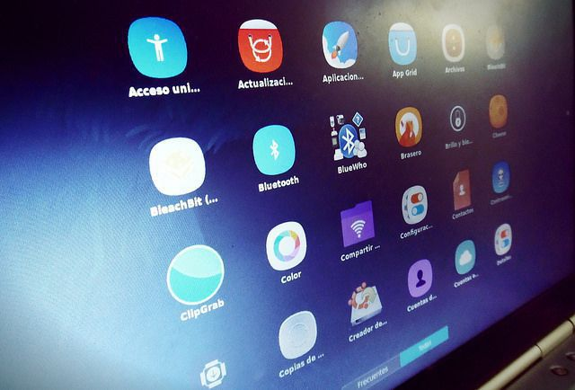

[Parallels Desktop 12 for Mac](http://www.parallels.com/jp/)で、Ubuntu 16.04 LTS が正式にサポートされたことに伴い、Parallels で仮想マシンを構築して Ubuntu 16.04 LTS を導入してみました。

ただ、Ubuntu 16.04 をインストールした素の状態の場合、IME が使いづらいため、Google 日本語入力ベースのオープンソースソフトウェアである「mozc」を導入し、Mac の「英数」「かな」キーで、IME オフ、オンを切り替えられるように設定を変更します。

Ubuntu 16.04 LTS については、下記の記事でもご紹介しています。

* [macOS El CapitanとUbuntu 16.04 LTSのデュアルブート環境を構築する](/posts/2016/04/el-capitan-ubuntu-dual-boot-6856/)

## Ubuntu 16.04 LTS の導入と日本語入力環境を快適に使うための設定

### Ubuntu 16.04 LTS のダウンロード

Ubuntu 16.04 の ISO ファイル（ディスクイメージファイル）は、以下のリンクからダウンロードできます。

http://www.ubuntu.com/download/desktop

### Ubuntu 16.04 LTS のインストール

続いて、Ubuntu 16.04 LTS をインストールします。

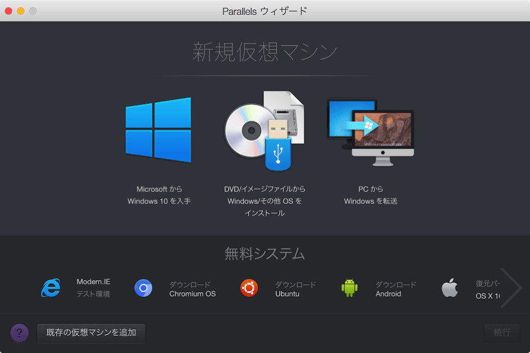

「DVD イメージファイルから Windows/その他 OS をインストール」を選択します。

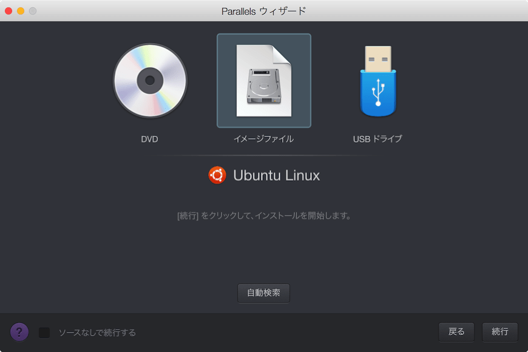

ダウンロードした ISO ファイルをドラッグ＆ドロップします。

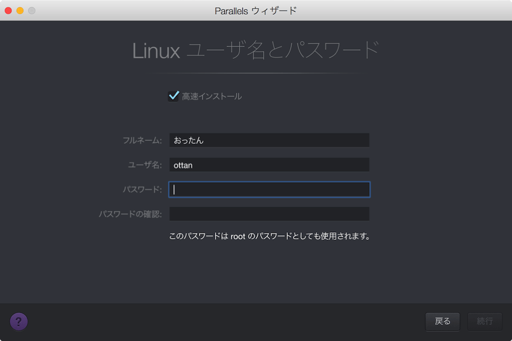

「高速インストール」を選択し、フルネーム（表示名）、ユーザ名、パスワードを入力します。

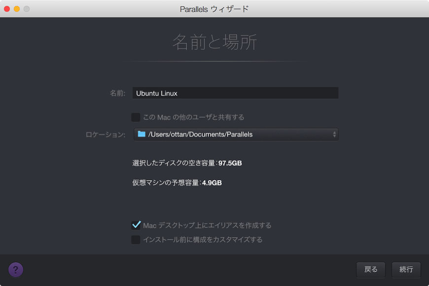

「続行」をクリックします。以上で、仮想マシンの作成は完了です。あとは、インストールが完了するのを待ちます。簡単ですね。

### Parallels Tools のインストール

手元の環境では、Parallels Tools が自動的にインストールされなかったため、Parallels Tools をインストールします。「処理」→「Parallels Tools の再インストール」を選択します。

特権で実行する必要があるため、インストール時に設定した「パスワード」を入力して処理を続行します。以下の手順で同様に特権を求められる場合がありますが、すべてインストール時に設定した「パスワード」を入力してください。インストールが完了したら、再起動します。

### 日付と時刻の設定

インストール直後の状態では、日付と時刻の設定が「Los Angeles」になっているので、「Tokyo」に変更します。

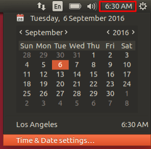

メニューバーの時計をクリックして、「Time & Date settings」を開きます。

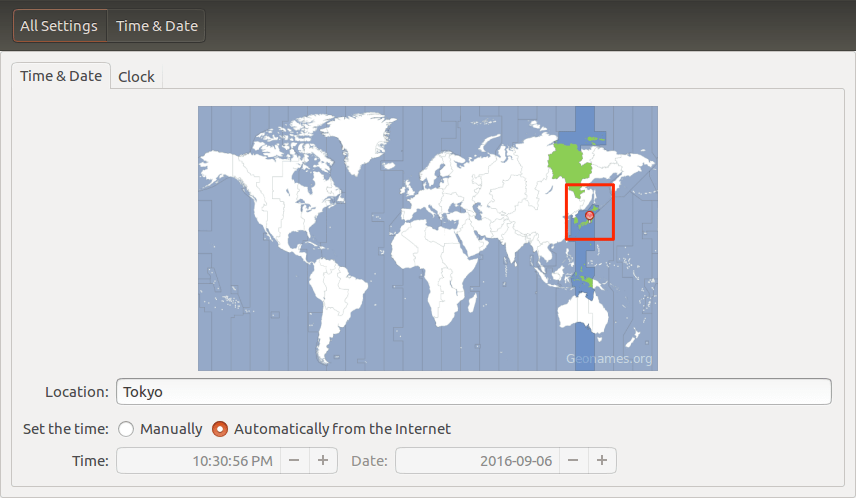

「Tokyo」付近をクリックします。「Location」が「Tokyo」になっていることを確認します。

### 言語の設定

続いて、システム言語に日本語を追加します。

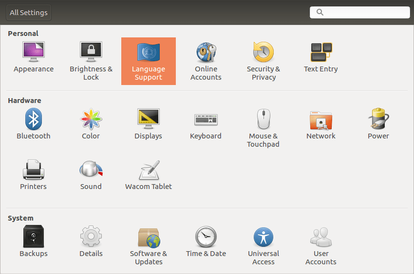

「設定」（Settings）を開き、「Language & Support」を選択します。

初回のみこのような画面が表示されます。「Install」をクリックします。

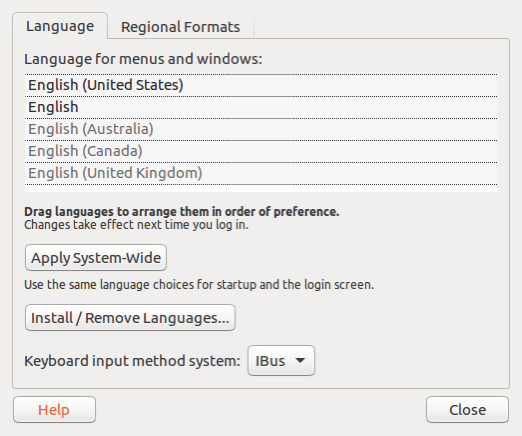

「Install / Remove Languages」をクリックします。

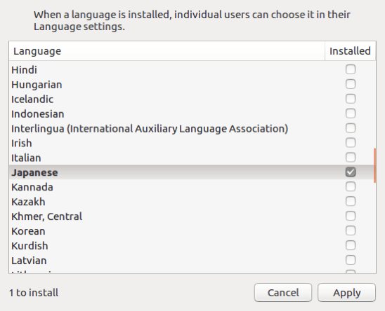

「Japanese」を選択して、「Apply」をクリックします。インストールが開始されます。

インストールが完了すると、「Language」に「日本語」が追加されます。

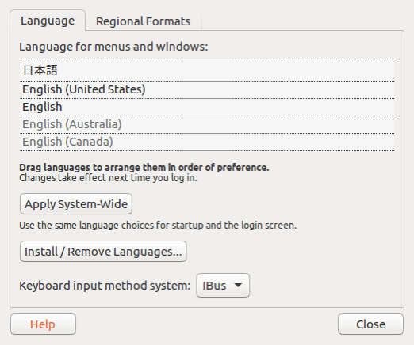

「日本語」をドラッグ＆ドロップして、最上位にします。この状態で、「Apply System-Wide」をクリックします。

続いて、「Regional Formats」タブをクリックして、言語を「日本語」に変更して、「Apply System-Wide」をクリックします。設定を反映させるために、いったんログアウトします。

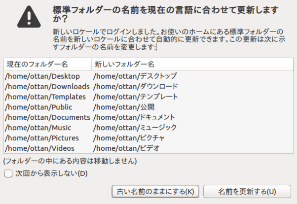

ログイン後にこのような画面が表示されます。「次回から表示しない」をチェックして、「古い名前のままにする」をクリックします。私の場合は、Linux 系 OS で日本語を使用したくないため、このままにしていますが、日本語の名称のフォルダーの方が良いという場合には、「名前を更新する」をクリックします。

### 日本語入力環境の設定

続いて、「設定」を開きます。

「テキスト入力」を選択します。

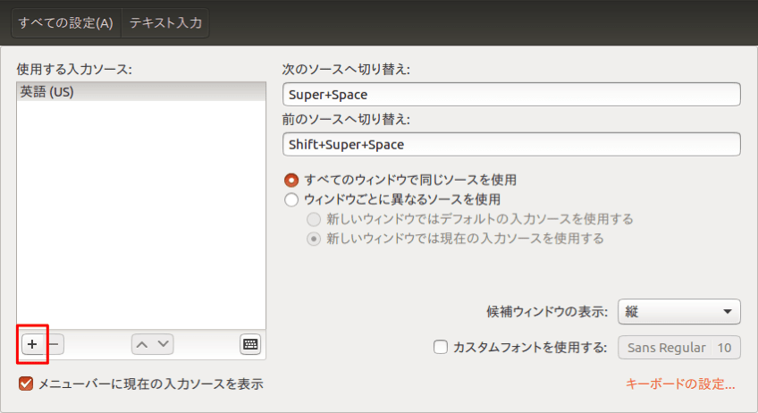

「+」をクリックします。

入力ソースから「日本語 (Mozc)」を選択し、「追加」をクリックします。

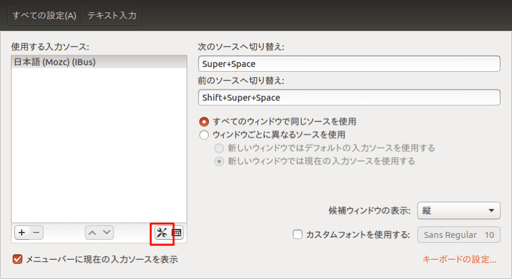

デフォルトの「英語 (US)」は削除しましょう。続いて、追加した「日本語 (Mozc)」を選択して、設定アイコンをクリックします（上図参照）。

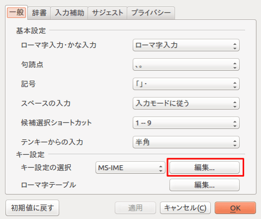

「キー設定の選択」で「編集」をクリックします。デフォルトでは、「MS-IME」風になっています。

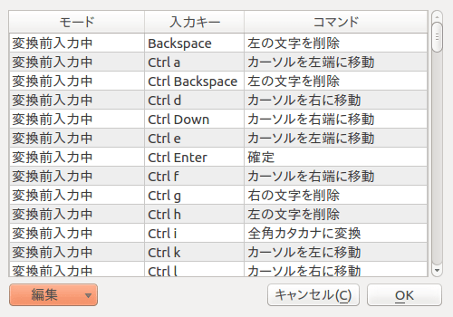

「編集」をクリックし、「エントリーを追加」をクリックします。

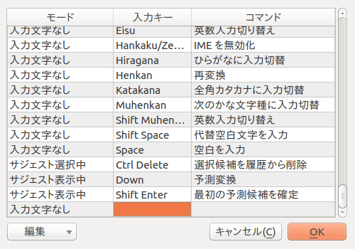

「モード」は「入力文字なし」とします。続いて、「入力キー」の空白をクリックします。

「割り当てるキーの入力」の画面が表示されるので、Mac の「英数」キーを押します。

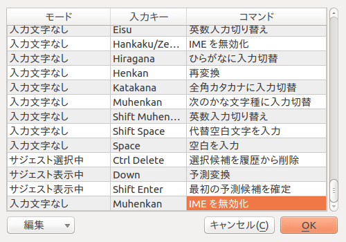

「コマンド」は「IME を無効化」とします。

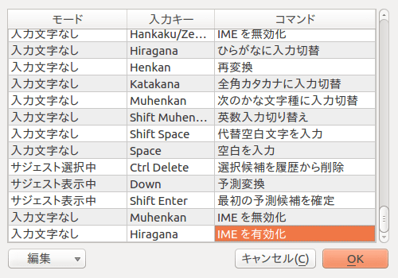

同様の手順で、「モード」を「入力文字なし」、「入力キー」を「かな」キー、「コマンド」を「IME を有効化」とします。以上で、「英数」「かな」キーで IME をオフ、オンできるようになりました。

## まとめ

これで、快適な日本語生活を送ることができます。ご質問はコメント欄、または[@ottanxyz](https://twitter.com/ottanxyz)で受け付けています。
