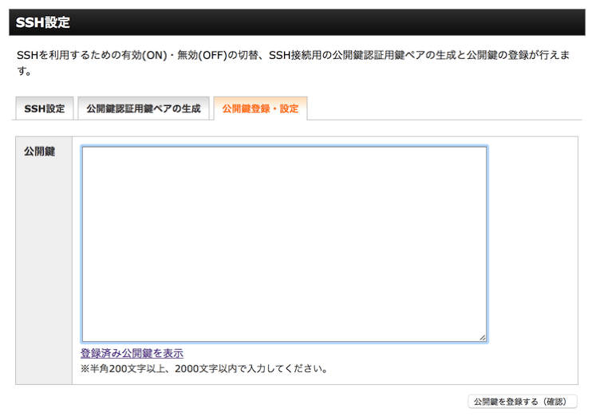
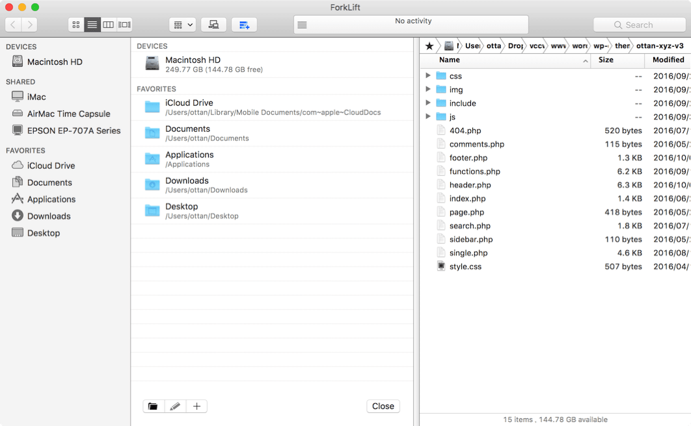
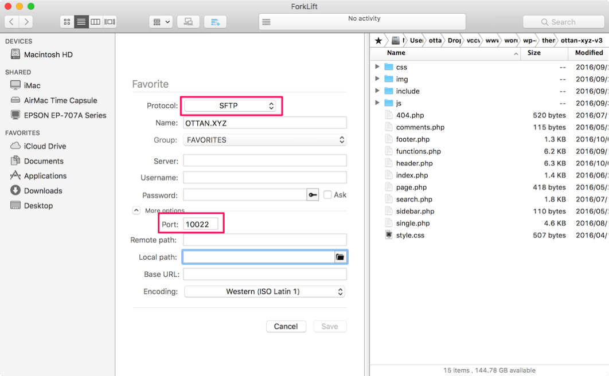
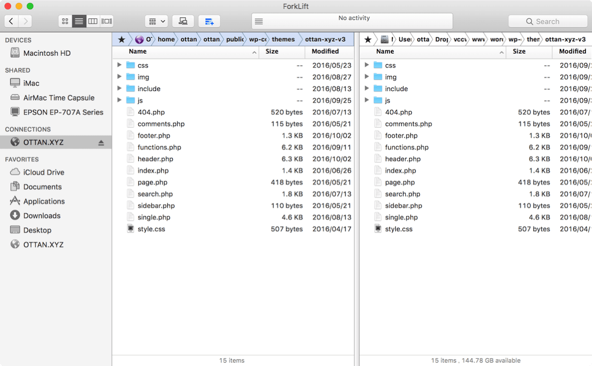

---
author:
- '@ottanxyz'
categories:
- Mac
date: 2016-10-08 00:00:00+00:00
draft: false
tags:
- 公開鍵
- xserver
- ssh
- sftp
- 秘密鍵
title: ファイラーとしても優秀なSFTP/FTPクライアント「」を使用してXSERVERにSFTPで接続する方法
type: post
---

Macのファイラーとしても優秀で、かつ有能なSFTP/FTPクライアントとして使用可能な「」が、先日、無償セールを行なっており、思わずMac App Storeからダウンロードしてしまいました。Amazon S3やWebDAVにも対応しており、まさに「万能」という言葉が似合うこのアプリケーションで、WordPress運用にオススメの高性能レンタルサーバであるXSERVER（エックスサーバー）に、SFTPで接続する方法をご紹介します。



なお、価格は記事執筆時点のものです。セールにより価格変動しますので、事前に十分に価格をご確認いただいてからご購入ください。

## からXSERVERにSFTPで接続する

SFTPとは、SSH File Transfer Protocolの略称で、SSHで接続し、セキュアにリモートサーバとファイルのやりとりを行うために取り決められたプロトコルです。通常のFTPが平文（暗号化されていない状態）でやりとりされるのに対して、SFTPではすべてが暗号化された状態でやりとりされるため、傍受される心配もありません。SFTPが使用できる場合は、FTPよりもSFTPを使用したほうがより安全にファイルのやりとりができます。

### XSERVERに接続するための秘密鍵、公開鍵を作成する

XSERVERは、SSH接続に対応していますが、SSH接続におけるパスワード認証には対応していません。よって、SSHで接続する場合に、アカウント名、パスワードによる認証を行うことはできないのです。対応している認証方式は、公開鍵認証方式です。

公開鍵認証方式とは、対となる2種類の鍵である秘密鍵と公開鍵を作成し、これらの鍵による暗号化、復号化を行うことにより、安全にネットワーク上のデータ通信を暗号化するための認証方式です。秘密鍵によって暗号化されたデータは、秘密鍵と対となる公開鍵でのみ復号化できます。

XSERVER側に公開鍵を登録し、秘密鍵をMacに保持しておくことで、その秘密鍵を保持しているMacからしかXSERVERにアクセスすることができなくなるというわけです。パスワードを管理する必要がない上、アクセスできるMacを制限できることから、通常のパスワード認証方式よりもセキュリティが向上するわけです。

Macで秘密鍵、公開鍵のペアを作成するためには、「ターミナル.app」を開いて、以下のコマンドを実行します。

    ssh-keygen

すると、下記のようなメッセージが表示されます。

    Generating public/private rsa key pair.
    Enter file in which to save the key (/Users/ottan/.ssh/id_rsa):
    Enter passphrase (empty for no passphrase):
    Enter same passphrase again:
    Your identification has been saved in /Users/ottan/.ssh/id_rsa.
    Your public key has been saved in /Users/ottan/.ssh/id_rsa.pub.
    The key's randomart image is:

すべて、デフォルトのまま↵（enter）でも構わないのですが、秘密鍵が盗難にあった場合、誰でもXSERVERにアクセスできてしまいます。そのため、「Enter passphrase」で秘密鍵にアクセスするためのパスフレーズ（パスワード）を設定しておきます。すると、万が一秘密鍵が盗難にあった場合も、パスフレーズを知らなければアクセスすることはできません。

### XSERVERに公開鍵を登録する

さて、では公開鍵の作成が完了したところで、XSERVER側に公開鍵を登録しましょう。公開鍵の内容は、以下のコマンドで確認できます。「ターミナル.app」から実行してください。

    cat ~/.ssh/id_rsa.pub

公開鍵の内容をそのままコピーしておいてください。公開鍵といっても、中身はただのテキストファイルです。

https://www.xserver.ne.jp/login_server.php

続いて、XSERVERのサーバーパネルにログインします。

「SSH設定」は全ドメイン共通です。「SSH設定」をクリックします。

「SSH設定」でSSHの状態が「OFF」の場合は、「ON」にしてください。

続いて、「公開鍵登録・設定」をクリックします。「公開鍵」に先ほどコピーした公開鍵の内容をそのまま貼り付けます。ただし、すでに公開鍵を登録したことがある場合は、「登録済み公開鍵を表示」をクリックしてください。そのまま公開鍵を登録してしまった場合、上書きされてしまいます。新たに公開鍵を追加する場合は、上記リンクをクリック後、末尾に追加してください。追加する前に改行を含めてください。

### でXSERVERにSFTPで接続する

続いて、ダウンロードした「.app」を起動します。

⇧（shift）+⌘（command）+Fを押して、FAVORITES（お気に入り）を表示します。FAVORITESが表示されたら、「+」ボタンをクリックしてください。

「Protocol」に「SFTP」、「Name」に任意の名称を、「More options」を表示して、「Port」を**「10022」**にします。XSERVERは、SSHのデフォルトポートである「22」では接続できませんので注意してください。あとは、「Server」に「_username_.xsrv.jp」、「Username」にXSERVERのサーバーパネルにログインするためのユーザIDを指定し、「Save」します。

このようにお気に入りに登録されました。登録されたお気に入りをダブルクリックします。

無事、XSERVERに接続できれば設定完了です！お疲れ様でした。

## まとめ

「」は、Macの「Finder」の良さを活かした高機能なSFTPクライアントです。MacでSFTPクライアントをお探しの方がいらっしゃいましたら、ぜひお試しください。



また、WordPressの運営にはXSERVERを推奨しています。これまで、使用しているXSERVERで障害が発生したことや、通信遅延等が発生したことは一度もありません。高性能でありながら安価に構築可能なレンタルサーバをお探しであれば、XSERVERを検討してみてはいかがでしょうか？

ご意見、ご感想はコメント欄、または[@ottanxyz](https://twitter.com/ottanxyz)でも受け付けています。