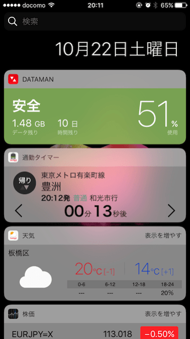
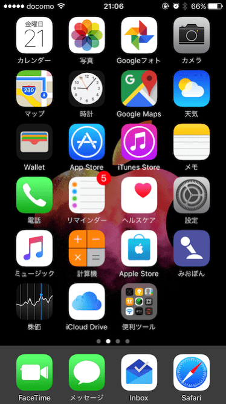
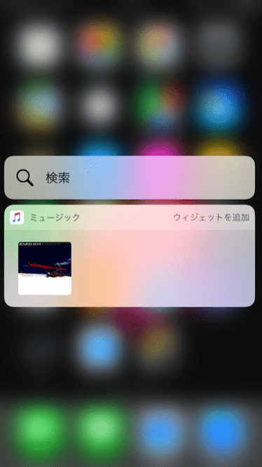

---
author:
- '@ottanxyz'
categories:
- iPhone
date: 2016-10-22 00:00:00+00:00
draft: false
tags:
- ウィジェット
- ホーム
- 3d
- dock
- 画面
title: iPhoneのホーム画面でいつでもどこでもウィジェットを確認する簡単な方法
type: post
---

ウィジェットは手軽に表示できるため、情報を即座に確認したい場合などに重宝します。そのため、ホーム画面を操作している状態で、ウィジェットを確認したい場合があります。しかし、ウィジェットの画面は左端のホーム画面をさらに右にスワイプする必要があるため、一度ホームボタンを押して左端のホーム画面に戻り、そこからさらに右にスワイプする操作が必要です。

## もっと簡単にウィジェットを使いこなす方法

今回、ご紹介する方法は、iPhone 6s以降の機種限定です（iPhone SE除く）。ポイントは、よくウィジェットを使うアプリを、あらかじめDock（画面下部）に登録しておくことです。Dockは、ホーム画面のどこからでもアクセスできます。そのため、わざわざホーム画面を行ったり来たりする必要がなくなるわけです。

ここで、3D Touchの登場です（そのため、3D Touch未対応の機種では使用できません）。ウィジェットを表示させたいアプリを、3D TouchでPeek（強く押す）します。

すると、ウィジェットに対応しているアプリであれば、3D Touchのショートカット以外に、ウィジェットも表示されます。そのため、わざわざ左端のホーム画面まで戻り右にスワイプする、または通知センターを表示し右にスワイプする、などの二度手間を防ぐことができます。また、3D Touchで表示したウィジェットを、そのままウィジェット画面に追加することも可能です。

ただし、3D Touchで表示できるウィジェットの表示範囲には限りがあります。そのため、ウィジェットの内容をすべて確認したい場合には、ウィジェット画面を表示させる必要がありますのでご注意ください。

## まとめ

ウィジェットとしてよく使用するアプリは、Dockに追加しておくと便利です。ただし、Dockで使用できるアプリは4つまでですので限りがあります。Dockのアプリをデフォルトのまま使用していませんか？探してみると、もっと有効活用できるかもしれません。